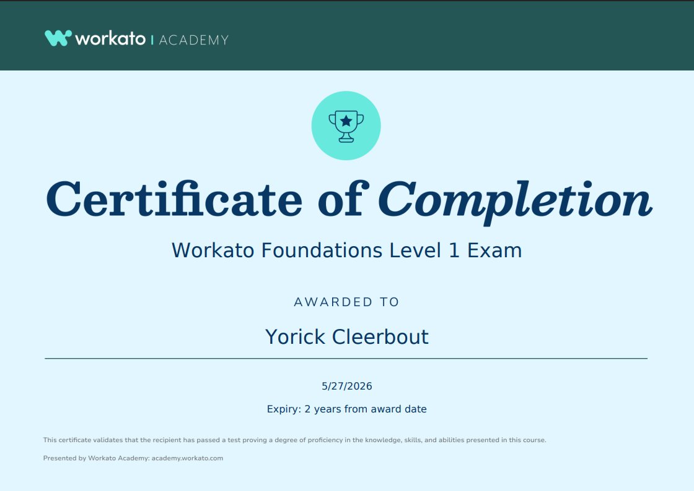

# 🧠 Certification Portfolio

   

---

Welcome to my **Certification Portfolio** — a curated space where I document study notes, concepts, and progress across professional certifications.  
This serves as both a **knowledge hub** and a **living roadmap** for continuous skill development.

---

## 🎯 Purpose

The purpose of this portfolio is to:

- 🗂️ **Centralize** all certification-related study material.  
- 🧩 **Connect** key concepts to practical, real-world applications.  
- 🔁 **Track** ongoing progress and keep learning momentum.  
- 💡 **Share** structured learning paths for others on similar journeys.  

---

## 📈 Overview

| Category        | Count | Status                                                                               |
| --------------- | ----- | ------------------------------------------------------------------------------------ |
| **Completed**   | 2     |   |
| **In Progress** | 1     |  |
| **On Hold**     | 1     |      |
| **Planned**     | 1     |         |

---

## 🏅 Certificate Showcase

View my verified certifications on [**Credly**](https://www.credly.com/users/yorick-cleerbout) *(If available)*.  

| Certification                        | Badge                                                                                                                                                                                           | Issued   |
| ------------------------------------ | ----------------------------------------------------------------------------------------------------------------------------------------------------------------------------------------------- | -------- |
| **AWS Certified Cloud Practitioner** |  | Oct 2022 |
| **Workato Foundations Level 1**      |                                                                                                                               | May 2026 |

---

## 📚 Learning Tracks

| Certification                        | Status                                                                                 | Folder                                                                            |
| ------------------------------------ | -------------------------------------------------------------------------------------- | --------------------------------------------------------------------------------- |
| **AWS Certified Cloud Practitioner** |   | *Not included in repo*                                                            |
| **Workato Foundations Level 1**      |   | [`/workato-foundations-level-1`](./workato-foundations-level-1/00.%20OVERVIEW.md) |
| **Workato Foundations Level 2**      |  |                                                                                   |
| **Workato Technical Developer**      |         |                                                                                   |
| **Kong Gateway Certified Associate** |          | [`/kong-gateway-certified-associate`](./kong-gateway-certified-associate)         |

---