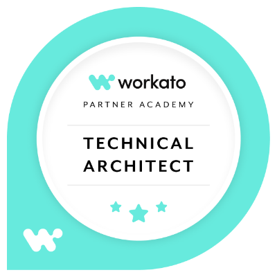
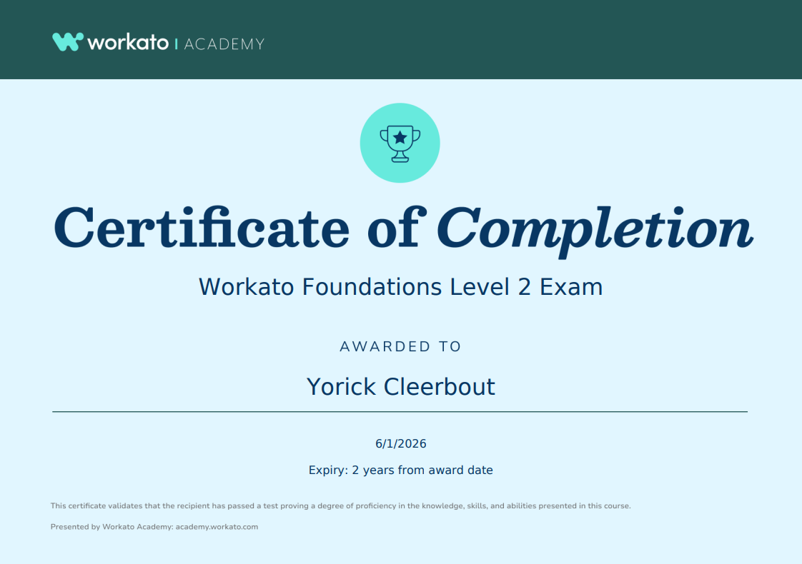

# 🧠 Certification Portfolio

   

---

Welcome to my **Certification Portfolio** — a curated space where I document study notes, concepts, and progress across professional certifications.  
This serves as both a **knowledge hub** and a **living roadmap** for continuous skill development.

---

## 🎯 Purpose

The purpose of this portfolio is to:

- 🗂️ **Centralize** all certification-related study material.  
- 🧩 **Connect** key concepts to practical, real-world applications.  
- 🔁 **Track** ongoing progress and keep learning momentum.  
- 💡 **Share** structured learning paths for others on similar journeys.  

---

## 📈 Overview

| Category        | Count | Status                                                                               |
| --------------- | ----- | ------------------------------------------------------------------------------------ |
| **Completed**   | 5     |   |
| **In Progress** | 0     |  |
| **On Hold**     | 1     |      |
| **Planned**     | 2     |         |

---

## 🏅 Certificate Showcase

View my verified certifications on [**Credly**](https://www.credly.com/users/yorick-cleerbout) or [**Accredible**](https://credentials.workato.com/profile/yorickcleerbout/wallet) *(If available)*.  

| Certification                        | Badge                                                                                                                                                                                                                 | Issued    |
| ------------------------------------ | --------------------------------------------------------------------------------------------------------------------------------------------------------------------------------------------------------------------- | --------- |
| **Workato Technical Architect**      | <a href="https://credentials.workato.com/73abc52f-6758-4d30-862a-b36dbac1e6ab" target="_blank"><a/>                                             | July 2026 |
| **Workato Technical Developer**      | <a href="https://credentials.workato.com/708488be-2ace-490f-8e46-a593ae588aad" target="_blank"><a/>                                             | July 2026 |
| **Workato Foundations Level 2**      | <a href="https://credentials.workato.com/42541cef-9f6e-4966-88c3-5ef35be244ed" target="_blank"><a/>                                       | June 2026 |
| **Workato Foundations Level 1**      | <a href="https://credentials.workato.com/6f48a822-16e1-408a-ad68-81887b8bb212" target="_blank"><a/>                                       | May 2026  |
| **AWS Certified Cloud Practitioner** | <a href="https://www.credly.com/badges/86e776bc-92f8-449e-9ed1-d3f35b7d0f74/public_url" target="_blank"><a/> | Oct 2022  |

---

## 📚 Learning Tracks

| Certification                                               | Status                                                                                | Folder                                                                            |
| ----------------------------------------------------------- | ------------------------------------------------------------------------------------- | --------------------------------------------------------------------------------- |
| **Workato Customer Onboarding 3.0 (OCP) - Project Manager** |        |                                                                                   |
| **Workato Customer Onboarding 3.0 (OCP) - Technical**       |        |                                                                                   |
| **Workato Technical Architect**                             |  | [`/workato-technical-architect`](./workato-technical-architect/00.%20OVERVIEW.md) |
| **Workato Technical Developer**                             |  | [`/workato-technical-developer`](./workato-technical-developer/00.%20OVERVIEW.md) |
| **Workato Foundations Level 2**                             |  | [`/workato-foundations-level-2`](./workato-foundations-level-2/00.%20OVERVIEW.md) |
| **Workato Foundations Level 1**                             |  | [`/workato-foundations-level-1`](./workato-foundations-level-1/00.%20OVERVIEW.md) |
| **Kong Gateway Certified Associate**                        |         | [`/kong-gateway-certified-associate`](./kong-gateway-certified-associate)         |
| **AWS Certified Cloud Practitioner**                        |  | *Not included in repo*                                                            |

---
## ⚠️ Disclaimer  
  
*These notes are personal study materials created to support preparation for professional certification exams.*  
  
*They are provided for educational and informational purposes only. While every effort has been made to keep the content accurate and up to date, no guarantee is made regarding its completeness, accuracy, or suitability for any specific certification exam.*  
  
*The author is not affiliated with any certification provider unless explicitly stated and accepts no liability for any exam results, certification outcomes, professional decisions, or other consequences arising from the use of these materials.*  
  
*Use these notes at your own discretion.*