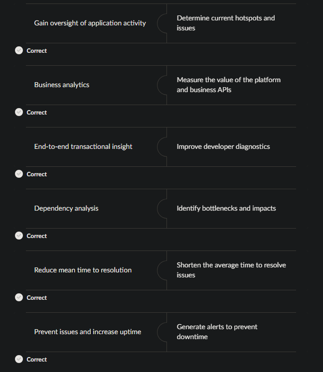

## 🩺 **API Observability in Kong Gateway**
### 🔍 **What is API Observability?**

**API Observability** refers to the ability to **monitor, understand, and analyze** the internal behavior and health of API systems — using **telemetry data** such as **metrics, logs, and traces**, without needing direct access to the code or infrastructure.

> 🧠 Observability goes beyond monitoring:  
> **Monitoring** tells you _what_ and _when_ something happened.
> **Observability** helps you understand _why_ it happened.

---

### 🎯 **Objectives of API Observability**

Observability ensures **performance**, **reliability**, and **security**, while helping teams gain deeper insights into distributed system behavior.

| Objective                            | Purpose                                                                        |
| ------------------------------------ | ------------------------------------------------------------------------------ |
| **End-to-End Transaction Insight**   | Enable full visibility into the lifecycle of a request for better diagnostics. |
| **Prevent Issues & Increase Uptime** | Detect anomalies early and trigger alerts automatically.                       |
| **Dependency Analysis**              | Identify service bottlenecks and understand downstream impacts.                |
| **Reduce MTTR**                      | Lower _Mean Time To Resolution_ through faster root cause analysis.            |
| **Business Analytics**               | Measure the business value and usage of your APIs and platform.                |
| **Metrics & Visualization**          | Monitor API performance hotspots and usage trends.                             |

---

### 📊 **What to Observe in an API Ecosystem**

| Category        | Example Metrics                                |
| --------------- | ---------------------------------------------- |
| **Traffic**     | Request counts, active consumers, bandwidth    |
| **Performance** | Latency, throughput, error rates               |
| **Health**      | Uptime, 5xx errors, timeouts, memory/CPU usage |
| **Usage**       | Top endpoints, clients, regions                |
| **Security**    | Authentication failures, rate limiting events  |

---
## 🔧 **Observability in Kong Gateway**

Kong Gateway observability is built on the **three pillars of telemetry**:

> **Metrics** → **Traces** → **Logs**

Each provides a different perspective on API traffic and system behavior.

---

### 📈 **Metrics**

**Metrics** are numerical data points reflecting the performance and health of your API Gateway — useful for dashboards, trend analysis, and alerting.

#### Example Metrics
| Metric                     | Description                                                               |
| -------------------------- | ------------------------------------------------------------------------- |
| `kong_http_requests_total` | Total HTTP requests by service, route, status code, source, and consumer. |
| `kong_kong_latency_ms`     | Latency introduced by Kong Gateway and enabled plugins (histogram).       |

#### 🧩 Relevant Plugins
- 🟢 **Datadog**
- 🟣 **Prometheus**

---

### 🧭 **Traces**

**Traces** capture the journey of a request through your API ecosystem, showing where time is spent and where failures occur.  
Each trace is made up of **spans**, where each span represents one step in the request lifecycle.

#### Example Trace Span

```json
{
  "traceId": "4bf92f3577b34da6a3ce929d0e0e4736",
  "spanId": "00f067aa0ba902b7",
  "parentSpanId": null,
  "name": "kong.receive",
  "kind": "SERVER",
  "startTimeUnixNano": 1699460000000000000,
  "endTimeUnixNano": 1699460000100000000,
  "attributes": {
    "http.method": "GET",
    "http.url": "https://api.example.com/v1/resource",
    "net.peer.ip": "203.0.113.42",
    "net.peer.port": 54321
  }
}
```

#### 🧩 Relevant Plugins
- 🔵 **Zipkin**
- 🟣 **OpenTelemetry**

---
### 🪵 **Logs**

**Logs** are timestamped event records describing what’s happening inside your system.  
They provide the most granular, real-time view of API activity, security events, and debugging information.

#### 🧩 Relevant Plugins
- 🟠 **HTTP Log**
- 🔵 **File Log**
- 🟣 **StatsD**
- 🟢 **Loggly**
- 🔵 **Syslog**
- 🟢 **UDP Log / TCP Log**
- 🟣 **Kafka Log**
- 🟡 **Splunk**

---

## 🧠 Summary

| Observability Pillar | Purpose                              | Common Tools              |
| -------------------- | ------------------------------------ | ------------------------- |
| **Metrics**          | Quantify system health & performance | Prometheus, Datadog       |
| **Traces**           | Visualize API request flow & latency | Zipkin, OpenTelemetry     |
| **Logs**             | Capture detailed event data          | Kafka Log, Syslog, Splunk |

> Kong’s plugin-based observability enables fine-grained visibility into API performance, ensuring your gateway remains transparent, reliable, and diagnosable in production.

---

## 📝 **Test your knowledge**

>❓ **Match each Plugin to the correct pillar of Observability:**

Zipkin | OpenTelemetry | HTTP Log | StatD | Datadog | Prometheus

| **Metrics** | **Tracing** | **Logs** |
| :---------: | :---------: | :------: |
|             |             |          |
|             |             |          |
|             |             |          |
<details>
	<summary>💡 Reveal Answer</summary>
	 <br />
	 <table>
		 <tr><th><b>Metrics</b></th><th><b>Tracing</b></th><th><b>Logs</b></th></tr>
		 <tr><td>Datadog</td><td>Zipkin</td><td>HTTP Log</td></tr>
		 <tr><td>Prometheus</td><td>OpenTelemetry</td><td>StatD</td></tr>
	 </table>
</details>

>❓ **Which of the following are typical objectives of observability? Select all that apply.**

- [ ] Ensuring the performance of API traffic and services
- [ ] Ignoring historical request and response data
- [ ] Creating new APIs for business use
- [ ] Improving developer diagnostics
- [ ] Identifying bottlenecks and their impacts

<details>
	<summary>💡 Reveal Answer</summary>
	 - Ensuring the performance of API traffic and services<br />
	 - Improving developer diagnostics<br />
	 - Identifying bottlenecks and their impacts
</details>

>❓ **Match each typical observability objective with its corresponding benefit or outcome.**

![[match-obsrv-obj-outcome.png]]

<details>
	<summary>💡 Reveal Answer</summary>
	 
</details>

>❓ **Which of the following accurately describe the three pillars of observability? Select all that apply.**

- [ ] Metrics include historical request and response data for monitoring.
- [ ] Traces capture the flow of execution of requests through the Kong proxy.
- [ ] Metrics provide numerical measurements of system performance.
- [ ] Logs are used to create new APIs for business purposes.
- [ ] Logs provide valuable information for monitoring, security, and incident investigation.

<details>
	<summary>💡 Reveal Answer</summary>
	 - Traces capture the flow of execution of requests through the Kong proxy.<br />
	 - Metrics provide numerical measurements of system performance.<br />
	 - Logs provide valuable information for monitoring, security, and incident investigation.
</details>

---

## 🧩 **Monitoring Overview**

Understanding the **state and performance** of your API Gateway is essential to maintaining a healthy, resilient API ecosystem. 

Kong Gateway provides **critical path protection** for your upstream services by isolating traffic, monitoring runtime behavior, and integrating with leading observability platforms.
Kong Gateway integrates with many monitoring and alerting systems:

> 🩺 **Goal:** Detect issues before they affect users, and respond proactively through automated alerts and dashboards.

---
### ⚙️ **Integrated Monitoring Ecosystem**

Kong Gateway supports multiple monitoring tools and frameworks to help track system performance, latency, and service-level indicators (SLIs).

#### 🟣 **Prometheus**

**Prometheus** is an open-source **monitoring and alerting toolkit** that provides:
- Multi-dimensional **time series data model** (metrics with labels)
- **PromQL**, a powerful query language for flexible analysis
- Integration with **Grafana** for rich dashboards and alerting

> 💡 Kong Gateway exposes Prometheus metrics via the `Prometheus Plugin`, allowing you to collect gateway-level metrics such as latency, request count, error rates, and bandwidth.

---
#### 🟢 **AppDynamics & Datadog**

**AppDynamics** and **Datadog** are popular **cloud-based APM (Application Performance Monitoring)** platforms.

They provide:
- Real-time **infrastructure and application health monitoring**
- **Service maps** and **dependency visualization**
- **Anomaly detection** and automated alerting

> ⚙️ Kong integrates with Datadog through the **Datadog Plugin**, sending metrics such as request latency, traffic volume, and plugin performance directly to your Datadog dashboards.

---

#### 🟠 **StatsD**

**StatsD** is a lightweight **network daemon** that collects and aggregates real-time application metrics.

- Supports both **UDP** and **TCP** connections
- Emits **counters**, **timers**, and **gauges**
- Sends aggregated metrics to backend systems like **Graphite** or **InfluxDB**

> 💡 Use the **StatsD Plugin** in Kong to emit gateway statistics — such as request counts and latencies — to your existing StatsD backend.

---

## 🧠 **Summary**

| Monitoring Tool | Type        | Key Use Case                             | Integration Method |
| --------------- | ----------- | ---------------------------------------- | ------------------ |
| **Prometheus**  | Open Source | Metrics collection, time series analysis | Prometheus Plugin  |
| **AppDynamics** | Cloud APM   | Application & infrastructure monitoring  | Native integration |
| **Datadog**     | Cloud APM   | Full-stack observability and alerting    | Datadog Plugin     |
| **StatsD**      | Daemon      | Lightweight metric aggregation           | StatsD Plugin      |
> Kong’s flexible monitoring integrations make it easy to plug into your existing observability stack — whether you’re running locally, on Kubernetes, or in a hybrid cloud setup.

---

>❓ **Match each definition to the correct monitoring and alerting systems:**

Sends aggregated values to one or more backend services | Popular cloud-based infrastructure and application monitoring services | Lightweight network deamon that listens for application metrics of UDP or TCP | Provides a multi-dimensional time series data model and query language | An open-source systems monitoring and alerting toolkit 

|                             **Prometheus**                             |                                  **StatD**                                   |                       **AppDynamics & Datadog**                        |
| :--------------------------------------------------------------------: | :--------------------------------------------------------------------------: | :--------------------------------------------------------------------: |
| Provides a multi-dimensional time series data model and query language |           Sends aggregated values to one or more backend services            | Popular cloud-based infrastructure and application monitoring services |
|         An open-source systems monitoring and alerting toolkit         | Lightweight network deamon that listens for application metrics of UDP or TC |                                                                        |
|                                                                        |                                                                              |                                                                        |
<details>
	<summary>💡 Reveal Answer</summary>
	 <br />
	 <table>
		 <tr><th><b>Prometheus</b></th><th><b>StatD</b></th><th><b>AppDynamics & Datadog</b></th></tr>
		 <tr><td>Provides a multi-dimensional time series data model and query language</td><td>Sends aggregated values to one or more backend services</td><td>Popular cloud-based infrastructure and application monitoring services</td></tr>
		 <tr><td>An open-source systems monitoring and alerting toolkit</td><td>Lightweight network deamon that listens for application metrics of UDP or TC</td><td></td></tr>
	 </table>
</details>

---

## 🩺 **Health Check Monitoring**

**Health checks** are used by infrastructure components such as load balancers, orchestration tools (e.g., Kubernetes), and monitoring systems to verify whether **Kong Gateway nodes** are operational and ready to handle traffic.

> 🔗 [Kong Gateway Health Check Probes — Official Documentation](https://developer.konghq.com/gateway/traffic-control/health-check-probes/)

---
### ⚙️ **Overview**

Health checks (also known as **probes**) ensure the stability and availability of your Kong Gateway deployment.  
They determine:

- If a **node is running** correctly
- If it’s **ready** to serve traffic
- Whether **traffic should be routed** to or away from that node

Kong Gateway provides two types of probes:

---
#### 🧠 **1. Liveness Probe**

The **liveness probe** determines whether the **Kong process itself is running**.

🔹 **Endpoint**:

```shell
GET /status
```

🔹 **Expected Behavior**

| Condition              | Response                                     |
| ---------------------- | -------------------------------------------- |
| Gateway is running     | **200 OK**                                   |
| Gateway is not running | **500 Internal Server Error** or no response |
> 💡 Use this probe to detect and automatically restart unresponsive or crashed Kong nodes.

---
#### 🚀 **2. Readiness Probe**

The **readiness probe** determines whether Kong has successfully loaded a valid configuration and is **ready to proxy traffic**.

🔹 **Endpoint**

```shell
GET /status/ready
```

🔹 **Expected Behavior**

| Condition                                 | Response                                     |
| ----------------------------------------- | -------------------------------------------- |
| Gateway is ready to proxy traffic         | **200 OK**                                   |
| Gateway not yet configured / initializing | **500 Internal Server Error** or no response |

> ⚠️ **Best Practice:**
> Always use **readiness probes** in production.
> They ensure that traffic is only sent to nodes that are **fully initialized** and ready to serve requests.

---

## 🧩 **Summary**

| Probe Type    | Endpoint        | Purpose                                    | Typical Use                           |
| ------------- | --------------- | ------------------------------------------ | ------------------------------------- |
| **Liveness**  | `/status`       | Checks if the Kong process is running      | Node health monitoring / auto-restart |
| **Readiness** | `/status/ready` | Checks if Kong is ready to handle requests | Load balancing / traffic routing      |

---
## 📝 **Test your knowledge

>❓ **Which monitoring system provides a multi-dimensional time series data model and query language?**

- <input type="radio" name="t1"> StatsD
- <input type="radio" name="t1"> AppDynamics
- <input type="radio" name="t1"> Prometheus
- <input type="radio" name="t1"> Datadog

<details>
	<summary>💡 Reveal Answer</summary>
	 - Prometheus
</details>

>❓ **AppDynamics and Datadog are popular cloud-based infrastructure and application monitoring services**

- <input type="radio" name="t2"> True
- <input type="radio" name="t2"> False

<details>
	<summary>💡 Reveal Answer</summary>
	 - True
</details>

>❓ **What infrastructure component performs Health Checks to monitor the health of a Kong Gateway**

- <input type="radio" name="t3"> Load Balancers
- <input type="radio" name="t3"> Plugins
- <input type="radio" name="t3"> Prometheus
- <input type="radio" name="t3"> GET request

<details>
	<summary>💡 Reveal Answer</summary>
	 - Load Balancers
</details>

> ❓ **Select all that apply: Which statements accurately describe the Liveness probe in Kong Gateway?**

- [ ] It fails with a 500 Internal Server Error if the Gateway is not running.
- [ ] It checks if the Gateway has successfully loaded a valid configuration.
- [ ] It responds with a 200 OK status if the Gateway is running.
- [ ] It sends a GET request to the /status endpoint.
- [ ] It is recommended over the Readiness probe in production environments.

<details>
	<summary>💡 Reveal Answer</summary>
	 - It fails with a 500 Internal Server Error if the Gateway is not running.<br />
	 - It responds with a 200 OK status if the Gateway is running.<br />
	 - It sends a GET request to the /status endpoint.
</details>

>❓ **What does the Readiness probe in Kong Gateway check for?**

- <input type="radio" name="t5"> If the Gateway is running
- <input type="radio" name="t5"> If the Gateway responds to a GET request to the /status endpoint
- <input type="radio" name="t5"> If the Gateway is recommended for production environments
- <input type="radio" name="t5"> If the Gateway successfully loaded a valid configuration

<details>
	<summary>💡 Reveal Answer</summary>
	 - If the Gateway successfully loaded a valid configuration
</details>

---

## 📊 **Monitoring Metrics with the Prometheus Plugin**

### 🧠 **What is Prometheus?**

**Prometheus** is an open-source **systems monitoring and alerting toolkit** that collects and stores real-time metrics as **time-series data** — each datapoint includes a value, timestamp, and optional **labels** (key-value pairs).

> Originally developed at **SoundCloud (2012)**, Prometheus became a **CNCF project (2016)** and is now a core component of the **cloud-native observability ecosystem**.

---

### ⚙️ **Key Features & Capabilities**

- **Time-series database** with rich, multidimensional metrics
- **PromQL**, a flexible query language for filtering and aggregation
- **Pull-based model** (Prometheus scrapes targets instead of receiving pushes)
- Seamless integration with **Grafana** for visualization
- Strong **alerting** and **recording rules**

> 🧩 Prometheus is now the _de facto_ monitoring standard for microservices and Kubernetes-based systems, due to its simplicity, scalability, and active community.

---

### 🔌 **What is the Prometheus Kong Plugin?**

The **Prometheus Plugin** for Kong Gateway enables metrics exposure in a **Prometheus-compatible format**, allowing Prometheus servers to scrape and store data from Kong nodes.

These metrics provide real-time insights into:

- Kong Gateway performance
- API traffic health
- Upstream service responsiveness

> Combined with **Grafana**, these metrics form a complete observability stack for **monitoring**, **alerting**, and **capacity planning**.

---

### 🧩 **Compatibility**

The **Prometheus Plugin** works in both **traditional** and **DB-less** modes, with some considerations:

| Mode                   | Behavior                                                                                            |
| ---------------------- | --------------------------------------------------------------------------------------------------- |
| **DB-less Mode**       | Admin API is mostly read-only — only declarative configuration endpoints are available (`/config`). |
| **DB Reachability**    | Always reported as "reachable" (since there’s no backing DB).                                       |
| **Metric Limitations** | The `kong_db_entities_total` metric is **not emitted** in DB-less mode.                             |

---

### 📈 **Available Metrics**

#### 🔹 **Status Codes**
HTTP status codes returned by Kong Gateway.

#### 🔹 **Latency Histograms**
Latency (in milliseconds) captured at multiple stages:

| Metric       | Description                                                  |
| ------------ | ------------------------------------------------------------ |
| **Request**  | Total time for Kong + upstream service to serve the request. |
| **Kong**     | Time Kong spends routing the request and executing plugins.  |
| **Upstream** | Time the upstream service takes to respond.                  |
#### 🔹 **Bandwidth**
When `bandwidth_metrics = true`, tracks total ingress/egress data through Kong — per service and globally.

#### 🔹 **DB Reachability**
A **gauge metric** with values:

- `1` = Database reachable
- `0` = Database unreachable

#### 🔹 **Connections**
Tracks NGINX-level connection states:

- Active
- Reading
- Writing
- Accepted connections

#### 🔹 **Target Health**
Reports the **health status** of targets in an upstream, along with the subsystem metrics.

#### 🔹 **Dataplane Status**
Exports the following for each data plane node:

- Last seen timestamp
- Config hash and sync status
- Certificate expiration timestamps

#### 🔹 **Enterprise License Info**
(Enterprise only)  
Exports details about:

- License expiration date
- Enabled features
- License signature

---

### 🌐 **Accessing Metrics**

To enable Prometheus metrics scraping, ensure the plugin is active and accessible.

#### Option 1 — Admin API

```shell
GET {HOST}:8001/metrics
```

> ⚠️ Not available when **RBAC** is enabled (Prometheus doesn’t support passing API tokens via Key-Auth).

#### Option 2 — Status API (Recommended)
```shell
GET {NODE}:<status_port>/metrics
```

- A **read-only endpoint** exposing non-sensitive metrics and health information.
- Ideal for production use with Prometheus or Grafana.

---

### 🔍 **Prometheus Service Discovery**

Prometheus automatically discovers Kong nodes using **service discovery**, then scrapes metrics from their `/metrics` endpoint.

#### ⚙️ Default Ports

| Plane             | Config Parameter | Default Port |
| ----------------- | ---------------- | ------------ |
| **Data Plane**    | `status_listen`  | `8101`       |
| **Control Plane** | `status_listen`  | `8100`       |
#### 🧾 Example (Docker Compose)

```shell
$ yq '.services.kong-dp.environment.KONG_STATUS_LISTEN' docker-compose.yaml
0.0.0.0:8101

$ yq '.services.kong-cp.environment.KONG_STATUS_LISTEN' docker-compose.yaml
0.0.0.0:8100
```

> 🧠 Each node exposes metrics locally. Prometheus scrapes these endpoints at defined intervals for historical trend analysis and alerting.

---

## 🧠 **Summary**

| Metric Category     | Description                                 | Example Use                       |
| ------------------- | ------------------------------------------- | --------------------------------- |
| **Latency**         | Measures request, Kong, and upstream delays | Diagnose bottlenecks              |
| **Bandwidth**       | Tracks data ingress/egress                  | Measure usage or detect anomalies |
| **DB Reachability** | DB connection health                        | Alert if DB becomes unreachable   |
| **Connections**     | Active/reading/writing stats                | Monitor load and concurrency      |
| **Target Health**   | Upstream target availability                | Detect failing services           |

> Prometheus + Grafana + Kong Gateway = A complete, open-source observability stack for API ecosystems.

---

## 📝 **Test your knowledge

>❓ **Select all that apply: Which of the following statements accurately describe Prometheus?**

- [ ] Prometheus stores real-time metrics in a time series database.
- [ ] Prometheus is primarily used for managing databases in cloud-native environments.
- [ ] Prometheus uses labels to filter and query metrics with precision.
- [ ] Prometheus is an open-source system monitoring and alerting toolkit.
- [ ] Prometheus was originally developed by the CNCF in 2016.

<details>
	<summary>💡 Reveal Answer</summary>
	 - Prometheus stores real-time metrics in a time series database.<br />
	 - Prometheus uses labels to filter and query metrics with precision.<br />
	 - Prometheus is an open-source system monitoring and alerting toolkit.
</details>

>❓ **The Prometheus Kong Plugin provides metrics and insights into both Kong Gateway and the upstream services it proxies.**

- <input type="radio" name="t6"> True
- <input type="radio" name="t6"> False

<details>
	<summary>💡 Reveal Answer</summary>
	 - True
</details>

>❓ **Metrics exposed through the Prometheus plugin can be accessed through the Admin API or the ` __________`, which is a read-only endpoint allowing monitoring tools to retrieve metrics and other non-sensitive information.**

<details>
	<summary>💡 Reveal Answer</summary>
	 - Status API
</details>

>❓ **What is the primary method Prometheus uses to discover Kong nodes?**

- <input type="radio" name="t7"> Manually configuring each node in Prometheus
- <input type="radio" name="t7"> Using a service discovery mechanism
- <input type="radio" name="t7"> Through the Admin API at {HOST}:8001/metrics
- <input type="radio" name="t7"> By querying the Status API at {node}:port/metrics

<details>
	<summary>💡 Reveal Answer</summary>
	 - Using a service discovery mechanism
</details>

---

## 🔍 **Tracing with the Correlation ID & OpenTelemetry Plugins**

### 🧭 **What is Tracing?**

**Tracing** in Kong Gateway is the process of capturing and visualizing the journey of API requests as they pass through Kong and its plugins.  
It provides detailed insights into each step of the request–response lifecycle, helping you:

- Monitor performance and latency
- Diagnose bottlenecks and failures
- Understand dependencies between services

> Traces connect logs and metrics, offering a complete picture of how API traffic flows across distributed systems.

---

### 🧩 **The Correlation ID Plugin**

The **Correlation ID Plugin** links all related requests and responses within a transaction using a unique identifier — the **Correlation ID**.

When enabled:

1. Kong attaches a unique **HTTP header** to all upstream requests.
2. If **`config.echo_downstream = true`**, the same header is echoed back to the client in the response.
3. If the client already sends this header, Kong **preserves it** instead of replacing it.
4. The **header name** and **value format** are configurable via plugin parameters.

---

### ⚙️ **Configuration Parameters**

| Parameter                    | Description                                                              |
| ---------------------------- | ------------------------------------------------------------------------ |
| **`config.header_name`**     | Sets the name of the correlation ID header.                              |
| **`config.generator`**       | Defines how the ID is generated (`uuid`, `uuid#counter`, or `tracker`).  |
| **`config.echo_downstream`** | When set to `true`, includes the correlation ID in downstream responses. |

---
### 🧾 **Supported Correlation ID Formats**
#### 🔹 **UUID**
- `config.generator = uuid`
- Generates a random hexadecimal UUID for each request.
- Example:
```shell
123e4567-e89b-12d3-a456-426614174000
```

#### 🔹 **UUID#Counter**
- `config.generator = uuid#counter`
- Generates a base UUID and appends a sequential counter.
- Example:
```shell
123e4567-e89b-12d3-a456-426614174000#2
```

#### 🔹 **Tracker**
- `config.generator = tracker`
- Builds an ID using network and process metadata.
- Format:
```shell
ip-port-pid-connection-connection_requests-timestamp
```
- Example:
```shell
192.168.1.10-8000-4200-23-57-1730103801
```

> 💡 Use Correlation IDs for debugging across multiple microservices. By following the same ID through different logs and systems, you can trace the entire API call path end-to-end.


---

## 🚀 **Tracing with the OpenTelemetry Plugin**

### 🧠 **What is OpenTelemetry?**

**OpenTelemetry (OTel)** is an open-source observability framework that provides APIs, SDKs, and tools to generate, collect, and export **metrics**, **logs**, and **traces**.

It defines the **OpenTelemetry Protocol (OTLP)** — a vendor-neutral specification for transporting telemetry data between:

- **Sources** (applications, gateways, APIs)
- **Collectors** (such as Jaeger, Tempo, or the OTel Collector)
- **Backends** (Grafana, Datadog, New Relic, etc.)

---

### 🔗 **Kong + OpenTelemetry**

Kong Gateway integrates natively with OpenTelemetry to propagate or generate trace data, enabling **distributed tracing** across microservices.

> This provides full visibility into request latency — both within Kong itself and across all connected upstream services.

---

### ⚙️ **Configuring OpenTelemetry in Kong Gateway**

Enable tracing globally by setting the following configuration parameters in `kong.conf` or as environment variables:

`tracing_instrumentations = all`
- Specifies which telemetry points to send to the collector.
- Use `"all"` to capture **all request and plugin traces** (ideal for testing or staging environments).

`tracing_sampling_rate = 1.0`
- Defines the percentage of requests that should be traced.
- **Examples:**
    - `1.0` → Capture 100% of requests (full tracing)
    - `0.25` → Capture 25% of requests (sampled tracing)

> ⚠️ In production, use a **sampling rate lower than 1.0** to reduce the performance impact of full tracing.

---

### 🧩 **Plugin-Level Tracing**

You can enable tracing **globally** or **per entity** (consumer, service, or route) using the **OpenTelemetry Plugin**.  
This offers flexible control over where and when tracing data is collected.

---

## 🧠 **Summary**

| Plugin             | Purpose                                   | Key Benefit                                              |
| ------------------ | ----------------------------------------- | -------------------------------------------------------- |
| **Correlation ID** | Adds unique IDs to requests and responses | Enables log and trace correlation across services        |
| **OpenTelemetry**  | Exports traces and telemetry data         | Enables distributed tracing and end-to-end observability |
> 🧭 Use both plugins together to achieve complete visibility — **Correlation IDs** for log-level tracing, and **OpenTelemetry** for system-wide distributed tracing.

---

## 📝 **Test your knowledge

>❓ **Select all that apply: Which of the following statements accurately describe OpenTelemetry?**

- [ ] It provides tools, APIs, and SDKs to help analyze software performance and behavior.
- [ ] OpenTelemetry only supports metrics and logs, not traces.
- [ ] OpenTelemetry is a proprietary tool developed exclusively for Kong Gateway.
- [ ] OpenTelemetry is an open-source standard for collecting and exporting telemetry data.
- [ ] The OpenTelemetry Protocol (OTLP) specifies how telemetry data is encoded and transported.

<details>
	<summary>💡 Reveal Answer</summary>
	 - It provides tools, APIs, and SDKs to help analyze software performance and behavior.<br />
	 - OpenTelemetry is an open-source standard for collecting and exporting telemetry data.<br />
	 - The OpenTelemetry Protocol (OTLP) specifies how telemetry data is encoded and transported.
</details>

---

## 🪵 **Logging in Kong Gateway**

> 📘 [Official Documentation – Kong Gateway Logs](https://developer.konghq.com/gateway/logs/)

Logging in **Kong Gateway** provides detailed visibility into all API traffic, system behavior, and proxy operations.  
Logs can be streamed, stored, or forwarded to external observability systems for monitoring, alerting, and compliance.

---

### ⚙️ **Kong Application Access Logs**

**Access logs** from both the **Data Plane** and **Control Plane** are emitted directly to standard output:

```bash
172.18.0.1 - - [4/Jul/2025:04:39:44 +0000] "GET /echo HTTP/1.1" 404 23 "-" "HTTPie/1.0.3"
```

These logs can be automatically captured and forwarded by your platform’s logging agent.  
For example, in a Kubernetes or EKS deployment, logs can be shipped to:

- **Amazon CloudWatch**
- **Datadog**
- **Elasticsearch (ELK Stack)**
- **Splunk**

> 💡 By default, logs are exposed via `/dev/stdout` and `/dev/stderr`, simplifying integration with log collectors.

---
### 🚀 **Kong Gateway Logging Plugins**

The **Kong Logging Plugin** framework enables flexible proxy log forwarding to third-party systems in various formats and transports.

#### 🧩 Supported Logging Plugins

- **Datadog Log Plugin**
- **Loggly Plugin**
- **Kafka Log Plugin**
- **Splunk Log Plugin**
- **HTTP Log Plugin**
- **TCP Log Plugin**
- **File Log Plugin**
- Custom log serializers (`kong.log.serializer`)

Each plugin can be configured globally or scoped per **Service**, **Route**, or **Consumer** to match your observability strategy

---

### 📁 **File Log Plugin**

#### What It Does

The **File Log Plugin** captures **HTTP**, **TCP**, **TLS**, or **UDP** request/response data in structured **JSON format** and appends it to a file or stream.

#### Typical Configuration

- Write logs to `/dev/stdout`, `/dev/stderr`, or a file path.
- Format logs as JSON for compatibility with log processors.

#### Example
```bash
curl -i -X POST http://localhost:8001/services/example-service/plugins \
  --data "name=file-log" \
  --data "config.path=/dev/stdout"
```

#### Use Case

- Easily integrated with log aggregators like **ELK Stack** or **Fluentd**.
- Ideal for local development, testing, or single-node setups.

---

### 🌐 **TCP Log Plugin & Splunk Integration**

The **TCP Log Plugin** is functionally similar to the File Log Plugin — it captures request and response data in JSON format — but differs in **where the logs are sent**.

| Plugin       | Log Destination                       | Typical Use                                    |
| ------------ | ------------------------------------- | ---------------------------------------------- |
| **File Log** | Writes to local file or stdout/stderr | Local or containerized environments            |
| **TCP Log**  | Streams to a remote TCP endpoint      | Centralized log collection (e.g. Splunk, SIEM) |

#### Example Configuration
```bash
curl -i -X POST http://localhost:8001/services/example-service/plugins \
  --data "name=tcp-log" \
  --data "config.host=splunk.mycompany.com" \
  --data "config.port=1514"
```

#### Use Case
- Real-time streaming of proxy logs to **Splunk**, **Datadog**, or other analytics systems.
- Scales well in multi-node, cloud-native deployments.

> ⚠️ Use secure channels (e.g., TLS) for transmitting logs to prevent data exposure.

---

## 🧠 **Observability Best Practices**

To ensure reliable, secure, and actionable observability in your Kong deployment:
### ✅ **Core Recommendations**

1. **Enable** `status_listen`
	- Expose metrics and health endpoints for external monitoring tools.
2. **Health Check All Nodes**
	- Continuously verify data plane and control plane node health using readiness/liveness probes.
3. **Use Load Balancer Probes**
	- Configure load balancers to check **readiness** via `/status/ready` for intelligent traffic routing.
4. **Kubernetes Deployments**
	- Implement both **liveness** and **readiness** probes for each Kong Pod.
5. **Set Up Alerting**
	- Create alert rules (e.g., via Datadog or Grafana) to proactively detect node or configuration issues.
6. **Avoid `kong health` for Monitoring**
	- The CLI command only verifies that the **Kong process** is running, not that configuration or routes are healthy.

---
## 📊 **Summary**

| Logging Method       | Destination               | Format     | Typical Use Case                           |
| -------------------- | ------------------------- | ---------- | ------------------------------------------ |
| **File Log Plugin**  | Local file or stdout      | JSON       | Local or container log shipping            |
| **TCP Log Plugin**   | Remote host/port          | JSON       | Centralized log aggregation (e.g., Splunk) |
| **HTTP Log Plugin**  | HTTP endpoint             | JSON       | Webhook-style log ingestion                |
| **Kafka Log Plugin** | Kafka topic               | JSON       | Event-driven pipelines                     |
| **Datadog / Loggly** | Cloud observability tools | Structured | Cloud-native monitoring integrations       |

---

## 📝 **Quiz - Kong Gateway Observability

>❓ **Which plugin is used to log traffic to an external file in JSON format in Kong?**

- <input type="radio" name="q1"> correrlation-id
- <input type="radio" name="q1"> tcp-log
- <input type="radio" name="q1"> zipkin
- <input type="radio" name="q1"> file-log

<details>
	<summary>💡 Reveal Answer</summary>
	 - file-log
</details>

>❓ **Which plugin streams traffic logs directly to a remote host over TCP in Kong?**

- <input type="radio" name="q2"> tcp-log
- <input type="radio" name="q2"> udp-log
- <input type="radio" name="q2"> http-log
- <input type="radio" name="q2"> file-log

<details>
	<summary>💡 Reveal Answer</summary>
	 - tcp-log
</details>

>❓ **What does the Correlation ID plugin do?**

- <input type="radio" name="q3"> Encrypts tracing headers
- <input type="radio" name="q3"> Assigns a unique ID to each request for traceability
- <input type="radio" name="q3"> Filters unauthorized traffic
- <input type="radio" name="q3"> Tracks uptime of upstream services

<details>
	<summary>💡 Reveal Answer</summary>
	 - Assigns a unique ID to each request for traceability
</details>

>❓ **What does the `tracing_sample_rate` setting control in OpenTelemetry config?**

- <input type="radio" name="q4"> The ratio of requests that are traced
- <input type="radio" name="q4"> How often metrics are flushed to disk
- <input type="radio" name="q4"> How often dashboards are updated
- <input type="radio" name="q4"> The number of log files kept in memory

<details>
	<summary>💡 Reveal Answer</summary>
	 - The ratio of requests that are traced
</details>


---

>  ⬅️ [Previous: (KGLL-206) The OpenID Connect (OIDC) Kong Plugin](./%28KGLL-206%29%20The%20OpenID%20Connect%20%28OIDC%29%20Kong%20Plugin.md) | ➡️ [Next: (KGLL-209) Troubleshooting Kong Gateway](./%28KGLL-209%29%20Troubleshooting%20Kong%20Gateway.md)

---

