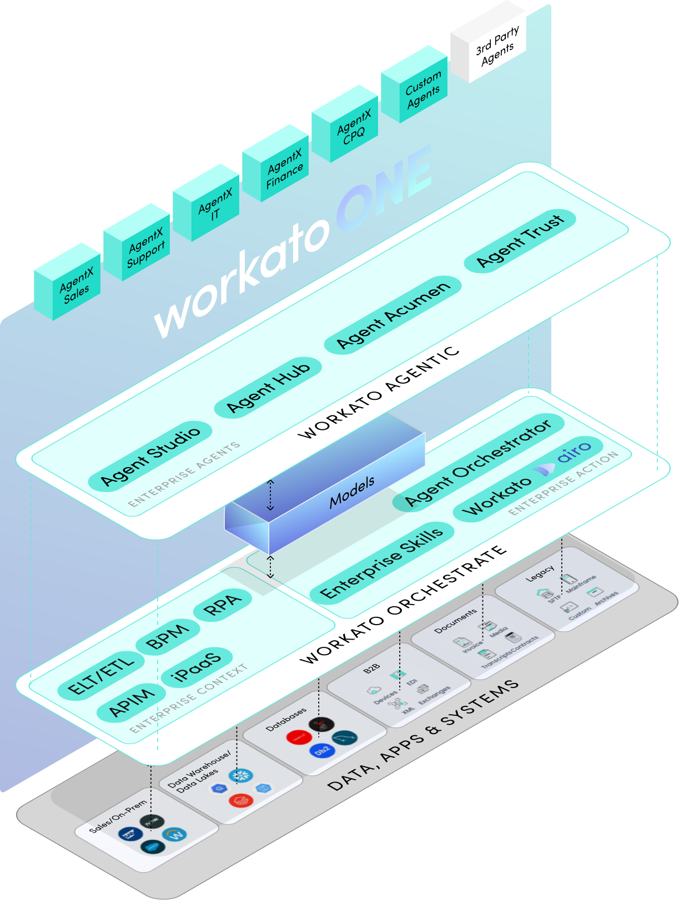
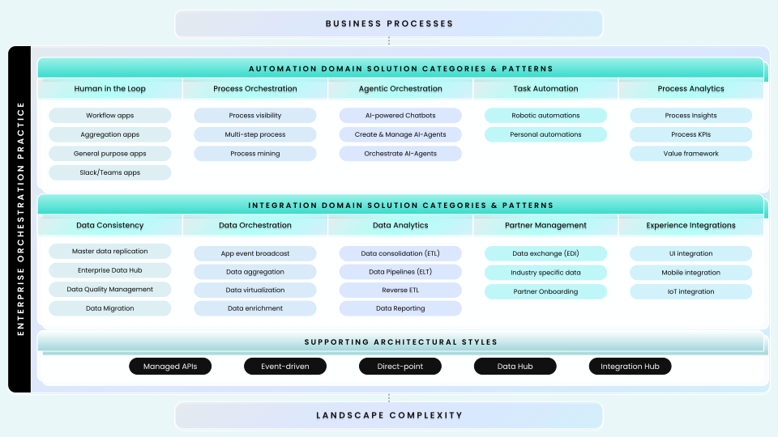
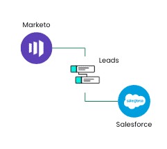
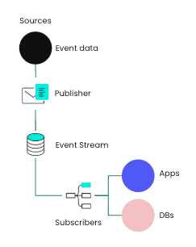
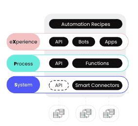
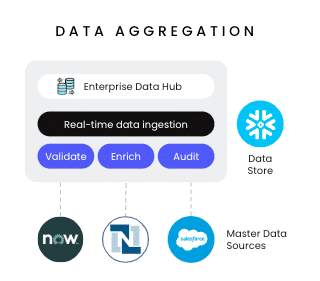
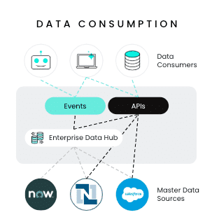

## 🚀 **Workato One**

**Workato** is a single, global platform for integration and automation — designed to connect every part of the business, empower every role, and scale to any workload. The **Workato ONE Platform** is built around three stacked layers, each building on the one below.

```
+--------------------------------------------------+  
| 🤖 Workato Agentic                               |
| Enterprise AI agents with business context       |
+--------------------------------------------------+  
| ⚙️ Workato Orchestrate                            |
| Integration, automation, workflows, BPM, iPaaS   |
+--------------------------------------------------+  
| 🗄️ Data, Apps & Systems                          |
| SaaS apps, databases, ERPs, docs, APIs, legacy   |
+--------------------------------------------------+
```



---

### 🏗️ The three layers

**🗄️ Data, Apps & Systems** — the foundational layer of enterprise data sources: CRM systems, sales platforms, data lakes, documents, legacy systems, SaaS apps, databases, cloud platforms, AI/LLM services.

**⚙️ Workato Orchestrate** — the integration and automation engine that orchestrates applications, data, business processes, user experiences, APIs, and enterprise workflows. This is the layer most users interact with directly.

**🤖 Workato Agentic** — extends Orchestrate with tools for building AI-powered enterprise agents that can dynamically orchestrate workflows, execute business tasks, make contextual decisions, and operate securely with governance controls.

---

### ✨ Orchestrate capabilities

Orchestrate delivers a broad capability set that maps to traditional enterprise software categories:

- **🔌 iPaaS** — Integration Platform as a Service
- **🌐 APIM** — API Management
- **📊 Data Orchestration** — moving and transforming data across systems
- **🔄 Application Integration** — connecting apps and synchronizing records
- **🤝 B2B / EDI Integration** — partner and supplier integration
- **📄 IDP** — Intelligent Document Processing
- **⚡ BPA** — Business Process Automation
- **🧠 AI-enhanced workflows** — workflows augmented by AI/ML
- **💬 Workflow bots** — automation inside Slack and Microsoft Teams

Workato connects to modern SaaS apps, on-premise ERPs, databases, cloud data warehouses, data lakes, legacy systems, and AI/LLM providers — and provides access to **650,000+ community recipes** as prebuilt automations and reusable templates.

---

### 🧠 Quick recall

- Name the three layers of the Workato ONE Platform from bottom to top. (Data/Apps/Systems → Orchestrate → Agentic)
- Which layer adds AI-powered agents on top of integration and automation? (Workato Agentic)
- Roughly how many community recipes does Workato provide? (`_____`) (650,000+)

---

## 🚀 **Workato's unified experience**

> 📌 On average, organizations use **1,000+ applications**, but **70% remain disconnected** from one another and the core business.

This disconnection — siloed processes, fragmented data, legacy apps — slows operations, reduces agility, and lets competitors get ahead. Workato addresses this by connecting systems, data, applications, and user experiences into one unified workflow surface.

---

### 🛠️ Eight features of the unified experience

#### 🖥️ 1. Intuitive UX & Unified UI

A **single pane of glass** for both IT teams and business stakeholders. Low-code/no-code integrations, process orchestration, and application connectors all live in one UI. Common use cases include invoice processing, employee onboarding, order management, and customer support ticketing.

#### 🍳 2. Recipes — the common language

> 📌 **Recipes** are the core automation unit in Workato. They use a low-code interface combining a **trigger** (the event that starts the automation) with **actions** (the tasks executed after).

Recipes support multi-step workflows, real-time and scheduled execution, and dynamic workflow logic. The Community Library provides **650K+ pre-built recipes** to accelerate development.

#### 💊🌳 3. Datapills & Data Trees

**Datapills** encapsulate output data from triggers and actions — they act like variables used throughout workflows. **Data trees** are the organized structures where datapills are stored and accessed. Together they enable iPaaS, BPA, data orchestration, MDM, and API lifecycle management.

#### 🔌 4. Smart Connectors

Out-of-the-box connectors, community-built connectors, and custom connectors created via **Connectors Copilot**. Workato connects to SaaS apps, custom apps, databases, data warehouses, LLMs, SFTP, on-prem systems, and mainframes via APIs, databases, or file-based integrations.

#### 🤖 5. Workflow Bots (Workbots)

Workbots automate processes inside collaboration platforms like **Slack** and **Microsoft Teams** — sending real-time notifications, triggering workflows, and enabling low-code/no-code interactions directly from messaging apps.

#### 📱 6. Low-Code Apps

Drag-and-drop app development for workflows requiring human intervention (approvals, reviews, manual data entry). Faster development with minimal coding, usable by both technical and non-technical users.

#### 🧠✨ 7. AI Assistance

Workflows enhanced with machine learning, NLP, and intelligent automation. The **AI-Powered Real-Time Orchestrator** carries an idea through the full lifecycle: ideation → sketching → building → testing → deployment. Workato claims it's **10× more powerful than a typical copilot**.

#### ☁️💻 8. Cloud IDE

Browser-based development supporting cloud, on-prem, and hybrid architectures. No software installation, hardware management, or manual updates required.

---

### 🧠 Quick recall

- A recipe's two essential components are a `_____` and one or more `_____`. (Trigger, actions)
- What's the difference between a datapill and a data tree? (Datapill = a single output value acting like a variable. Data tree = the organized structure storing all available datapills.)
- Where do Workbots run? (Inside collaboration platforms — Slack and Microsoft Teams.)

---

## 🚀 **Solution design the Workato way**

**Solution design** is the structured process of solving business problems using technology, automation, and process improvements. Workato organizes this into six steps that should be followed in order.

---

### 🛠️ The six steps of Workato solution design

1. **🎯 Understand business requirements** — gather needs, clarify goals, define expected outcomes. Refine the intent of the solution to avoid scope creep.
2. **🖥️ Analyze systems landscape & complexity** — review existing technologies, current architecture, reusable components, and non-functional requirements (scalability, reliability, performance, security).
3. **🔄 Map current workflows & processes** — visualize the complete end-to-end process using flowcharts, workflow diagrams, and integration maps. Identify integrations, automations, data flows, and human interactions.
4. **⚙️ Identify key components & moving parts** — separate stable components from change-prone ones. Document current limitations, included functionality, and future roadmap items. Be explicit about what exists now versus future enhancements.
5. **🏛️ Design logical & technical architecture** — apply Workato's Reference Architecture Framework (see below).
6. **📈 Plan for scalability & future enhancements** — use modular architecture, pluggable modules, and configuration tables to make solutions flexible, adaptable, and extensible.

---

### 🏛️ The Reference Architecture Framework

The framework has three goals:

- **🔄 Data Consistency** — all systems contain accurate, up-to-date, synchronized data.
- **🎼 Data Orchestration** — managed data movement, transformation, and delivery between systems.
- **📈 Data Analytics** — supports data warehouses, data lakes, and data-centric strategies.

---

### ⚖️ Automation vs Integration domains

Two domains that solve different problems and often appear together:

|⚙️ Automation Domain|🔌 Integration Domain|
|---|---|
|**Taking action**|**Connecting the dots**|
|Eliminates repetitive manual tasks|Connects systems and data flows|
|Improves efficiency and accuracy|Creates unified information views|
|Frees human resources|Reduces data silos|
|Example: automated invoice generation|Example: CRM + marketing platform integration|

When designing a solution, differentiate which parts are automation work and which are integration work. These reusable building blocks are called **🧱 implementation patterns**.



---

### 🛠️ Technology mapping: five architectural styles

If implementation patterns are the blueprint, architectural styles are the building tools. Workato supports five:

- **🔗 Direct-Point Integration** — direct integration between two systems via a centralized mediator. Simple architecture, fast implementation, best for limited integrations. _Example: Marketo ↔ Salesforce lead sync._
- **📡 Event-Driven Architecture (EDA)** — built around events flowing `Event → Publisher → Event Stream → Subscribers`. Real-time responsiveness, scalability, loose coupling.
- **🌐 Managed APIs** — purpose-specific APIs managed as products with individual lifecycles, centralized management, and reusable services. Better governance and easier scaling.
- **🗄️ Data Hub** — centralized transactional data repository that aggregates data from multiple sources with real-time ingestion, validation, enrichment, and auditing.
- **🔄 Integration Hub** — provides digital access to data hubs through APIs, events, and multiple channels. Centralizes connectivity and simplifies data consumption.

    

---

### 💰 Example: Quote-to-Cash automation

A company wants to automate Quote-to-Cash. Business goals: increase efficiency, improve accuracy, enhance customer experience, improve decision-making, reduce costs. Required outcomes: human approval interactions, data synchronization between systems, connected end-to-end sub-processes, enriched customer information.

Using Workato to connect Salesforce and SAP, the Operations Team automated workflows, synchronized data, improved customer experiences, and increased operational efficiency.

---

### 🧠 Quick recall

- Name the six solution design steps in order. (Requirements → Landscape → Map workflows → Components → Architecture → Scalability)
- What's the right step _after_ mapping current workflows and processes? (Identify key components and moving parts — determine what's stable vs change-prone.)
- A company needs real-time order updates flowing to multiple subscribers. Which architectural style fits? (Event-Driven Architecture)
- An integration between just Marketo and Salesforce for lead sync — which style? (Direct-Point Integration)

---

## 🚀 **Module key takeaways**

- The **Workato ONE Platform** has three layers: Data/Apps/Systems (foundation) → Orchestrate (integration/automation) → Agentic (AI agents).
- The **unified experience** combines 8 features into one UI: intuitive UI, recipes, datapills/data trees, smart connectors, Workbots, low-code apps, AI assistance, cloud IDE.
- **Recipes** = trigger + actions. The Community Library has 650K+ pre-built recipes.
- **Solution design** follows six steps; the Reference Architecture Framework's goals are data consistency, orchestration, and analytics.
- **Automation vs Integration** — automation takes action, integration connects systems. Most real solutions need both.
- **Five architectural styles**: Direct-Point, EDA, Managed APIs, Data Hub, Integration Hub.

---

## 📝 **Knowledge check: Introduction to Workato**

> ❓**Imagine a scenario where critical business workflows span both cloud and on-premise systems. How would you employ Workato to ensure seamless process automation?**

- <input type="radio" name="q1"> By leveraging Workato's broad connectivity to integrate SaaS, on-prem ERPs, databases, and legacy systems.
- <input type="radio" name="q1"> By only automating workflows that operate exclusively in the cloud.
- <input type="radio" name="q1"> By disconnecting legacy systems from automated processes entirely.
- <input type="radio" name="q1"> By manually transferring data between cloud and on-premise solutions daily.

<details> <summary>💡 Reveal Answer</summary> - By leveraging Workato's broad connectivity to integrate SaaS, on-prem ERPs, databases, and legacy systems. </details>

> ❓**How would you use Workato Orchestrate to overcome bottlenecks caused by disconnected systems and data silos in a growing enterprise?**

- <input type="radio" name="q2"> By assigning manual oversight teams to monitor disconnected systems continuously.
- <input type="radio" name="q2"> By restricting workflow automation to only customer-facing processes and ignoring others.
- <input type="radio" name="q2"> By integrating and orchestrating systems, data, and processes in real time to enable streamlined workflows.
- <input type="radio" name="q2"> By replacing all existing systems with new platforms and eliminating legacy data.

<details> <summary>💡 Reveal Answer</summary> - By integrating and orchestrating systems, data, and processes in real time to enable streamlined workflows. </details>

> ❓**Given a need to ensure consistent product and pricing data across multiple business systems, how would you apply Workato's reference architecture principles?**

- <input type="radio" name="q3"> Focus only on data analytics to improve reporting capabilities.
- <input type="radio" name="q3"> Employ data consistency to guarantee unified and accurate information across all integrated systems.
- <input type="radio" name="q3"> Prioritize process visualization over system integration.
- <input type="radio" name="q3"> Restrict automation to reduce human involvement entirely.

<details> <summary>💡 Reveal Answer</summary> - Employ data consistency to guarantee unified and accurate information across all integrated systems. </details>

> ❓**How would you use Workato Workbots to streamline the process of updating team members about real-time changes to a customer order using Slack?**

- <input type="radio" name="q4"> Create traditional email alerts outside of Slack without using automation.
- <input type="radio" name="q4"> Set manual reminders for each team member to check the customer order status in Slack.
- <input type="radio" name="q4"> Schedule daily summary meetings to discuss all customer order changes verbally.
- <input type="radio" name="q4"> Implement automated workflows in Workato Workbots to send actionable notifications of order updates directly within Slack.

<details> <summary>💡 Reveal Answer</summary> - Implement automated workflows in Workato Workbots to send actionable notifications of order updates directly within Slack. </details>

> ❓**Apply the Workato solution design process to a scenario where a company wants to automatically update customer data in both their CRM and marketing automation platforms. What is the main step you should carry out after mapping current workflows and processes?**

- <input type="radio" name="q5"> Gather business requirements without reviewing existing technologies.
- <input type="radio" name="q5"> Immediately plan for scalability, customization, and future enhancements.
- <input type="radio" name="q5"> Identify key components and moving parts to determine stable elements and planned enhancements.
- <input type="radio" name="q5"> Analyze non-functional requirements before mapping workflows.

<details> <summary>💡 Reveal Answer</summary> - Identify key components and moving parts to determine stable elements and planned enhancements. </details>

---

> ⬅️ [Previous: Workato Foundations Level 1](./00.%20OVERVIEW.md) | ➡️ [Next: 02. Workato Core Platform Architecture](./02.%20Workato%20Core%20Platform%20Architecture.md)

---
