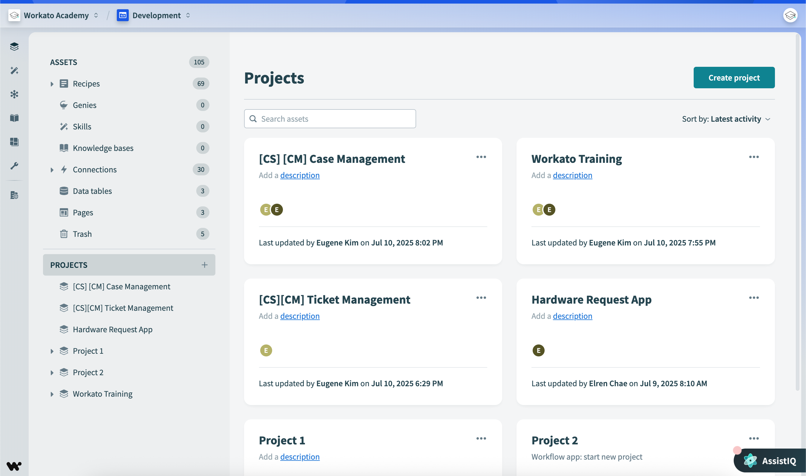
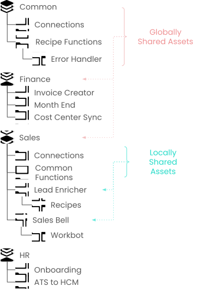
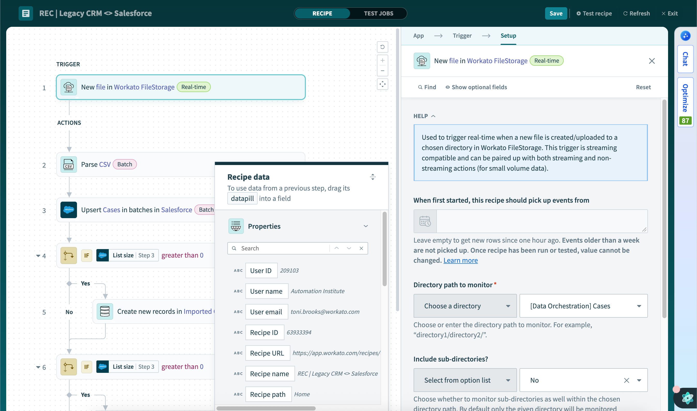
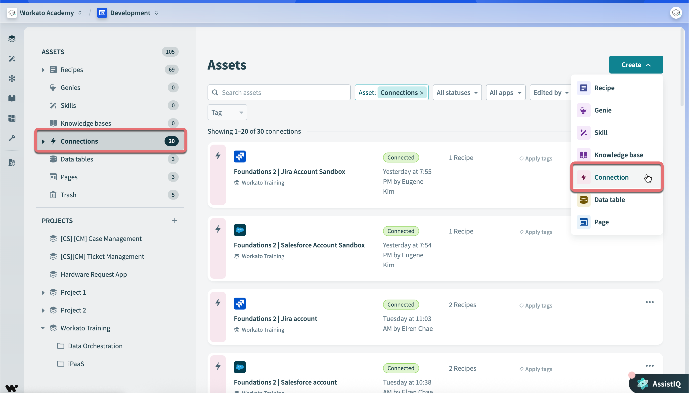

## 🏗️☁️ **Decoupled architecture**

Workato is a **cloud-native platform** that behaves more like a serverless orchestration engine than a traditional integration platform. This architectural choice delivers high scalability, flexibility, faster deployments, reduced infrastructure management, and elastic processing.

---

### 🔒 Transaction Integrity

> 📌 **Transaction integrity** ensures all parts of a transaction execute correctly, reliably, in the proper sequence, and without data loss.

Workato achieves this through four key components:

- **📬 Guaranteed Delivery** — transactions are always delivered, even during failures or interruptions.
- **🔁 Transaction Replay** — failed or interrupted transactions can be retried safely without losing data.
- **👀 Observability** — visibility into transaction status, workflow execution, errors, and system behavior for monitoring, troubleshooting, and auditing.
- **🔢 In-Sequence Delivery** — events and transactions are processed in the correct order, critical when multiple systems depend on synchronized updates.

Combined, these enable business continuity, high availability, reliable integrations, resilient automation, and future-proof implementations.

---

### 🧠 Quick recall

- What are the four key components of transaction integrity? (Guaranteed delivery, transaction replay, observability, in-sequence delivery)
- Why does in-sequence delivery matter? (Multiple systems may depend on synchronized updates — out-of-order processing breaks data consistency.)

---

## 🖥️ **The Workato UI**

When you log in to Workato you land in **Project View** — a navigation bar on the left, an assets hierarchy, and a projects hierarchy.

---

### 🧭 Navigation bar

The navigation bar provides quick access to:

- **📁 Projects** — manage automation assets and teams.
- **📊 Operations Hub** — monitor recipe and connection performance with real-time analytics and insights.
- **🌍 Community Library** — discover reusable recipes and community-built connectors (especially useful when no official connector exists).
- **🛠️ Tools** — utilities for building recipes, connecting applications, and managing collaboration.
- **⚙️ Workspace Admin** — manage users, account settings, subscription info, 2FA, permissions, API keys, and workspace configuration.

---

### 📦 Assets and Smart Folders

> 📌 **Assets** are smart folders containing integration resources (recipes, connections, trash). **Smart folders** dynamically filter assets — letting you view all recipes, active recipes, recently stopped recipes, or connected connections without manual sorting.

---

### 📁 Projects

> 📌 A **Project** is a repository for integration assets. Projects can contain recipes, connections, folders/subfolders, data tables, skills, workflow apps, and other assets — depending on permissions.

Projects let teams organize automations by department, use case, application, or business process, control access, and build automation products collaboratively.

**Project best practices:**

- **🧩 Organize by functional area** — Finance, HR, Sales, Operations. Simplifies access control, asset ownership, and team collaboration.
- **🔄 Share assets within functional areas** — use shared connections, shared recipe functions, and subfolders to improve reuse and standardization.
- **🌐 Create shared/common projects** at the top level (e.g. `Shared Assets`, `Common Services`) for assets used across teams.

**Important project guidelines:**

- Before importing a project, verify the target workspace already contains a destination project.
- Before deleting a project, verify its assets aren't reused elsewhere.
- Use **fine-grained access control** — team members may only access specific projects and assets, which enhances security, governance, and operational separation.

---

### 🔄 Workspaces and Environments

> 📌 Each Workato workspace is tied to a **unique email address**. A workspace typically contains three environments: **🧪 Development**, **🛠️ Test**, **🚀 Production**.

Recipes and dependencies move between workspaces and environments using the **Deployment feature** and **Recipe Lifecycle Management (RLM)**.

---

### 🧠 Quick recall

- A workspace is tied to a unique `_____`. (Email address)
- What are the three typical environments in a workspace? (Development, Test, Production)
- You want to organize Finance and HR automations separately with different team access. Which Workato feature handles this? (Projects, with fine-grained access control)

---

## 🍳 **What is a recipe?**

> 📌 A **recipe** is an automated workflow that integrates and processes data across multiple applications. Every recipe contains three things: a **trigger**, one or more **actions**, and the **application connectors** they use.

Recipes run continuously in the background, monitoring for trigger events and automatically executing actions. They're **resilient** — if stopped and restarted, they resume processing from where they left off.

Recipes can be **🌍 public** (shared with the community for collaboration) or **🔐 private** (restricted to your workspace).

---

### 🖥️ Recipe Editor

The Recipe Editor is the central workspace for building automations — considered the powerhouse of the Workato platform.

The editor has two main areas:

- **🔄 Recipe Workflow Area** (left side) — shows the workflow structure, triggers, actions, and step sequence as a visual flow.
- **⚙️ Step Configuration Window** (right side) — appears when you select a step. Used to configure triggers, actions, input fields, business logic, and mapping rules.

---

### 🌳 Datatree and Datapills

Every recipe step generates or receives data. This data is stored in the **datatree** and accessed as **datapills**.

- **🌳 Datatree** — stores all data from triggers, actions, and previous steps. Lets users map fields, reuse values, and build dynamic workflows.
- **💊 Datapills** — represent individual data items from the datatree. Act like variables that can be dragged into recipe steps for visual, low-code data mapping.

---

### 🧠 Quick recall

- Name the three components of every recipe. (Trigger, actions, connectors)
- A recipe is stopped overnight and restarted in the morning. What happens? (It resumes from where it left off — resilient processing.)
- What's the difference between the datatree and datapills? (Datatree = the storage structure for all available data. Datapills = individual values from the datatree that you drag into steps.)

---

## 🔌 **Application Connections**

> 📌 An **application connection** authorizes a Workato recipe to interact with an external application (Salesforce, Zendesk, Slack, SAP, databases, APIs). Triggers and actions use connections to exchange data.

---

### 🏢 One connection per application instance

Each connection corresponds to **one specific application instance** — so multiple recipes can reuse the same connection. Reuse is recommended for the same app instance because it provides easier management, better consistency, reduced duplication, and simpler maintenance.

Different environments need separate connections: Salesforce Sandbox and Salesforce Production each need their own connection, as do test and production databases.

---

### 🤖 Service accounts

Many organizations use **generic service accounts** instead of personal user accounts for important connections. This prevents automations from breaking when an employee leaves, permissions change, or personal credentials expire — improving stability, security, and reliability.

---

### 🔗 Creating connections

Two methods, used in different situations:

- **🧙‍♂️ Connection Wizard** (`Assets → Connections → Create Connection`) — best when one connection will be shared across multiple recipes. Used during solution planning, architecture setup, or shared connection creation. Provides centralized management and better governance.
- **🍳 Connect during recipe creation** — create the connection directly inside the Recipe Editor. Useful when prototyping, building recipes quickly, or connecting multiple apps within one workflow.

---

### 🔐 Authentication and permissions

Workato uses each application's authentication APIs. Common authentication types:

- **🔑 OAuth** — secure delegated authentication, common in SaaS apps.
- **🪪 Basic Authentication** — username/password.
- **🗝️ API Keys** — generated API credentials.
- **⚙️ Other** — token authentication, custom auth flows, service account authentication.

> ⚠️ A connection's access is tied to **the permissions of the authenticated account**. Workato can only access data, actions, and APIs that the connected user or service account is allowed to use.

Creating connections requires the **"Create Connections"** privilege, managed through workspace roles, project access controls, and admin settings.

---

### 🧠 Quick recall

- Each connection corresponds to how many application instances? (`_____`) (One)
- Why use service accounts instead of personal accounts for important connections? (To prevent automations from breaking when an employee leaves or permissions change.)
- A connection authorized with read-only API access — can the recipe perform write actions? (No — the recipe inherits the authenticated account's permissions.)

---

## ⚡ **Triggers**

> 📌 A **trigger** specifies the event that initiates actions in a recipe. Without a trigger, a recipe cannot start.

Triggers respond to many event types: **application events** (new Salesforce contact, Jira ticket update), **file events** (CSV uploaded, row added), **scheduled events** (daily, weekly, monthly), and **real-time events** (immediate processing via APIs/webhooks).

---

### 🔄 Trigger reliability behaviors

Workato triggers provide enterprise-grade reliability automatically — these are key differentiators of the platform:

- **🔢 In-Sequence Delivery** — events processed in the exact order they were created/modified.
- **📍 Durable Cursor Position** — Workato maintains an internal cursor tracking the **last processed record**. If servers fail, networks fail, or recipes stop, processing resumes from the correct position with no data loss.
- **🚫 No Duplication** — trigger events are processed only once; duplicates are automatically rejected.
- **🌊 Flow Control** — stable job execution even with higher concurrency and parallel processing.
- **📬 Guaranteed Delivery** — for polling triggers, events are guaranteed to be retrieved, processed, and delivered in sequence, even during outages.

> 📌 Most real-time triggers use **webhooks** — applications notify Workato immediately when events occur. Webhook events can occasionally be lost, but most Workato real-time triggers include **backup polling mechanisms** that recover missed events.

---

### ⚙️ Three trigger mechanisms

#### 🔄 1. Polling Triggers

Periodically query applications for new events. Implemented automatically by Workato — checks apps at regular intervals (typically every 5 minutes, up to every 30 minutes depending on plan) and fetches new events since the last check.

- **🚀 Initial startup** — fetches events after a specified date that can only be configured **once**.
- **▶️ Check Now** button — allows immediate trigger execution between polling intervals.
- **🔄 Stop & restart** — when stopped, polling pauses; when restarted, missing events are automatically fetched.

#### ⚡ 2. Real-Time Triggers

Built on asynchronous notification mechanisms — usually webhooks. When an event occurs, the application sends a notification, Workato receives it, and a trigger event is generated instantly. Requires registration in the connected app. Minimal delay, faster automation, lower latency.

#### ⏰ 3. Scheduled Triggers

Execute recipes at predefined times (daily, weekly, monthly, custom intervals). Fetch matching events, can return previously processed events, and process events in batches. Users can define **maximum batch size** to control processing volume.

---

### 📬 Trigger dispatch: single vs batch

Trigger dispatch defines how events are grouped:

|Type|Use case|Example|
|---|---|---|
|⚡ **Single**|Real-time synchronization (most Workato triggers)|Salesforce opportunities → NetSuite sales orders immediately after closing|
|📦 **Batch**|High-volume throughput optimization|Marketo activity data → Redshift data warehouse|

> 📌 Larger batches mean fewer jobs, fewer API calls, lower task consumption, and better throughput — but less real-time responsiveness.

---

### 🔍 Trigger conditions

Trigger conditions filter which events should be processed. **Conditions are evaluated AFTER events are fetched** — if conditions fail, no job is created and no logs are generated.

> ⚠️ Some conditions only work with certain data types. Using invalid conditions on incorrect data types may prevent recipes from starting.

There are 14 condition types in 4 categories:

- **✍️ Text** — CONTAINS, DOESN'T CONTAIN, STARTS WITH, DOESN'T START WITH, ENDS WITH, DOESN'T END WITH
- **⚖️ Comparison** — EQUALS, DOES NOT EQUAL, GREATER THAN, LESS THAN
- **✅❌ Boolean** — IS TRUE, IS NOT TRUE
- **📌 Presence** — IS PRESENT, IS NOT PRESENT

---

### 🧠 Quick recall

- Name the three trigger mechanisms. (Polling, Real-Time, Scheduled)
- A polling trigger's initial startup date can be configured how many times? (`_____`) (Once)
- Most Workato triggers are Single or Batch dispatch? (Single)
- When are trigger conditions evaluated — before or after events are fetched? (After — failed conditions create no job and no log.)
- A polling trigger is stopped and restarted 2 hours later. What happens to events that arrived during downtime? (They're automatically fetched on restart — durable cursor + guaranteed delivery.)

---

## 🪜 **Steps**

> 📌 **Steps** define what the recipe does after a trigger fires. Every recipe must contain **at least one step**, and the simplest type is an action.

Steps can be **🔧 actions** (operations in connected applications) or **🔀 control flow statements** (conditional and looping logic). Together they describe the business logic of the automation.

---

### ⚙️ Eight step types

|#|Type|Purpose|
|---|---|---|
|1|🔌 **Actions in an app**|Perform operations: create, update, search, delete records|
|2|✅ **IF Condition**|Execute steps only if a condition is true|
|3|🔄 **ELSE IF Condition**|Check additional conditions when previous IFs are false|
|4|🚪 **ELSE Condition**|Fallback logic when no IFs match|
|5|🔁 **Repeat Step**|Loop through collections (CSV rows, customer records)|
|6|☎️ **Call Recipe Functions**|Call reusable recipe logic — improves reusability and cleaner workflows|
|7|🛑 **Stop Step**|Stop recipe execution intentionally (validation failures, business rule enforcement)|
|8|⚠️ **Handle Errors**|Custom error handling for reliability, recovery, and observability|

---

### 🔧 Actions: inputs and outputs

Most connectors support these action types: **➕ Create**, **✏️ Update**, **🔄 Upsert**, **🔍 Search**, **📥 Get**, **🗑️ Delete**.

Each action has:

- **📥 Input fields** — data required to perform the action (customer ID, email, status value).
- **🌳 Output data tree** — data returned after execution (record IDs, API responses, created objects). This output becomes available to later recipe steps through the datatree.

> 📌 Available actions vary by **application connector** — different applications expose different capabilities through their APIs.

---

### 🛠️ Built-in utilities

Beyond external app connectors, Workato provides built-in utility actions:

- **📄 CSV Processing** — parse CSV files, generate CSV output.
- **♻️ Recipe Functions** — reusable logic blocks shared across recipes.
- **📚 Collections** — manage lists and grouped data structures.
- **📊 Data Tables** — store and retrieve structured data directly in Workato.
- **💻 Code Execution** — JavaScript or Ruby scripting for advanced custom logic.

If a connector doesn't provide a required action, you can create a **🧩 custom action** for custom API calls and extended integrations.

---

### 🧠 Quick recall

- The minimum number of steps in a recipe is `_____`. (One — typically an action)
- Name the eight step types. (Actions, IF, ELSE IF, ELSE, Repeat, Call Recipe Functions, Stop, Handle Errors)
- A connector doesn't have the action you need. What's the workaround? (Create a custom action.)
- Which two scripting languages can you use inside Workato for advanced logic? (JavaScript and Ruby)

---

## 🚀 **Module key takeaways**

- **Cloud-native architecture** + **transaction integrity** (guaranteed delivery, replay, observability, in-sequence) make Workato resilient and reliable.
- **Workato UI** is built around Projects (repositories for integration assets), with environments, Operations Hub, Community Library, and Workspace Admin all accessible from the navigation bar.
- A **recipe** = trigger + actions + connectors. Recipes are resilient (resume after stop/restart) and run continuously.
- **Connections** = one per app instance, reuse where possible, prefer service accounts over personal credentials.
- **Triggers** come in 3 mechanisms (polling, real-time, scheduled) and 2 dispatch modes (single, batch). Conditions evaluate **after** fetching — failures create no jobs and no logs.
- **Steps** = the recipe's logic. 8 types covering actions, conditionals, loops, reusable functions, stop, and error handling.

---

## 📝 **Knowledge check: Introduction to Workato**

> ❓**How does the Workato recipe editor support users in building workflows?**

- <input type="radio" name="q1"> The editor synchronizes recipes directly with external databases for data storage.
- <input type="radio" name="q1"> The editor renders visual reports on recipe performance for auditing purposes
- <input type="radio" name="q1"> The editor provides a workflow view and step configuration options to create and manage recipes.
- <input type="radio" name="q1"> The editor exclusively manages user access and recipe permissions.

 
💡 Reveal Answer
 - The editor provides a workflow view and step configuration options to create and manage recipes. 

> ❓**Explain what the Projects feature in Workato is designed to do.**

- <input type="radio" name="q2"> Projects are used to access the Workato community for connector sharing.
- <input type="radio" name="q2"> Projects help group people and assets to organize and manage the automation lifecycle.
- <input type="radio" name="q2"> Projects display only the recipes a user has created in their account.
- <input type="radio" name="q2"> Projects serve as real-time dashboards for visualizing recipe analytics.

 
💡 Reveal Answer
 - Projects help group people and assets to organize and manage the automation lifecycle. 

> ❓**Clarify the purpose of using a distributed message queue in Workato's architecture.**

- <input type="radio" name="q3"> To directly execute workflow steps without involving containers.
- <input type="radio" name="q3"> To monitor user actions across different workspaces.
- <input type="radio" name="q3"> To store recipes securely for offline execution.
- <input type="radio" name="q3"> To provide guaranteed delivery, sequencing, deduplication, and durable cursor position for events.

 
💡 Reveal Answer
 - To provide guaranteed delivery, sequencing, deduplication, and durable cursor position for events. 

> ❓**Which statement best explains the purpose of connectors in a Workato recipe?**

- <input type="radio" name="q4"> Connectors allow the recipe to interact with different applications, enabling seamless data flow.
- <input type="radio" name="q4"> Connectors serve as user interfaces for monitoring the status of recipes.
- <input type="radio" name="q4"> Connectors define the specific actions that each recipe step will perform.
- <input type="radio" name="q4"> Connectors are used to schedule when recipes are executed at certain times.

 
💡 Reveal Answer
 - Connectors allow the recipe to interact with different applications, enabling seamless data flow. 

> ❓**How would you categorize the main role of the trigger in a Workato recipe?**

- <input type="radio" name="q5"> The trigger defines how data is stored within the recipe.
- <input type="radio" name="q5"> The trigger determines when the recipe's workflow will begin.
- <input type="radio" name="q5"> The trigger specifies which applications the recipe can access.
- <input type="radio" name="q5"> The trigger allows users to configure the details of each step's actions.

 
💡 Reveal Answer
 - The trigger determines when the recipe's workflow will begin. 

> ❓**How would you employ control flow in a Workato recipe to execute different actions based on specific criteria such as a customer's account type?**

- <input type="radio" name="q6"> Only use call Recipe Functions steps to decide which actions to take.
- <input type="radio" name="q6"> Always use Stop steps to choose between possible actions.
- <input type="radio" name="q6"> Insert IF, ELSE/IF, or ELSE conditions in the recipe steps to carry out particular actions based on the account type.
- <input type="radio" name="q6"> Replace all application actions with one large repeat step.

 
💡 Reveal Answer
 - Insert IF, ELSE/IF, or ELSE conditions in the recipe steps to carry out particular actions based on the account type. 

---

> ⬅️ [Previous: 01. Introduction to Workato](./01.%20Introduction%20to%20Workato.md) | ➡️ [Next: 03. Recipe Design](./03.%20Recipe%20Design.md)

---