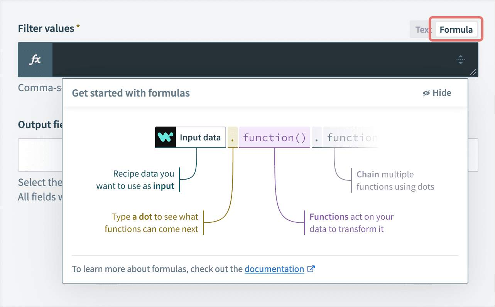
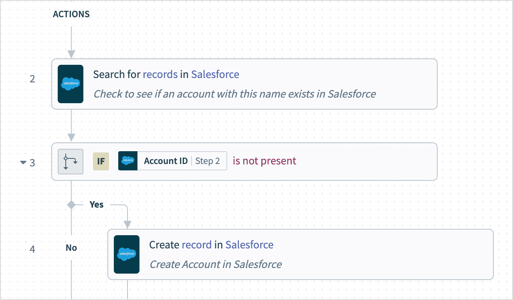
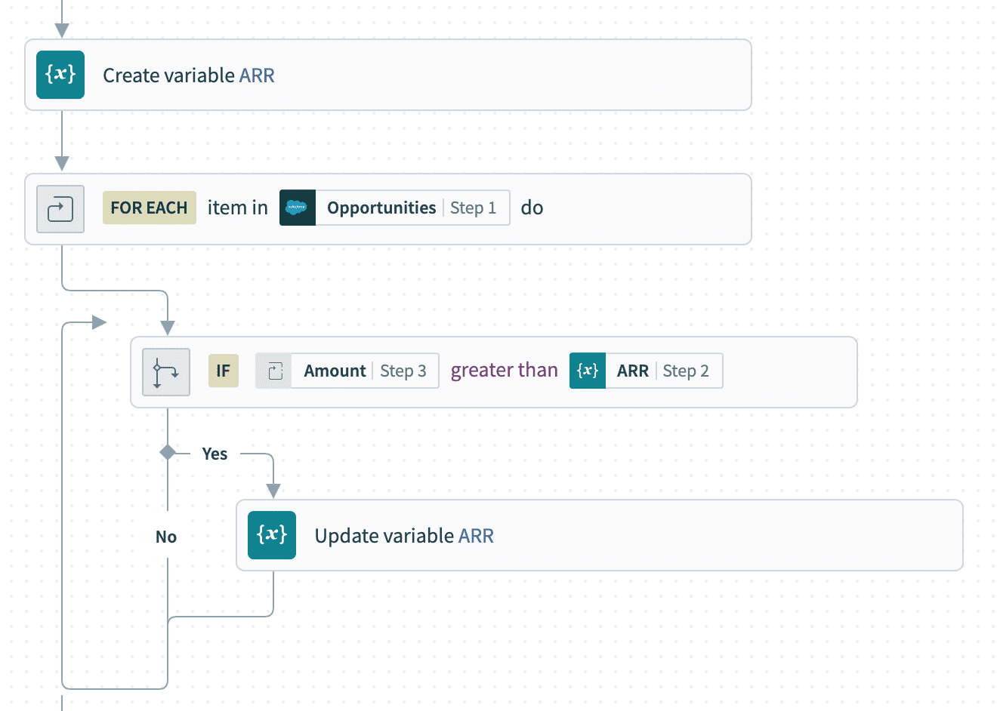

## 🏗️🍳 **What is recipe design?**

Recipe design is the practice of building Workato automations that are **stable, scalable, maintainable, reusable, and easy to understand**. The goal isn't just to make something that works today — it's to make something that keeps delivering value as your business changes.

---

### 🧩 Core principles

Good recipe design follows four principles in order:

1. **🎯 Understand the root problem.** Before building, identify the actual business problem. Solving the wrong issue is the most expensive mistake — automations built on the wrong premise become overly complex, suffer scope creep, and are hard to maintain.
2. **🗺️ Map the workflow.** Ask: what starts the process, what systems are involved, what actions follow, what exceptions need handling, where does it end? A flowchart or process map before you build saves rework later.
3. **📊 Identify expected outcomes.** Where should results appear? Updated Salesforce records, Slack notifications, ERP sync, reports — knowing this up front lets you validate that the automation actually worked.
4. **🔐 Verify application access.** API access, authentication credentials, service accounts, and permissions all need to be in place. Without them, recipes can't execute and data sync silently breaks.

---

### 🎯 What "well-designed" means

A well-designed recipe should be **reliable** (performs consistently), **flexible** (adapts to change), **efficient** (uses resources well), **transparent** (easy to monitor and debug), and **reusable** (works across multiple use cases).

> 🏛️ Think enterprise-grade: design for future enhancements, data growth, new integrations, and organizational change — not just today's requirements.

---

### 🧠 Quick recall

- Name the four core principles in order. (Root problem → map workflow → identify outcomes → verify access)
- Why is "understand the root problem" listed first? (Solving the wrong problem is the most expensive mistake — everything downstream depends on it.)

---

## 🗺️💊 **Data Mapping**

> 📌 Data mapping in Workato is achieved using **datapills** — output data generated by triggers or action steps that act as reusable, dynamic variables throughout a recipe.

When a Salesforce trigger retrieves an account, every field on that account becomes an available datapill. You map those datapills into the input fields of later actions — for example, mapping `Account Name` → `Organization Name` when creating a Zendesk organization from a Salesforce account.

|💊 Salesforce datapill|🎫 Zendesk field|
|---|---|
|Account Name|Organization Name|
|Phone Number|Contact Number|
|Industry|Organization Type|

---

### 🌳 The Datatree

Every recipe step contributes data to a pool called the **datatree**. As the recipe runs, the trigger fires first and adds its output, then each action adds its own output, and any later step can pull from any earlier step's data.

> 📌 At each step, the datatree shows **all data available up to that point** in the workflow — never data from later steps.

---

### 📥 Input fields and field mapping

Triggers and actions have **input fields** that determine how they execute. **Field mapping** is the process of filling those input fields with either:

- **💊 Datapills** — dynamic values that change with every job run (e.g. `Account Name` will be a different company each time the recipe runs).
- **🔒 Constants** — fixed values you type in manually (e.g. `Status = "Active"`, `Country = "Belgium"`).

---

### 🧩 Common data types

Workato shows a small icon next to each datapill indicating its type. This matters because formulas only work on compatible types.

|Type|Description|Example|
|---|---|---|
|🔤 String|Plain text|Names, emails|
|🔢 Integer|Whole numbers|Quantity, count, IDs|
|🔣 Float|Numbers with decimals|Prices, percentages|
|📦 Object|Structured grouped data|A Salesforce account record|
|📅 Date|Date without time|2026-05-26|
|⏰ DateTime|Date + time|2026-05-26 14:30:00|
|✅❌ Boolean|True/false|Is Active, Approved|
|📚 Array|List of values|Multiple records|

---

### 🧠 Quick recall

- A datapill is `_____`. (Output data from a trigger or action, reusable in later steps)
- What's the difference between a datapill and a constant? (Datapill = dynamic, changes per job. Constant = fixed value you type in.)
- The datatree at step 5 shows you data from which steps? (Steps 1–4 and the trigger — never later steps.)

---

## 🧮✨ **Data Transformations & Formula Mode**

Different applications structure data differently — a sales app might store `Full Name = "John Doe"` while a marketing app needs `First Name` and `Last Name` as separate fields. Workato handles these gaps with **formulas**.

> 📌 Formulas in Workato are **whitelisted Ruby methods** — Workato approves specific Ruby methods, but not all Ruby functionality is available.

Common transformation needs include splitting names, combining address fields, mapping equivalent priority values across systems (`High/Medium/Low` ↔ `Urgent/Normal/Low`), formatting dates, and converting currencies.

---

### 🧮 Formula categories

Formulas are grouped by the data type they operate on:

- **🔤 String formulas** — split names, replace text, change case, concatenate.
- **🔢 Number formulas** — calculations, rounding, currency formatting.
- **📅 Date/DateTime formulas** — format dates, add days, calculate durations, convert timezones.
- **📚 List formulas** — filter, sort, loop, aggregate collections.

Formulas can be chained together for advanced transformations.

---

### ⚙️ Formula Mode

> 📌 Formula Mode is enabled **at the field level** — most input fields support it. When enabled, the field's icon changes and the editor switches to formula input.



The formula editor is **type-aware**: it suggests formulas based on the datapill's data type. String datapills get text formulas; number datapills get math operations; etc.

|✍️ Text Mode|🧮 Formula Mode|
|---|---|
|Plain text input|Explicit formula syntax|
|Simple datapill insertion|Advanced transformations|
|Automatic formatting|Text must be explicitly formatted|

---

### 🧠 Quick recall

- Formulas in Workato are based on `_____`. (Whitelisted Ruby methods — not full Ruby)
- Formula Mode is enabled at the `_____` level. (Field)
- A datapill shows a 🔤 icon. Which formula category will the editor suggest? (String formulas)

---

## 🔀⚙️ **Conditional Actions**

Conditional actions let recipes branch based on data — different inputs follow different paths. Workato provides three condition types that combine into decision trees:

- **✅ IF** — executes actions only when a condition is true.
- **🔄 ELSE IF** — checks an alternative condition when the IF is false.
- **🚪 ELSE** — fallback branch when no IF or ELSE IF matched.

```
IF priority = High
→ Notify escalation team
ELSE IF priority = Medium
→ Notify support team
ELSE
→ Assign to default queue
```



---

### 🧠 How conditions evaluate

Conditions are evaluated **during recipe execution** against datapills, field values, formula results, and boolean expressions.

Common patterns:

- **Approval workflows** — `IF amount > 10,000 → Manager approval`
- **Priority routing** — `IF priority = Urgent → Escalation queue`
- **Data validation** — `IF email is present → Continue, ELSE → Stop`
- **Upsert logic** — `IF customer exists → Update, ELSE → Create new`

---

### ✅ Best practices

- **Keep logic readable.** Avoid deep nesting; if a condition has 4+ branches, consider splitting the recipe.
- **Handle default cases.** Always include an ELSE for unexpected inputs.
- **Validate datapill existence** before using it in a condition — missing data is a common cause of silent failures.

---

### 🧠 Quick recall

- What are the three conditional action types? (IF, ELSE IF, ELSE)
- Why should every recipe have an ELSE branch? (To handle unexpected/default cases — otherwise unexpected inputs are silently ignored.)

---

## 🔁 **Repeat Actions**

When integrations need to process batches of records — customer imports, order processing, file uploads, batch updates — recipes use **repeat actions** to loop over collections.

Workato provides two repeat types:

### 🔁 Repeat for each

> 📌 **Repeat for each** executes a set of actions for every item in a list. It's equivalent to a `foreach` loop in programming.

Input: a list/array (customer records, orders, attachments, CSV rows, API response arrays). Workato processes one item at a time, running the configured actions for each. Inside the loop, each iteration exposes datapills for the **current** item.

Classic example: for each Salesforce file attachment, download it and upload to Box.

---

### 🔄 Repeat while

> 📌 **Repeat while** keeps executing actions **while a condition remains true**. It's equivalent to a `while` loop. The condition is evaluated after each iteration.

Use cases:

- **📄 Pagination** — keep fetching API pages while `next_page_exists = true`
- **🔁 Retry logic** — keep retrying while `status != Success`
- **📬 Queue processing** — keep processing while `queue is not empty`

---

### ⚖️ Side by side

|Feature|🔁 Repeat for each|🔄 Repeat while|
|---|---|---|
|Purpose|Process every item in a list|Repeat while condition is true|
|Based on|Arrays/lists|Boolean condition|
|Similar to|`foreach` loop|`while` loop|
|Typical use|Batch processing|Pagination, retries, queues|

---

### ✅ Best practices

- **Keep loops efficient** — avoid unnecessary actions inside the loop; they multiply by the list size.
- **Handle errors carefully** — one failed item shouldn't always stop the entire batch (combine with Handle Errors).
- **Watch task consumption** — every action inside a loop counts against task usage per iteration.
- **Mind concurrency** — large volumes may need concurrency settings adjusted.

---

### 🧠 Quick recall

- A list of 100 customer records needs the same processing applied to each. Which repeat type? (Repeat for each)
- An API returns paginated results and you don't know how many pages. Which repeat type? (Repeat while — loop until `next_page_exists = false`)
- A loop has 5 actions and runs over 200 items. How many task-billable actions execute? (1000 — actions × iterations)

---

## ⚠️🛡️ **Error monitoring and handling**

Errors happen, and because automations support critical business processes, every recipe needs a strategy for them.

### 🧩 Three types of errors

- **🌐 System-generated** — network failures, API downtime, auth issues, timeouts, service outages. Often temporary; may resolve on retry.
- **👤 User-created** — incorrect field mappings, invalid formulas, missing required fields, wrong conditional logic.
- **📄 Bad data input** — unexpected or invalid values from upstream systems, like receiving `"invalid amount"` where a number was expected.

---

### ⚠️ Handle Errors action

> 📌 The **Handle Errors** action wraps a block of steps so the recipe can catch failures inside it and respond — sending alerts, logging, retrying, stopping execution, or routing to a support team — instead of failing silently or crashing.

---

### 🛑 Stop Job vs Stop Job with Error

Two related actions for intentionally ending a recipe early:

- **🛑 Stop Job** — stops execution because further processing shouldn't continue (e.g. validation failed, duplicates found, customer email missing).
- **🚨 Stop Job with Error** — same as Stop Job but **forces an error status**, useful for surfacing data quality issues, enforcing business rules, or triggering operational alerts.

When configuring either, you choose how the job appears in reports:

- **✅ Mark as Successful** — for intentional early exits at valid business-rule stopping points.
- **❌ Mark as Failed** — for critical workflow failures, data inconsistencies, or validation errors that need attention.

---

### ✅ Best practices

- **🔍 Validate inputs early** — catch bad data before downstream actions consume tasks.
- **🔀 Use conditional logic** to prevent invalid scenarios before actions execute.
- **📢 Notify teams** for critical failures so they're not buried in job reports.
- **🚨 Fail fast** when something is fundamentally wrong — cascading failures are worse than an early stop.
- **📝 Log meaningful errors** — future-you needs the context.

Error handling typically combines with conditional actions, Stop Job, repeat loops, notifications, and monitoring dashboards.

---

### 🧠 Quick recall

- Name the three error categories. (System-generated, user-created, bad data input)
- What's the difference between Stop Job and Stop Job with Error? (Stop Job ends execution cleanly; Stop Job with Error forces a failure status, useful for alerting.)
- An invoice has a missing customer email. Which Workato feature fits best? (Stop Job — typically marked as failed if it's a data quality issue worth alerting on.)

---

## 💊🔄 **Variables by Workato**

> 📌 Variables by Workato are **user-declared datapills that store data values** — and unlike regular datapills, they are **mutable** (values can change during recipe execution).

Standard datapills are read-only outputs from triggers and actions. Variables fill the gap when a recipe needs to store intermediate values, track running calculations, maintain state across loops, or build accumulators — patterns common in traditional programming.

---

### 🛠️ Built-in utility

Variables by Workato is a **built-in utility** — no external connection is required. To use it during recipe development, add a step and search for `Variables by Workato`.

---

### 🧩 Creating and updating variables

Variables are **typed** — every variable must declare a data type when created.

|Common types|Example|
|---|---|
|🔤 String|Customer name|
|🔢 Integer|Quantity|
|🔣 Float|ARR value|
|✅❌ Boolean|Approval status|
|📅 Date|Invoice date|
|📚 List|Collection of records|

**Two actions matter:**

1. **➕ Create Variable** — declares the variable's name, type, and initial value. You must create a variable before you can use it.
2. **🔄 Update Variable** — changes the stored value mid-recipe. **You can only update variables that were previously created with Create Variable.**

```
Variable Name: ARR
Type: Float
Initial Value: 0
```



---

### 🌍 Classic use case: tracking a running maximum

Imagine a report of opportunities and you want to find the one with the highest ARR. ARR values are dynamic, so:

1. Create a variable `ARR` (Float, initial value 0)
2. Use a **Repeat for each** loop over the opportunities
3. Inside the loop: `IF current_record.ARR > ARR variable → Update ARR variable`
4. After the loop, use the final `ARR` value to retrieve the matching record

```
FOR EACH opportunity
    IF ARR > stored ARR
        Update ARR variable
```

This is the classic accumulator pattern — variables + repeat loops + conditional logic.

---

### 🧠 Quick recall

- What makes Workato variables different from regular datapills? (They're mutable — values can change during execution.)
- Can you Update a variable that was never Created? (No — Create must come first.)
- What three Workato features combine for accumulator patterns? (Variables, Repeat loops, Conditional logic.)

---

## 🚀 **Module key takeaways**

This module covered the six building blocks of recipe design. The big things to remember:

- **Design before you build** — root problem, workflow map, expected outcomes, application access.
- **Datapills move data** between steps; the **datatree** shows what's available at each step (everything up to that point, never later).
- **Formula Mode** uses whitelisted Ruby methods, enabled per field, with type-aware suggestions.
- **Conditional actions** (IF / ELSE IF / ELSE) — always include an ELSE for safety.
- **Repeat actions** — `Repeat for each` for lists, `Repeat while` for condition-driven loops (pagination, retries).
- **Error handling** — three error types, Handle Errors action, Stop Job (clean exit) vs Stop Job with Error (forced failure).
- **Variables** are the only **mutable** datapills; Create before Update; combine with loops for accumulator patterns.

---

> ⬅️ [Previous: 02. Workato Core Platform Architecture](./02.%20Workato%20Core%20Platform%20Architecture.md) | ➡️ [Next: 04. Account, Recipe, and Job Information](./04.%20Account,%20Recipe,%20and%20Job%20Information.md)

---
