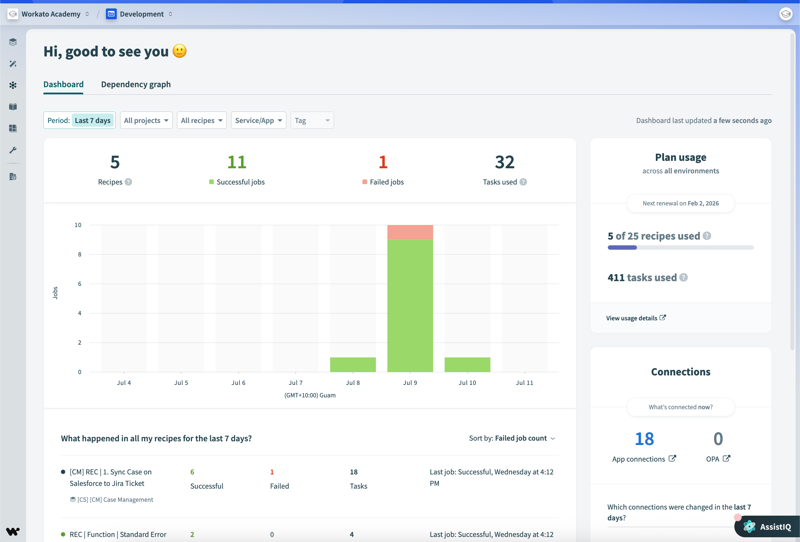
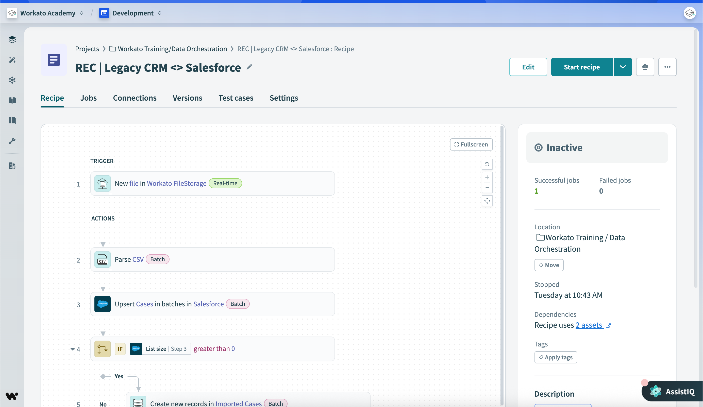
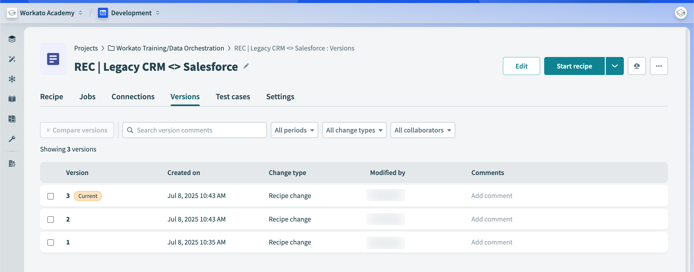
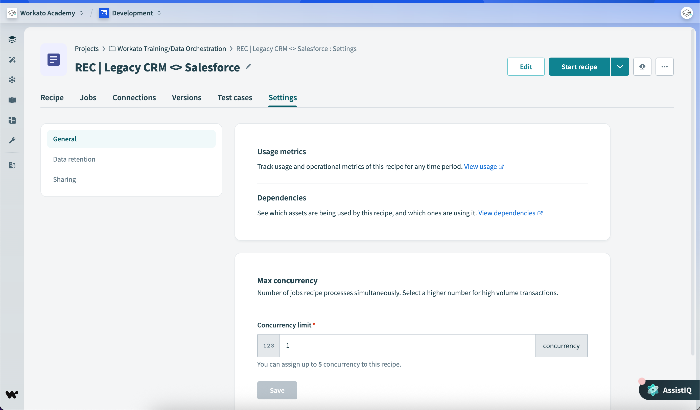

## 📊 **Operations hub dashboard**

The **Operations Hub Dashboard** is the central place to monitor recipe health and connections in real time. You reach it through the navigation bar, and it's where you'll go to spot failures, watch trends, and troubleshoot.

---

### 🧩 **Three Parts of the Dashboard**

The dashboard has three sections you'll use regularly: the **Jobs Graph**, the **Plan Usage Box**, and the **Application Connection Overview**.

#### 📈 Jobs Graph

The Jobs Graph is a high-level view of recipe activity. You can filter it by time range, recipe status, and project to surface failed jobs, successful jobs, and operational trends.

Below the graph sits a **recipe details table** that you can sort by status, successful job count, failed job count, or most recent job — this is your fastest path to a problematic recipe.

> 📌 To find recipes failing the most: filter by recipe status, then sort the table by failed job count.

#### 📦 Plan Usage Box

Shows your account's subscription information: plan renewal date, billable recipes used, and a link to subscription details. Useful for keeping an eye on licensing.

#### 🔌 Application Connection Overview

Lists connection changes from the **last 7 days** — modifications, authentication updates, and anything that might explain a sudden integration issue.

---

### 🧠 Quick recall

- The dashboard has `_____` main parts. (3)
- Which section would you check first if recipes suddenly started failing this morning? (Application Connection Overview — recent auth/connection changes are a common cause.)

---

## 📝 **Recipe details and versions**

### 📋 Recipe Details Tab

The Recipe tab is your overview of a single recipe. It shows the workflow, current status, location, linked dependencies, and the running counts of successful and failed jobs. From here you can also jump to related connections and assets.

---

### 🕘 Recipe Versions Tab

> 📌 Every time a recipe is edited and saved, a new recipe version is created.

The **Recipe Versions** tab lists every version with its creation time, change type, and the user who made the change. You can preview an older version or restore it — making this your rollback and change-tracking tool.

> ✅ **Best practice:** add a comment when saving a new version. It costs five seconds and saves real time when you're debugging next month.

#### Types of recipe changes

There are two kinds:

- **🏗️ Schema changes** — triggered automatically by Workato when an app's schema changes (e.g. a field is added or removed from an object).
- **⚙️ Logic changes** — made manually by users: new steps, updated conditions, modified workflow logic.

---

### ⚙️ Recipe Settings

The Settings tab has three sections:

1. **General** — concurrency and simultaneous job processing. Higher concurrency speeds up high-volume workflows.
2. **Data Retention** — how long job history is kept, set per your organization's policy.
3. **Sharing** — share recipes internally or publish them to the Workato Community Library.

---

### 🧠 Quick recall

- A new recipe version is created every time you `_____`. (edit and save the recipe)
- What's the difference between a schema change and a logic change? (Schema = automatic, triggered by app changes. Logic = manual, made by the user.)

---

## ⚙️📊 **Jobs and Job Reports**

> 📌 A **job** is one execution of a recipe for a specific trigger event.

When an active recipe processes a trigger event and runs its actions, Workato creates a job. Each job contains the trigger event data, the executed steps, the input and output data, and the final status.

---

### 🔄 Job execution flow

1. ▶️ A trigger event occurs
2. ⚙️ The recipe's actions execute step-by-step
3. 🧩 A job is created recording the whole run

---

### ✅❌ Successful vs failed jobs

A **successful job** is one where every action completed. A **failed job** is one where an error stopped execution — and by default, no subsequent steps run.

> ⚠️ The exception: if error handling is configured on the recipe, execution can continue past the failure point.

> 📌 **Task counting on failure:** all successfully-run actions _before_ the failed step are still counted as tasks against your usage. Failures don't refund the work that already happened.

---

### 📊 Job Report

The **Job Report** summarizes every processed job — each trigger event appears as its own job, with ID, date, time, and status. Job data sticks around according to your data retention policy.

You can customize what the report shows via the **More** menu (recipe data, app data, custom columns), up to a hard limit of **10 columns**.

---

### 🔍 Job details

Clicking into a single job opens its full execution record: job ID, recipe version that ran, status, processing time, the step-by-step flow, and input/output data at each step. This is the view you'll spend the most time in when troubleshooting.

---

### 🔁 Repeating jobs

Workato lets you rerun jobs — useful after you've fixed an issue and want to retry the failed processing.

> ⚠️ A repeated job replays the **original trigger event data** against the **latest recipe version**. It does **not** pick up new incoming events or fresh data — only the stored job data is reprocessed.

---

### 🧠 Quick recall

- A job fails at step 4 of 6. How many tasks are counted? (Three — the successfully run actions before the failure.)
- You rerun a failed job after fixing the recipe. Which recipe version runs, and which trigger data is used? (Latest recipe version, original trigger data.)

---

## 🚀 **Module key takeaways**

The Operations Hub dashboard, recipe versions, and job reports are the three tools you use to keep recipes healthy and debug problems:

- The **dashboard** surfaces failing recipes (filter by status, sort by failed job count).
- **Recipe versions** track every save and let you roll back — always comment your changes.
- **Job reports** show every execution; **task counts include all successful steps before a failure**.
- **Repeated jobs** use original trigger data + latest recipe — they don't replay live events.

---

## 📝 **Knowledge check: Account, recipe, and job information**

> ❓**You have just edited your recipe's workflow to include a new job step. How would you employ version control best practices according to the guidelines?**

- <input type="radio" name="q1"> Only make changes in the recipe details tab without updating the version information.
- <input type="radio" name="q1"> Save all edits anonymously to keep the workflow confidential
- <input type="radio" name="q1"> Add a comment when creating a new recipe version to improve version management.
- <input type="radio" name="q1"> Clone the recipe and store changes in the cloned version without commenting.

 
💡 Reveal Answer
 - Add a comment when creating a new recipe version to improve version management. 

> ❓**How would you use the jobs graph in the Operations hub dashboard to identify recipes with frequent failures?**

- <input type="radio" name="q2"> Sort recipes alphabetically to spot frequent failures.
- <input type="radio" name="q2"> Filter by recipe status and sort by failed job count to find problematic recipes.
- <input type="radio" name="q2"> Review changes from the application connection overview to find failures.
- <input type="radio" name="q2"> Search only for billable recipes using the plan usage box.

 
💡 Reveal Answer
 - Filter by recipe status and sort by failed job count to find problematic recipes. 

> ❓**Explain how task usage is counted when a recipe job fails at a certain step.**

- <input type="radio" name="q3"> All actions, successful and failed, are always counted as tasks.
- <input type="radio" name="q3"> Only the actions after the failure are counted as tasks.
- <input type="radio" name="q3"> All successfully run actions prior to the failed step are still counted as tasks.
- <input type="radio" name="q3"> No tasks are counted if the job fails at any step.

 
💡 Reveal Answer
 - All successfully run actions prior to the failed step are still counted as tasks. 

---

> ⬅️ [Previous: 03. Recipe Design](03.%20Recipe%20Design.md) | ➡️ [Next: Workato Foundations Level 2](../workato-foundations-level-2/00.%20OVERVIEW.md)

---