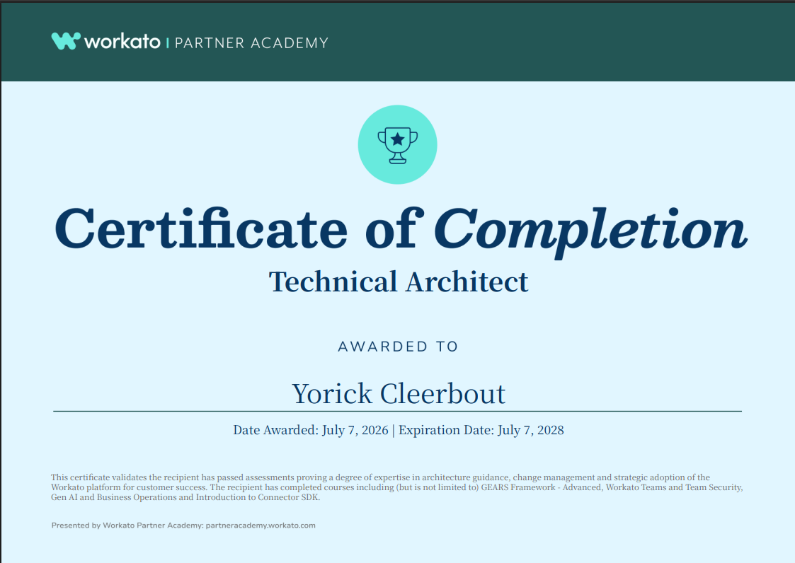

# 🎓 Workato Technical Architect

Study notes for the **Workato Technical Architect** certification course. These notes cover the **architectural and governance side** of running Workato at enterprise scale — how to structure teams, secure the workspace, organize assets, apply role-based access control, ensure compliance, deploy accelerators, and scale the automation practice using the **GEARS Framework**.

---

> ⚠️ **Note on coverage**
> 
> The **Workato Technical Architect** course is delivered through a mix of **recorded webinars**, and content that **overlaps significantly with the Workato Technical Developer course**. **Study notes exist only for topics with original written source content** — recorded-only sessions and topics fully covered elsewhere don't have dedicated notes in this repository.
> 
> **The notes in this repository focus on** the architect-specific content: team management, workspace organization, access control (RBAC), user management, compliance, EDH Accelerator, and the GEARS Framework.

---

## 🏅 Certificate

---

## 📚 Table of Contents

| #   | Lesson                                                                                                                          | Key Topics                                                                                                           |
| --- | ------------------------------------------------------------------------------------------------------------------------------- | -------------------------------------------------------------------------------------------------------------------- |
| 1.1 | [Introduction to Workato Teams](./01.%20Workato%20Teams%20and%20Teams%20Security/1.1.%20Introduction%20to%20Workato%20Teams.md) | Need for governance, six benefits of a governed workspace                                                            |
| 1.2 | [Organizing Workspace Assets](01.%20Workato%20Teams%20and%20Teams%20Security/1.2.%20Organizing%20Workspace%20Assets.md)         | Functional area projects, folders vs projects, sharing within/across teams, common vocabulary                        |
| 1.3 | [Access Control Overview](01.%20Workato%20Teams%20and%20Teams%20Security/1.3.%20Access%20Control%20Overview.md)                 | Principle of least privilege, RBAC 3-step process, RACI matrix, example role definitions                             |
| 1.4 | [User Management](01.%20Workato%20Teams%20and%20Teams%20Security/1.4.%20User%20Management.md)                                   | SAML SSO, 2FA, session logout, SSO/JIT provisioning, workspace owner safeguards                                      |
| 1.5 | [Ensuring Compliance](./01.%20Workato%20Teams%20and%20Teams%20Security/1.5.%20Ensuring%20Compliance.md)                         | Activity audit log, data masking, data retention (30/90 days), streaming logs to SIEM                                |
| 2.1 | [Enterprise Data Hub](./02.%20Enterprise%20Data%20Hub/2.1.%20Enterprise%20Data%20Hub.md)                                        | EDH Accelerator, golden record, decoupled architecture, supported databases (Snowflake, SQL Server, PostgreSQL)      |
| 3.1 | [The GEARS Framework](./03.%20The%20GEARS%20Framework/3.1.%20The%20GEARS%20Framework.md)                                        | GEARS acronym (Govern, Enable, Adopt, Run, Scale); Automation HQ concept                                             |
| 3.2 | [Challenges in Scaling Automation](./03.%20The%20GEARS%20Framework/3.2.%20Challenges%20in%20Scaling%20Automation.md)            | Four common challenges; three steps to building an automation practice; build-to-adapt mindset                       |
| 3.3 | [GEARS Framework Domains](./03.%20The%20GEARS%20Framework/3.3.%20GEARS%20Framework%20Domains.md)                                | Domains → levers hierarchy; progressive adoption; illustrative levers                                                |
| 3.4 | [Govern](./03.%20The%20GEARS%20Framework/3.4.%20Govern.md)                                                                      | 4 levers: Intake & Prioritization, Architecture & Design, Security & Administration, Automation Lifecycle Management |
| 3.5 | [Enable](./03.%20The%20GEARS%20Framework/3.5.%20Enable.md)                                                                      | 3 levers: Resource Center, Onboarding & Education, Accelerators & Reusable Assets                                    |
| 3.6 | [Adopt](./03.%20The%20GEARS%20Framework/3.6.%20Adopt.md)                                                                        | 3 levers: Value Reporting (KPIs), Champions & Evangelism, Community                                                  |
| 3.7 | [Run](./03.%20The%20GEARS%20Framework/3.7.%20Run.md)                                                                            | 4 levers: Project Execution (Agile), Capacity Planning, Support Models (L0–L3), Operations                           |
| 3.8 | [Scale](./03.%20The%20GEARS%20Framework/3.8.%20Scale.md)                                                                        | 3 levers: Automation Maturity & Improvement, Automation Discovery, Enterprise Automation Ecosystem                   |
| 3.9 | [The Phased Execution Approach](./03.%20The%20GEARS%20Framework/3.9.%20The%20Phased%20Execution%20Approach.md)                  | Three phases: Foundation, Grow, Transform + chapter recap                                                            |

---

## 🧭 Quick Navigation

➡️ **Start here:** [1.1. Introduction to Workato Teams](./01.%20Team%20Governance%20and%20Security/1.1.%20Introduction%20to%20Workato%20Teams.md)

---

## 🎯 Learning Outcomes

By the end of this course, you should be able to:

- ✅ Explain **why governance matters** in a multi-team Workato workspace and articulate the **six benefits** of a governed setup
- ✅ Organize workspace assets using **functional area projects** at the top level (for permission boundaries) and **folders inside them** (for organization, not security)
- ✅ Design a **sharing strategy** for assets — sub-folders for within-functional-area sharing; a top-level "commons" or "shared assets" project for cross-team sharing
- ✅ Apply the **principle of least privilege** and use Workato's **Role-Based Access Control (RBAC)** capabilities
- ✅ Execute the **three-step RBAC design process**: assess org & teams → determine roles & responsibilities → review & adjust
- ✅ Use a **RACI matrix** (Responsible, Accountable, Consulted, Informed) to document the automation operating model
- ✅ Distinguish between common role types — **Platform Admin, Operations Analyst, Developer, Business Analyst** — and their scopes/permissions
- ✅ Namespace roles by teams (except workspace admin), separate duties by environment, and avoid role proliferation via cloning
- ✅ Standardize user access with **SAML SSO** — including **enforced SSO**, **2FA fallback**, and **SSO/JIT provisioning** for automated onboarding
- ✅ Protect the **workspace owner (root) account** — never use for daily tasks, enforce 2FA, rotate passwords, restrict to security team
- ✅ Configure **Activity audit logs** (add-on) and understand default 1-year retention plus the three viewer roles (account owner, Admin, Activity audit privilege)
- ✅ Enable **data masking** at the recipe step level via the Comment section to hide sensitive fields in job history
- ✅ Choose the right **data retention** setup: **30 days** (default), **90 days customizable** with Enterprise Workspace or Advanced Security & Compliance (ASC) add-on
- ✅ Stream job history and login/user activity to a centralized **SIEM** (S3, Sumo Logic, Splunk, Datadog) for long-term storage and holistic troubleshooting
- ✅ Recognize when the **Enterprise Data Hub (EDH) Accelerator** is the right fit — 5+ downstream apps, golden-record needs, decoupled architecture for source-system changes — vs. when a full MDM platform is warranted
- ✅ Know EDH's three out-of-the-box supported databases (**Snowflake, SQL Server, PostgreSQL**) and that it's extendable to others
- ✅ Explain the **GEARS Framework** — the five domains (**G**overn, **E**nable, **A**dopt, **R**un, **S**cale) and their role in balancing execution speed with governance
- ✅ Navigate the **four common challenges** of scaling automation (delivery backlog, specialized resources, business change velocity, democratization vs. governance) and the **three-step journey** (Foundation → Culture → Value)
- ✅ Understand the **domain → lever hierarchy** and the **17 levers** distributed across the 5 domains
- ✅ Recall the four Govern levers, three Enable levers, three Adopt levers, four Run levers, three Scale levers
- ✅ Distinguish the **four support levels** (L0 Self-support → L1 Ops team → L2 Workato support → L3 Workato escalation via CSM) and the escalation flow between them
- ✅ Design a maturity roadmap through the **three phases**: **Foundation → Grow → Transform** — matching them to increasing organizational maturity and toward wall-to-wall automation

---

## 🔑 Numbers worth remembering

A quick reference for the specific quantities that come up in scenario questions:

|Number|What it refers to|Where to find it|
|---|---|---|
|**1 year**|Default Activity audit log retention (extendable via Customer Success Manager)|1.5|
|**30 days**|Default job data retention (no plan add-ons)|1.5|
|**90 days**|Max retention with Enterprise Workspace or Advanced Security & Compliance add-on|1.5|
|**1 hour**|Minimum retention with the ASC add-on (fully customizable down to this)|1.5|
|**3**|Roles that can view Activity audit logs (account owner + Admin role + Activity audit privilege)|1.5|
|**6**|Benefits of governance in a shared workspace|1.1|
|**5+**|Downstream apps at which EDH Accelerator becomes worthwhile|2.1|
|**3**|Out-of-the-box databases supported by EDH (Snowflake, SQL Server, PostgreSQL)|2.1|
|**5**|GEARS domains (Govern, Enable, Adopt, Run, Scale)|3.1|
|**17**|Total levers across all 5 GEARS domains (4+3+3+4+3)|3.4 – 3.8|
|**4**|Support levels (L0 Self, L1 Ops, L2 Workato, L3 Escalation via CSM)|3.7|
|**3**|Phases of GEARS execution (Foundation, Grow, Transform)|3.9|
|**6**|Automation Discovery mechanisms (WorkJam, cross-functional demos, user training, conferences, hackathons, BPO)|3.8|

---

> ➡️ [Next: 1.1. Introduction to Workato Teams](./01.%20Team%20Governance%20and%20Security/1.1.%20Introduction%20to%20Workato%20Teams.md)

---