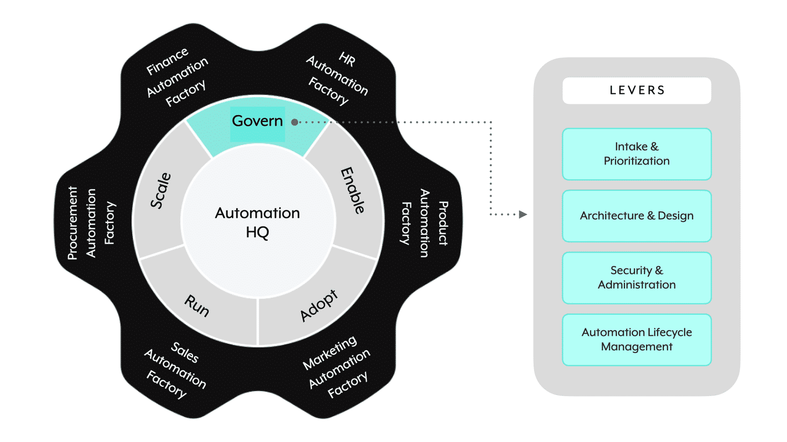

## 🛡️ **The Govern domain**

**Govern** is the first of the five GEARS domains. It focuses on **how the organization controls, secures, and shapes what automations get built** — the governance and oversight layer.

> 📌 **Govern has four levers:**
> 
> 1. **📥 Intake & Prioritization**
> 2. **🏛️ Architecture & Design**
> 3. **🔐 Security & Administration**
> 4. **🔄 Automation Lifecycle Management**

---

## 📥 **Lever 1: Intake & Prioritization**

**Intake & Prioritization** has two parts working together.

### Part 1 — Intake process

An **intake process** for stakeholders to submit **new project requests, automation ideas, and improvement suggestions**. A well-defined intake process **eliminates back-and-forth** between stakeholders and streamlines collaboration.

### Part 2 — Prioritization

A **prioritization framework** for defining the **business value** and **complexity** of requests — so everyone shares an understanding of a project's priority and success metrics.

> 📌 Intake & prioritization together enable teams to:
> 
> - **📊 Organize and update the backlog** — work on highest business-impact requests.
> - **👁️ Create cross-functional visibility** — all stakeholders know the status of their requests.

---

## 🏛️ **Lever 2: Architecture & Design**

**Architecture & Design** defines the **architectural styles and design principles** that builders follow when creating new Workato assets.

> 📌 **Standards should be defined by the Automation HQ team** and **enforced through governance checkpoints**.

Successful implementation provides:

- **📚 A central storehouse for standards** — plus relatable use cases with suggested implementation patterns (e.g. **when point-to-point beats microservices** for a specific scenario, or vice versa).
- **🧩 Identification of reusable assets** — the Automation HQ team should spot **potentially reusable assets and common services** that feed into the **Accelerators & Reusable Assets** lever (covered in 3.5).

---

## 🔐 **Lever 3: Security & Administration**

**Security & Administration** establishes **guardrails that extend the freedom to build automations** without exposing the organization to unmanaged risks.

> 📌 **Workato follows a shared responsibility model**:
> 
> - **🛡️ Workato manages platform security**.
> - **👤 Users manage aspects of platform usage** to ensure governance and compliance.

### User-owned security & administration categories

Five categories fall under user responsibility:

- **📁 Automation asset management approach** (covered in Workato Teams chapter 1.2 — Organizing Workspace Assets)
- **🎭 Role-based access policies** (covered in Workato Teams chapter 1.3 — Access Control Overview)
- **🎫 User authentication and management** (covered in Workato Teams chapter 1.4 — User Management)
- **🔌 App connections & data security**
- **📝 Audit and compliance management** (covered in Workato Teams chapter 1.5 — Ensuring Compliance)

> 💡 Notice how much of the Security & Administration lever maps directly to chapter 1 of this course. Chapter 1 is essentially a deep-dive into most of this lever.

---

## 🔄 **Lever 4: Automation Lifecycle Management**

The process of implementing automation generally involves **several stages and multiple teams**. To improve success chances and reduce business service disruptions, you need a **plan for implementing changes and operating live automations**.

> 📌 **Automation Lifecycle Management** is a series of steps that teams follow — **from discovering automation ideas to implementing and running them in production**.

Applying best practices helps organizations:

- **📈 Streamline end-to-end automation delivery.**
- **🤝 Enable seamless collaboration between teams** — vital for cohesive organizations working towards common goals.

> 💡 Deep dive on this lever: **Technical Developer chapter 8** covers **Environment Management, Recipe Lifecycle Stages, Manifests & Packages, and Release Management** in detail.

---

### 🧠 Quick recall

- How many levers does the Govern domain have? (`_____`) (4)
- Name the four Govern levers. (Intake & Prioritization; Architecture & Design; Security & Administration; Automation Lifecycle Management)
- What are the two parts of Intake & Prioritization? (An intake process for stakeholder submissions; a prioritization framework based on business value and complexity.)
- Who should define architectural standards? (The Automation HQ team.)
- How are architectural standards enforced? (Through governance checkpoints.)
- What model does Workato follow for security? (Shared responsibility — Workato secures the platform, users manage their platform usage.)
- Name the five user-owned security & administration categories. (Automation asset management; role-based access policies; user authentication & management; app connections & data security; audit and compliance management.)
- Where in your Workato study is Automation Lifecycle Management covered in depth? (Technical Developer chapter 8)

---

## 🚀 **Module key takeaways**

- **Govern has 4 levers**: Intake & Prioritization, Architecture & Design, Security & Administration, Automation Lifecycle Management.
- **Intake & Prioritization** = submission process + prioritization framework (business value + complexity).
- **Architecture & Design** = Automation HQ-defined standards enforced via governance checkpoints.
- **Security & Administration** = shared responsibility model. Five user-owned categories map heavily to Workato Teams chapter 1.
- **Automation Lifecycle Management** = idea → build → operate. Technical Developer chapter 8 is the deep dive.

---

> ⬅️ [Previous: 3.3. GEARS Framework Domains](./3.3.%20GEARS%20Framework%20Domains.md) | ➡️ [Next: 3.5. Enable](./3.5.%20Enable.md)

---