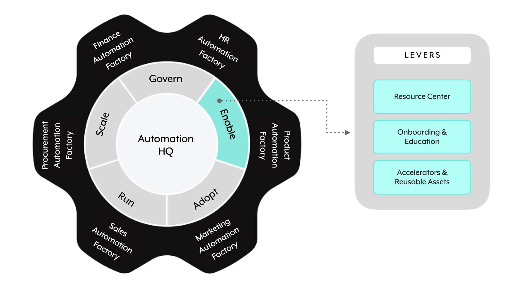

## 📚 **The Enable domain**

**Enable** is the second GEARS domain. It focuses on **equipping builders and stakeholders with knowledge, resources, and reusable assets** — the "make people successful" layer.

> 📌 **Enable has three levers:**
> 
> 1. **📖 Resource Center**
> 2. **🎓 Onboarding & Education**
> 3. **🧩 Accelerators & Reusable Assets**

---

## 📖 **Lever 1: Resource Center**

The **Resource Center** enables builders and provides useful information about the automation practice for anyone involved or interested in learning more. It lives on whatever **internal website or collaboration platform** the company already uses.

> 📌 Two audiences, two types of content:

### For builders

- **📖 Training guides**, examples, templates
- **📏 Standards, procedures, best practices**
- **📚 Reference docs** — contacts, connectors, common/reusable assets
- **📋 A catalog of existing automations**
- **🎬 "How-tos" and recorded training**

### For anyone interested in learning more or becoming involved

- **ℹ️ General information** on automation capabilities
- **🎥 Recorded demos** or information sessions
- **📝 Intake / idea forms**
- **🚀 "How to get started" assets**
- **📇 Contacts**
- **🏆 Success stories**
- **📋 Catalog of existing automations**

The overlap on "catalog of existing automations" is intentional — it serves both discovery for builders and inspiration for newcomers.

---

## 🎓 **Lever 2: Onboarding & Education**

**Onboarding and Education** provides users and builders with what they need to **be successful and contribute quickly and effectively** to the automation practice.

> 📌 Includes:
> 
> - **🏫 Training and certification** on the platform, standards, and best practices
> - **📋 Automation implementation processes and procedures**
> - **🔄 Regular updates** on available functionality and capabilities
> - **📖 An onboarding plan and guide** with resources for reference and continued education

The goal isn't a single training event — it's an ongoing enablement mechanism that keeps up with platform evolution.

---

## 🧩 **Lever 3: Accelerators & Reusable Assets**

**Accelerators & Reusable Assets** — including commonly used patterns, use cases, and functionality — enable **even faster development** and **templating of standards and best practices**.

> 📌 **Two sources of accelerators & reusable assets:**
> 
> - **🏢 From Workato** — official Workato Use Case Accelerators (deep dive in **Technical Developer chapter 13** and **Workato Teams chapter 2** for EDH)
> - **🏗️ Created within your company** — for common internal use

### Examples

- **🏢 Workato Use Case Accelerators** — turn-key ZIP packages (Technical Developer 13.1)
- **🔁 Recipe Functions** encapsulating common functionality (callable recipes)
- **📋 Template Recipes** for common patterns

> 💡 This lever is where **the "reusable assets" identified in the Govern domain's Architecture & Design lever end up**. That's the design-time → distribution flow.

---

### 🧠 Quick recall

- How many levers does the Enable domain have? (`_____`) (3)
- Name the three Enable levers. (Resource Center; Onboarding & Education; Accelerators & Reusable Assets)
- What are the two audiences the Resource Center serves? (Builders; anyone interested in learning more about automation.)
- What content overlaps between the two Resource Center audiences? (Catalog of existing automations — serves both discovery for builders and inspiration for newcomers.)
- Should Onboarding & Education be a one-time event? (No — ongoing enablement that keeps up with platform evolution.)
- Name three examples of Accelerators & Reusable Assets. (Workato Use Case Accelerators; Recipe Functions; Template Recipes)
- Where do "reusable assets" originate in the GEARS framework? (Identified in the Govern → Architecture & Design lever, then distributed via the Enable → Accelerators & Reusable Assets lever.)

---

## 🚀 **Module key takeaways**

- **Enable has 3 levers**: Resource Center, Onboarding & Education, Accelerators & Reusable Assets.
- **Resource Center** = centralized knowledge for two audiences (builders + interested newcomers).
- **Onboarding & Education** = ongoing enablement, not one-shot training.
- **Accelerators & Reusable Assets** come from **both Workato AND internal creation** — including Recipe Functions and Template Recipes.
- The **design → distribute flow**: Architecture & Design (Govern) identifies reusable candidates → Accelerators & Reusable Assets (Enable) distributes them.

---

> ⬅️ [Previous: 3.4. Govern](./3.4.%20Govern.md) | ➡️ [Next: 3.6. Adopt](./3.6.%20Adopt.md)

---