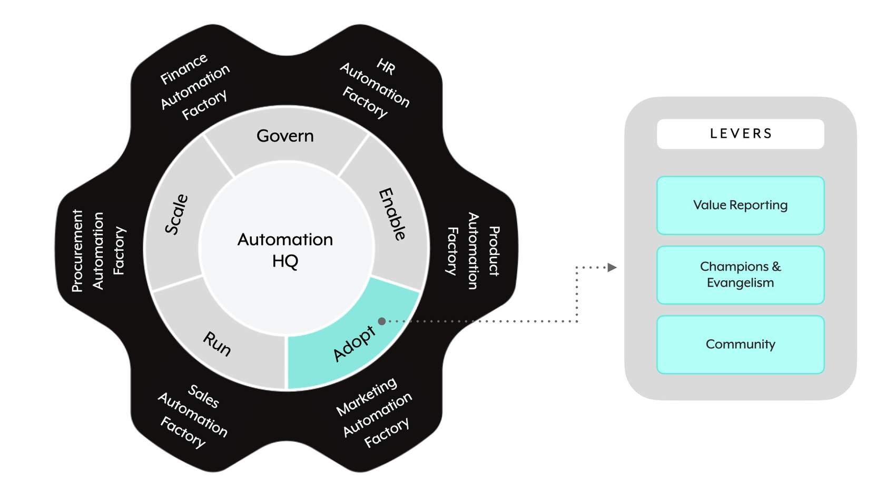

## 🤝 **The Adopt domain**

**Adopt** is the third GEARS domain. It focuses on **spreading and growing a culture of automation** across the organization — measuring value, evangelizing, and building community.

> 📌 **Adopt has three levers:**
> 
> 1. **📊 Value Reporting**
> 2. **📣 Champions & Evangelism**
> 3. **👥 Community**

---

## 📊 **Lever 1: Value Reporting**

> 📌 **Value Reporting** is about adopting a **systemic and consistent approach** to **quantify the impact of automation** using different KPIs.

### Key Performance Indicator (KPI) categories

Three KPI categories anchor Value Reporting:

- **💰 Operational Cost Savings**
- **📈 Revenue Impact**
- **⚖️ Risk & Compliance**

> 📌 **Metrics can be measured in**: dollars, time, or quantity (as a number or percentage).

### Why Value Reporting matters

Automation programs that focus on **prioritizing candidates and determining ROI** have **better success rates on adoption and scaling** in the long run. Impact areas:

- **🤝 Organizational buy-in** on automation programs
- **👂 Business interests are heard and prioritized**
- **💼 Sponsors and funding tracked with outcomes**
- **🚀 New automation solutions carved and created**

> 💡 A **regular milestone review** of the value assessed helps the automation initiative **pivot for better and more visible business outcomes**. Value Reporting isn't a one-time exercise — it's iterative.

---

## 📣 **Lever 2: Champions & Evangelism**

**Champions & Evangelism** focuses on **spreading the word** about how automation can solve business problems — and the value it brings.

### Champions

> 📌 **Champions** are those who have **already implemented automation** and now see its value. They are **drivers of adoption** who act as:
> 
> - **🎭 Role models**
> - **🧑‍🏫 Mentors**
> - **🗺️ Guides** helping others realize the benefits

### Evangelism

> 📌 **Evangelism** is the **way in which you showcase the benefits and capabilities** of automation across the organization.

Together: champions do the work and demonstrate value; evangelism spreads the story to the rest of the org.

---

## 👥 **Lever 3: Community**

**Community** is an important tool to build **collaboration and develop a culture of automation** — providing a program for **guidance, practical experience, idea exchange, and connections across teams**.

> 📌 **Communities usually start small** — like a **Slack channel or an internal website** — then **scale as the automation practice scales**, growing to events and dedicated collaboration platforms.

The scaling pattern matters: don't over-invest in community infrastructure upfront. Start where your users already are (chat, wiki), grow when there's demand.

---

### 🧠 Quick recall

- How many levers does the Adopt domain have? (`_____`) (3)
- Name the three Adopt levers. (Value Reporting; Champions & Evangelism; Community)
- Name the three KPI categories for Value Reporting. (Operational Cost Savings; Revenue Impact; Risk & Compliance)
- Metrics for Value Reporting can be measured in what three units? (Dollars; time; quantity — as number or percentage.)
- What's the difference between champions and evangelism? (Champions are individuals who implemented automation and now advocate; evangelism is the way you showcase benefits across the org.)
- What three roles do champions play? (Role models; mentors; guides.)
- Where do most communities start? (Small — a Slack channel or internal website — then scale as the practice grows.)
- Why does Value Reporting improve long-term success? (Programs that focus on ROI and prioritization achieve better adoption, scaling, sponsor funding, and organizational buy-in.)

---

## 🚀 **Module key takeaways**

- **Adopt has 3 levers**: Value Reporting, Champions & Evangelism, Community.
- **Value Reporting** anchors on **three KPI categories**: Operational Cost Savings, Revenue Impact, Risk & Compliance — measured in dollars, time, or quantity.
- **Champions ≠ evangelism** — champions are people (role models, mentors, guides); evangelism is the practice of showcasing value.
- **Start communities small** (Slack channel, internal wiki) and grow with the practice. Don't over-engineer upfront.

---

> ⬅️ [Previous: 3.5. Enable](./3.5.%20Enable.md) | ➡️ [Next: 3.7. Run](./3.7.%20Run.md)

---