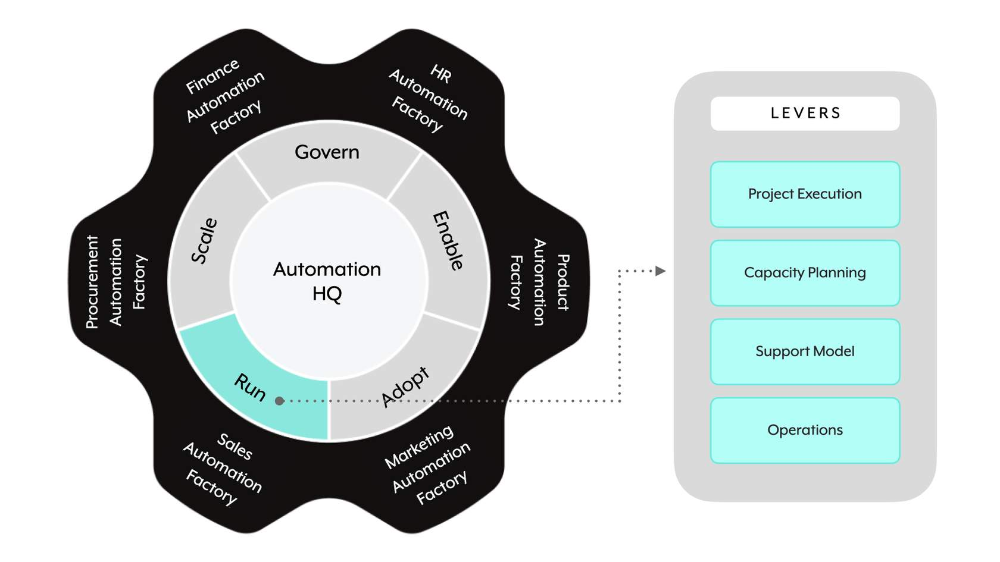

## 🏃 **The Run domain**

**Run** is the fourth GEARS domain. It focuses on the **day-to-day operational aspects** of an enterprise automation platform — execution, capacity, support, and operations.

> 📌 **Run has four levers:**
> 
> 1. **🚀 Project Execution**
> 2. **📊 Capacity Planning**
> 3. **🎫 Support Models**
> 4. **⚙️ Operations**

---

## 🚀 **Lever 1: Project Execution**

**Project Execution** — with Workato's **low-code/no-code development approach**, the platform is built to deliver with **speed and agility**.

> 📌 **Adopting lean automation with a Scrum-based Agile delivery approach** complements the platform's capabilities — giving a quick turnaround to deploy, execute the pilot, and convert it into a production version.

### What the Agile approach covers

- **📋 Project planning and backlog planning**
- **📝 Requirements gathering**
- **🧪 Testing reporting and testing plan** (testing approach & automated testing lives in the Automation Lifecycle Management lever from Govern — 3.4)
- **👥 Project resource allocation**
- **⚠️ Project risk tracking and reporting**
- **🎯 Guidance for specific project types** — platform consolidations, migrations, etc.
- **🔄 Project cutover release plan**
- **📊 Project status reporting**

---

## 📊 **Lever 2: Capacity Planning**

> 📌 **Capacity Planning** is the practice of **calculating (and predicting) the required capacity** — either **number of recipes** or **task consumption** — to support ongoing and future initiatives.

As the automation footprint grows, this includes:

- **📈 Closely monitoring and predicting consumption.**
- **📋 Capturing estimated capacity required by new initiatives** — an outcome of the Intake & Prioritization lever from Govern (3.4).
- **💰 Exploring chargeback models** — for organizations driving wall-to-wall automations.

> 💡 The **task consumption** side of capacity planning connects directly to **Technical Developer chapter 7** (Task Optimization) — the 16 optimization strategies and monitoring practices you already know.

---

## 🎫 **Lever 3: Support Models**

**Support Models** describe the different channels users can leverage for two types of support:

- **🛠️ Development support** — e.g. getting stuck on a particular recipe.
- **🐛 Product support** — e.g. automation breaks or bugs found.

---

### 📶 The four support levels

> 📌 **Four progressive escalation levels:**

|Level|Name|What it is|
|---|---|---|
|**L0**|**🌐 Self-support**|**Crowd-sourced** (Slack channels, community forums) and **self-serve** (knowledge hubs, Workato Chat support).|
|**L1**|**🏢 Ops team**|**Formal process to log a ticket** to the internal central Ops Team for assistance.|
|**L2**|**🛠️ Workato support**|**Formal process to log a support ticket with Workato**. Ideally, tickets are created **by the central Ops Team**, not by end users directly.|
|**L3**|**🚨 Workato escalation**|**Formal process to escalate critical open support tickets** through the assigned Customer Success Manager (CSM).|

> 📌 The **L0 → L3 escalation ladder** is important: **user problems should climb the ladder in order**. L2 tickets should ideally be created by the Ops team (L1) — not raised directly by end users — so Workato's queue stays focused and the internal team stays informed.

---

## ⚙️ **Lever 4: Operations**

The **Operations** lever focuses on **day-to-day operational activities** related to running an enterprise automation platform.

> 📌 Five main focus areas:
> 
> - **📡 Monitoring** — proactive and reactive tracking of production assets
> - **📊 Log aggregation strategy**
> - **📈 Analytics**
> - **⚠️ Error handling and notifications**
> - **🚀 Concurrency and performance**

> 💡 Deep dives on these topics live in Technical Developer chapters:
> 
> - **RecipeOps** (chapter 9) — monitoring, error handling, notifications
> - **Task Optimization** (chapter 7) — concurrency, performance, task consumption
> - **RLCM** (chapter 8) — log aggregation, activity audit logs

---

### 🧠 Quick recall

- How many levers does the Run domain have? (`_____`) (4)
- Name the four Run levers. (Project Execution; Capacity Planning; Support Models; Operations)
- What Agile methodology complements the Workato platform's low-code/no-code approach? (Scrum-based Agile delivery.)
- What two units of capacity are typically planned for? (Number of recipes; task consumption.)
- For organizations driving wall-to-wall automation, what optional capacity mechanism might be explored? (Chargeback models.)
- Name the four support levels in order. (L0 Self-support; L1 Ops team; L2 Workato support; L3 Workato escalation.)
- Who should ideally create L2 Workato support tickets? (The central Ops Team — not end users directly.)
- L3 escalations flow through what role? (The assigned Customer Success Manager — CSM.)
- Name the five focus areas of the Operations lever. (Monitoring; log aggregation; analytics; error handling & notifications; concurrency & performance.)
- Which Technical Developer chapter covers monitoring and automated recovery in depth? (Chapter 9 — RecipeOps.)

---

## 🚀 **Module key takeaways**

- **Run has 4 levers**: Project Execution, Capacity Planning, Support Models, Operations.
- **Project Execution** uses **Scrum-based Agile delivery** to match Workato's low-code speed.
- **Capacity Planning** = number of recipes + task consumption. Chargeback models for wall-to-wall.
- **Support Models** = **L0 (self) → L1 (Ops team) → L2 (Workato support) → L3 (Workato escalation via CSM)** — climb the ladder in order.
- **L2 tickets ideally opened by Ops team**, not end users. Preserves the internal knowledge chain.
- **Operations lever** covers monitoring, log aggregation, analytics, error handling, and concurrency/performance — all deep-dived in Technical Developer chapters 7, 8, and 9.

---

> ⬅️ [Previous: 3.6. Adopt](./3.6.%20Adopt.md) | ➡️ [Next: 3.8. Scale](./3.8.%20Scale.md)

---