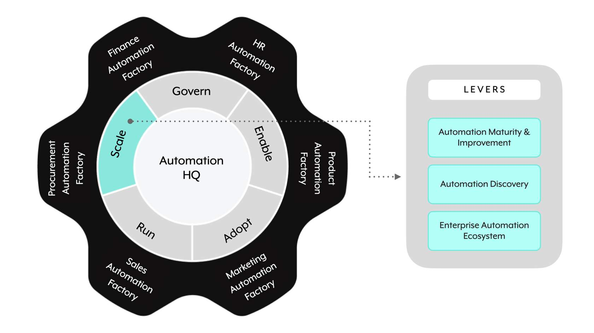

## 📈 **The Scale domain**

**Scale** is the fifth and final GEARS domain. It focuses on **maturing and expanding the automation practice enterprise-wide** — pushing toward wall-to-wall automation.

> 📌 **Scale has three levers:**
> 
> 1. **📊 Automation Maturity & Improvement**
> 2. **🔎 Automation Discovery**
> 3. **🌐 Enterprise Automation Ecosystem**

---

## 📊 **Lever 1: Automation Maturity & Improvement**

> 📌 A **maturity level** is an assigned grade with predetermined sets of criteria — used to **evaluate parameters impacting the performance of the enterprise automation practice**.

The maturity assessment evaluates the automation practice and **surfaces opportunities and recommendations** for planning your roadmap to **enterprise-wide adoption**.

### Four benefits of adopting this methodology

- **📏 Understand the current level of maturity** for each category and set it as a **baseline**.
- **📊 Establish a data-driven approach** to introduce incremental changes.
- **🗺️ Incorporate guided recommendations** to facilitate improvement.
- **📈 Set recurring assessments** to visualize and quantify progress made over time.

> 📌 **Maturity assessments are iterative** — recurring assessments (not one-off evaluations) are what actually track and prove progress.

---

## 🔎 **Lever 2: Automation Discovery**

> 📌 **Automation Discovery is a journey.** To keep momentum going and make automation core to optimizing operations and driving business value, you need a **consistent pipeline of potential automation candidates**.

### Six initiatives to identify potential use cases

Six mechanisms surface new automation candidates and build platform awareness:

- **🎪 WorkJam** — Workato's structured internal engagement events
- **🎭 Cross-functional demos** — showcase automations across departments
- **🎓 User training** — trained users spot automation opportunities in their own work
- **🎤 Conferences** — external inspiration
- **⚡ Hackathons** — internal innovation with time-boxed builds
- **🔬 Business process optimization** — process mining and similar techniques uncover streamlining opportunities

> 💡 **Business Process Optimization** is often the most systematic: process mining tools surface where handoffs, waits, and repetitive steps live — each is a candidate for automation.

---

## 🌐 **Lever 3: Enterprise Automation Ecosystem**

> 📌 The **Enterprise Automation Ecosystem** lever focuses on **how the Enterprise Automation platform fits within the Business Technology integration and automation tech stack ecosystem**.

The realistic view: while Enterprise Automation (Workato) should cover **the vast majority of scenarios** for wall-to-wall automation, there are **cases requiring a specialized platform** to work in tandem.

### Two main outcomes for this lever

- **🎯 Enterprise Automation fit strategy and decision tree** — when does Workato lead vs. when do you reach for a specialized tool?
- **🗺️ Reference architecture** describing how the Enterprise Automation platform can **coexist with specialized tools** — API Management (APIM), Robotic Process Automation (RPA), etc.

> 📌 **Coexistence, not replacement.** GEARS treats Enterprise Automation as the dominant layer — but expects APIM, RPA, and other specialized tools to still play targeted roles. The lever's job is to make the boundaries and integration clear.

---

### 🧠 Quick recall

- How many levers does the Scale domain have? (`_____`) (3)
- Name the three Scale levers. (Automation Maturity & Improvement; Automation Discovery; Enterprise Automation Ecosystem)
- Are maturity assessments a one-off exercise or recurring? (Recurring — that's how you visualize and quantify progress over time.)
- Name six mechanisms for surfacing automation candidates. (WorkJam; cross-functional demos; user training; conferences; hackathons; business process optimization)
- Which discovery mechanism uses process mining? (Business Process Optimization.)
- What are the two main outcomes of the Enterprise Automation Ecosystem lever? (Fit strategy and decision tree; reference architecture for coexistence with specialized tools.)
- Name two examples of specialized tools that might coexist with an Enterprise Automation platform. (APIM — API Management; RPA — Robotic Process Automation.)
- Does GEARS position Enterprise Automation as replacing all specialized tools? (No — coexistence, not replacement. Specialized tools still play targeted roles.)

---

## 🚀 **Module key takeaways**

- **Scale has 3 levers**: Automation Maturity & Improvement, Automation Discovery, Enterprise Automation Ecosystem.
- **Maturity assessments are recurring**, not one-time — that's what makes them useful for tracking progress.
- **Six discovery mechanisms**: WorkJam, cross-functional demos, user training, conferences, hackathons, business process optimization.
- **Business Process Optimization** (via process mining) is often the most systematic candidate-generation approach.
- **The ecosystem lever recognizes coexistence** — Workato is the dominant layer, but APIM, RPA, and other specialized tools still have roles. Design for it explicitly with a fit strategy and reference architecture.

---

> ⬅️ [Previous: 3.7. Run](./3.7.%20Run.md) | ➡️ [Next: 3.9. The Phased Execution Approach](./3.9.%20The%20Phased%20Execution%20Approach.md)

---