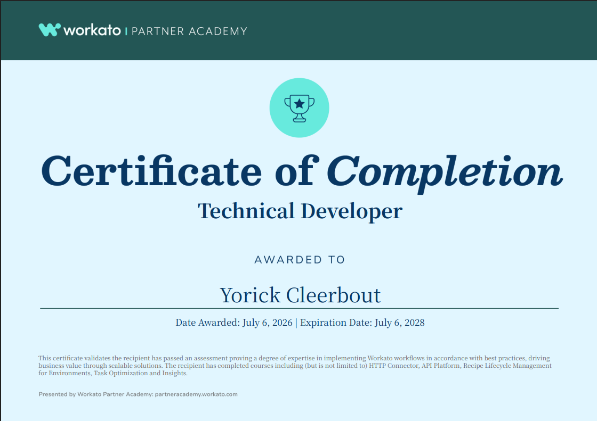

# 🎓 Workato Technical Developer

Study notes for the **Workato Technical Developer** certification course. These notes cover Workato's technical and developer-facing capabilities in depth: the **HTTP Connector**, the **On-Prem Agent**, **advanced data transformations**, **database connectivity**, the **API Platform**, **SQL Collection**, **task optimization**, **Recipe Lifecycle Management**, **RecipeOps**, **Workflow Apps**, **Insights**, **SQL Transformations**, and **Automation Accelerators**.

---

## 🏅 Certificate

---

## 📚 Table of Contents

| #   | Chapter                                                                                                                                                       | Key Topics                                                                                                                              |
| --- | ------------------------------------------------------------------------------------------------------------------------------------------------------------- | --------------------------------------------------------------------------------------------------------------------------------------- |
| 01  | [HTTP Connector](./01.%20HTTP%20Connector/1.1.%20Introduction%20to%20the%20Workato%20HTTP%20Connector.md)                                                     | HTTP Connector overview, HTTP connections, HTTP actions, best practices                                                                 |
| 02  | [On-Prem Agent Overview](./02.%20On-Prem%20Agent%20Overview/2.1.%20What%20is%20OPA.md)                                                                        | What OPA is and why you need it, OPA features (secure tunnel, complete control, extensibility), on-prem groups for high availability    |
| 03  | [Perform advanced data transformations in Workato](./03.%20Perform%20advanced%20data%20transformations%20in%20Workato/3.1.%20Complex%20Datatypes.md)          | Complex datatypes, advanced data transformations, troubleshooting formula errors                                                        |
| 04  | [Connecting to databases](./04.%20Connecting%20to%20databases/4.1.%20Database%20Connectors.md)                                                                | Database connectors, SQL commands and stored procedures, database best practices                                                        |
| 05  | [API Platform](./05.%20API%20Platform/5.1.%20API%20Platform%20Overview.md)                                                                                    | API Platform overview, hands-on activity, best practices                                                                                |
| 06  | [SQL Collection](./06.%20SQL%20Collection/6.1.%20SQL%20Collection%20by%20Workato.md)                                                                          | SQL Collection by Workato (SQLite, in-memory, single-job), best practices, use case in data transformation                              |
| 07  | [Task Optimization](./07.%20Task%20Optimization/7.1.%20Key%20Factors%20of%20Task%20Usage.md)                                                                  | 3 key factors of task usage, identify/assess/optimize approach, 16 optimization strategies across 3 categories, monitoring and tracking |
| 08  | [Recipe Lifecycle Management for Environments](./08.%20Recipe%20Lifecycle%20Management%20for%20Environments/8.1.%20Environment%20Management%20%26%20Teams.md) | Environment management & teams, recipe lifecycle stages, manifests and packages, release management                                     |
| 09  | [Manage Recipe health with RecipeOps by Workato](./09.%20Manage%20Recipe%20health%20with%20RecipeOps%20by%20Workato/9.1.%20What%20is%20RecipeOps.md)          | RecipeOps triggers, actions for recipe/job management & info gathering, common use cases, best practices                                |
| 10  | [Workflow Apps](./10.%20Workflow%20Apps/10.1.%20What%20is%20Workflow%20Apps.md)                                                                               | Low-code/no-code app platform, three pillars (UI, data storage, business logic), Apps Portal, SAML SSO with JIT provisioning            |
| 11  | [Insights](./11.%20Insights/11.1.%20Introduction%20to%20Insights.md)                                                                                          | Insights overview, 4 use cases (Usage Reporting, Automation ROI, Process Analytics, App Analytics), real-time dashboards                |
| 12  | [SQL Transformations](./12.%20SQL%20Transformations/12.1.%20Introduction%20to%20SQL%20Transformations.md)                                                     | Introduction to SQL Transformations, basics, how it works (vs. SQL Collection), best practices                                          |
| 13  | [Automation Accelerators](./13.%20Automation%20Accelerators/13.1.%20What%20are%20Automation%20Accelerators.md)                                                | Turn-key ZIP-delivered asset packages, Accelerator library, benefits (80% jump start), naming conventions (`Sub`/`REC`/`CALL`/`CON`)    |

---

## 🧭 Quick Navigation

➡️ **Start here:** [1.1. Introduction to the Workato HTTP Connector](./01.%20HTTP%20Connector/1.1.%20Introduction%20to%20the%20Workato%20HTTP%20Connector.md)

---

## 🎯 Learning Outcomes

By the end of this course, you should be able to:

- ✅ Build and secure integrations with the **HTTP Connector** — configure connections, triggers, and actions; avoid the **New Event via Polling** trap; protect sensitive data via datapills and connection/account properties
- ✅ Deploy and operate the **Workato On-Prem Agent (OPA)** — establish the outbound **TLS 1.2 websocket tunnel** without opening firewall ports, extend to non-HTTP protocols, and configure **on-prem groups** for high availability, fault tolerance, and load balancing
- ✅ Perform **advanced data transformations** — handle complex datatypes, apply formula-mode transformations, and troubleshoot formula errors systematically
- ✅ Connect Workato to **databases** — configure connectors, use SQL commands and stored procedures, and apply database connectivity best practices
- ✅ Design, secure, and expose APIs using the **Workato API Platform** — including policies, versioning, and rate-limit handling
- ✅ Choose between **SQL Collection** (temporary, single-job, ~50,000 records, SQLite) and **SQL Transformations** (persistent, cross-job, virtually unlimited volume, FileStorage-based) for the right data-processing scenario
- ✅ Diagnose task overconsumption using the **three key factors** (jobs, events per job, processing efficiency) and apply the right optimization strategies from the **16-strategy playbook** across 3 categories (trigger, batch, efficiency)
- ✅ Recall the **task accounting rules** — what counts as a task, what doesn't (triggers, control flow, error handling), and when conditional/failed actions are counted
- ✅ Establish **Recipe Lifecycle Management (RLCM)** — plan environments and teams, define governance (decentralized vs centralized), enforce recipe reviews and release approvals, and use **manifests + packages** for controlled deployments between environments
- ✅ Design a **release management** process — classify releases (Major / Minor / Bug-Fix), version with semver (`v.MAJOR.MINOR.PATCH`), and enact the five release plans (Build & Test, Deployment, Validation, Communication, Review)
- ✅ Operate mission-critical recipes with **RecipeOps** — configure monitoring triggers (Recipe Started/Stopped, Job Failed, Usage Threshold), management actions (Start/Stop Recipe, Rerun Jobs), and information-gathering actions (Search Job History, Search Recipes)
- ✅ Distinguish between the **Error Monitoring Action** (in-recipe, specific errors) and **RecipeOps** (workspace-wide, many recipes) — and apply each in the right situation
- ✅ Build no-code business applications with **Workflow Apps** — the **three pillars** (UI, Data Storage, Business Logic), the **Apps Portal** configuration (General/Branding/Security), and enterprise auth via **SAML SSO with JIT provisioning**
- ✅ Measure automation impact and process efficiency with **Insights** — set up real-time dashboards for **Usage Reporting, Automation ROI, Process Analytics**, and **App Analytics**
- ✅ Handle large-scale data transformation and Change Data Capture patterns with **SQL Transformations** — including bulk extraction, CSV-based staging in FileStorage, and inferred-vs-defined schema handling
- ✅ Accelerate delivery with **Automation Accelerators** — recognize the **five package content types**, identify assets by their **naming prefixes** (`Sub`, `REC`, `CALL`, `CON`), and choose the right accelerator for the use case

---

## 🔑 Numbers worth remembering

A quick reference of the specific quantities and thresholds that come up in scenario questions:

|Number|What it refers to|Where to find it|
|---|---|---|
|**~50,000**|Recommended SQL Collection dataset size (up to 100K–200K for small rows)|6.2|
|**10 GB / 100 GB**|Workato FileStorage — per-file / total|6.2|
|**100 columns / 1,000,000 records**|Workato DataTables capacity|6.2|
|**10 columns / 100,000 entries**|Workato Lookup Tables capacity|6.2|
|**1,000**|Default job return count in RecipeOps `Search Job History` (also `Search Recipes`)|9.3|
|**60**|Cumulative authentication errors before Workato auto-stops a recipe|9.2|
|**10%**|Usage-increment interval for the RecipeOps `Usage Threshold Reached` trigger|9.2|
|**3,600 seconds**|Max cache lifetime for API GET response caching|7.3|
|**1,200+**|Prebuilt Workato connectors available for Workflow Apps|10.1|
|**~80%**|Percentage of solution jump-started by an Automation Accelerator|13.1|
|**5**|Package content types (recipes, custom recipes, solution components, reference data, instructional guides)|13.1|

---

> ⬅️ [Previous: Workato Foundations Level 2](../workato-foundations-level-2/00.%20OVERVIEW.md) | ➡️ [Next: 1.1. Introduction to the Workato HTTP Connector](./01.%20HTTP%20Connector/1.1.%20Introduction%20to%20the%20Workato%20HTTP%20Connector.md)

---