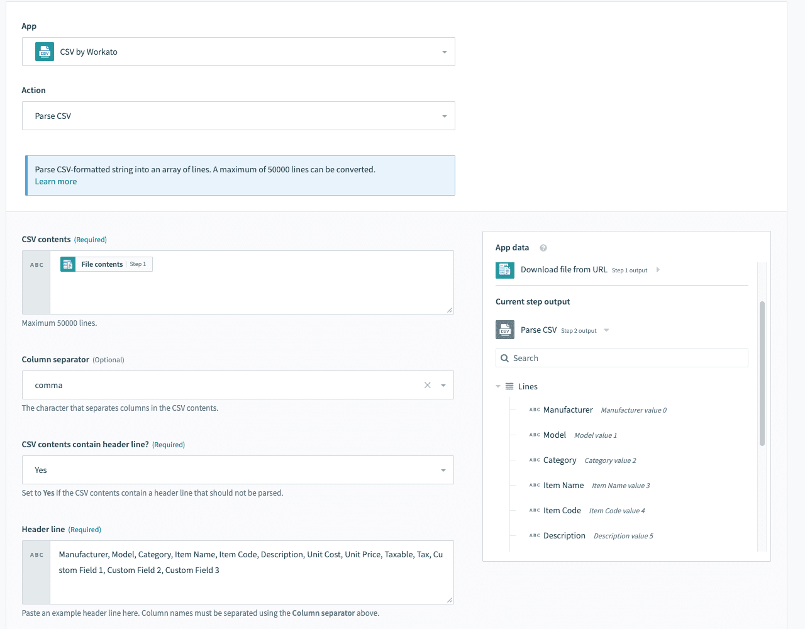
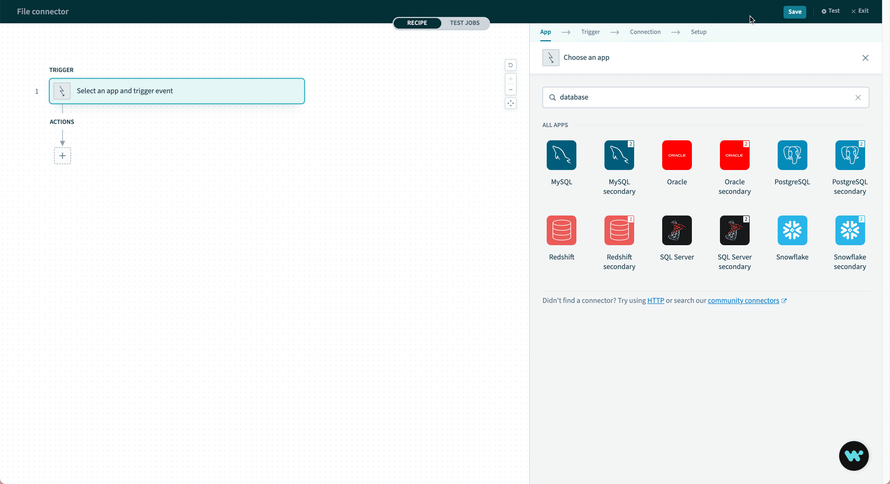
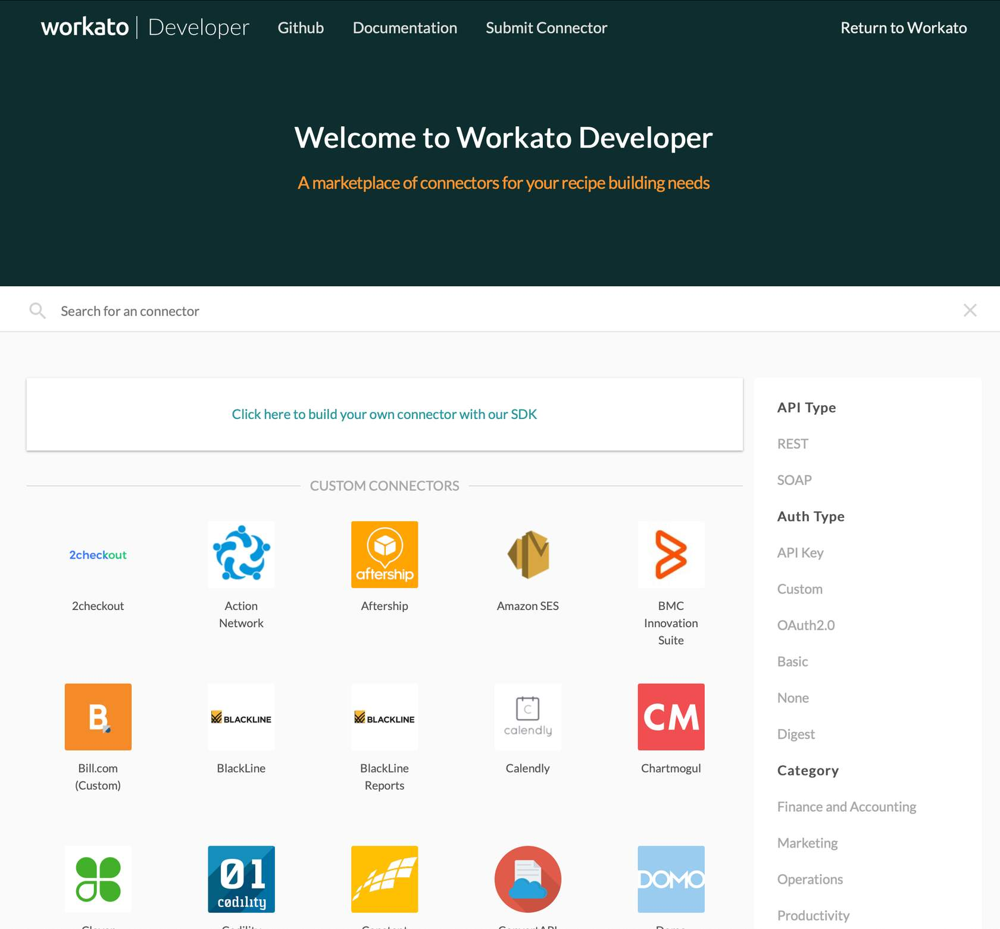
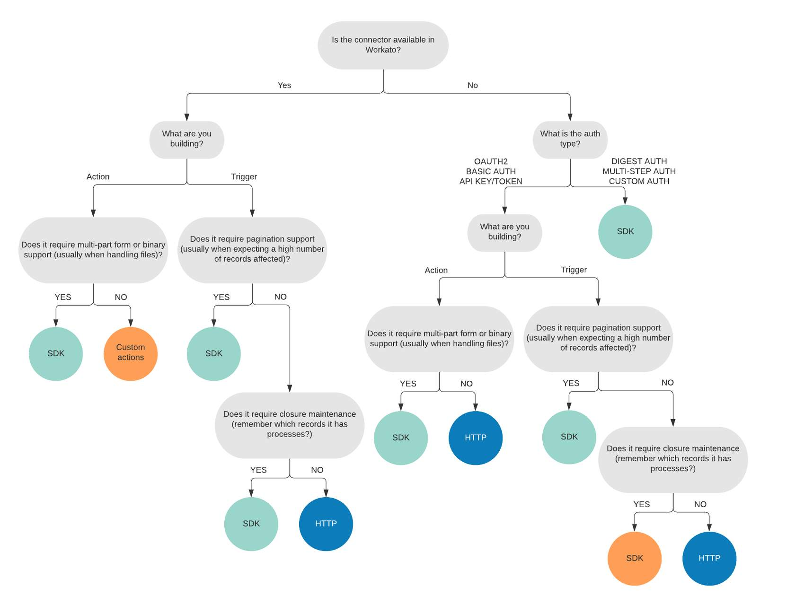
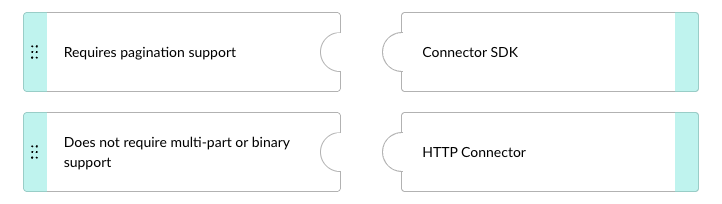
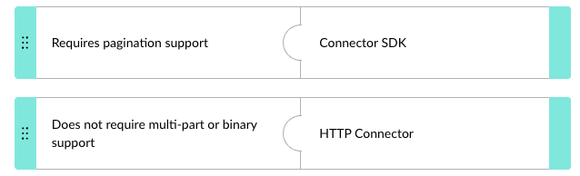
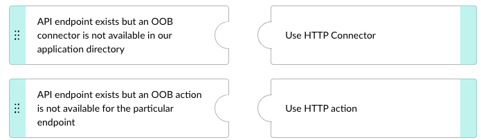
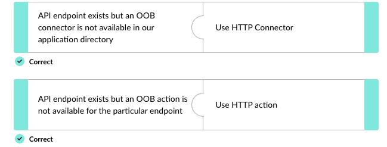

## 🔌 **Why use an HTTP Connector?**

Workato comes pre-loaded with hundreds of out-of-the-box (**OOB**) connectors, actions, and triggers. But sometimes you'll need to integrate with an application Workato doesn't yet support, or you'll need an action or trigger that even an existing connector doesn't expose. _Example: Workato's Jira connector exists, but it doesn't include an action to delete issues._

> 📌 With the Workato **HTTP Connector**, you can make **any API call to any application that accepts HTTP requests**. If you can find the API documentation, you can integrate it via the HTTP Connector.

A couple of quick illustrations:

- Create an invoice in your accounting system → `POST` request with a JSON body.
- Retrieve metrics from an analytics tool → `GET` request with query parameters.

In short, the HTTP Connector enables you to **build integrations** with any cloud application that has an HTTP-based API, and to **build additional actions** on the Workato platform.

---

## ⚖️ **HTTP Connectors vs other Workato connectors**

### 🧱 Workato connector review

Workato **connectors** manage both the technical aspects and the user experience of app integrations. Each connector bundles **authentication, triggers, and actions** for a specific application — the building blocks of recipes.

1. A connector allows the Workato platform to interact with an application through triggers and actions.
2. **Triggers** monitor for events in the connected application and start a workflow of actions (a recipe).
3. **Actions** carry out specific predefined operations in the target application.

---

### 📊 Connector type comparison

Workato offers several connector types beyond the HTTP Connector. Knowing them helps you choose the right tool for each scenario.

#### 📦 Application connectors

**Out-of-the-box (OOB)** connectors readily available in Workato. There are **500+** OOB connectors with more added regularly. You can browse them in the [Workato application directory](http://www.workato.com/integrations), and searching for multiple apps shows side-by-side trigger/action lists — useful for checking whether two apps can be synced before committing to an approach.

> 📌 OOB connectors are the **safest solution** for most scenarios. Reach for HTTP Connector only when no OOB option fits.

#### 📁 File connectors

For apps that support CSV import/export. Workato can read CSV files into your apps or write CSV files for your apps to import:

- If you're missing a _trigger_ to read data, have the app drop a CSV onto SFTP and let Workato read from there.
- If you're missing an _action_ to write data, have Workato upload a CSV into the app's file server for mass import.

#### 🗄️ Database connectors

Non-API connectors that connect to databases like MySQL and Oracle. Covered in more depth in the Data Orchestration learning plan.

#### 🛠️ Connector SDK

If you have **Ruby development support**, you can build a custom Workato connector using the SDK. It provides advanced flexibility — custom authentication, schema built from metadata, and more.

> 📌 If you **don't** have Ruby development support, the HTTP Connector is the better choice. The SDK is for developers; the HTTP Connector is for non-developers.

More info: the [Workato Connector SDK docs](https://docs.workato.com/developing-connectors/sdk.html) and the Connector SDK course.

---

### 🔀 HTTP Connector vs SDK — choosing between them

Both let you reach apps Workato doesn't OOB-support, but they're aimed at different audiences. Follow the decision flowchart from the course:

---

### 🧠 Quick recall

- Workato has roughly `_____` OOB connectors. (500+)
- You need to integrate with an app that has an API but no Workato OOB connector, and you don't have Ruby developers. Best tool? (HTTP Connector)
- You need a custom connector with advanced auth and metadata-driven schemas, and you have Ruby developers. Best tool? (Connector SDK)
- True or false: OOB connectors are the safest default solution. (True)

---

## 🎯 **When to use HTTP Connector**

When you need connections or actions not available OOB, the HTTP Connector accelerates development. The choice between _connector_ and _action_ depends on what's missing:

> 📌 **Use the HTTP Connector** when an API endpoint exists but **no OOB connector** is available for that application.
> 
> 📌 **Use an HTTP action** (or custom action) when an API endpoint exists but **no OOB action** is available for that particular endpoint.

---

### ✅❌ Pros and cons

|✅ Pros|❌ Cons|
|---|---|
|Quick connectivity to custom apps or apps not yet covered by Workato|Can't handle complex API functionality — long-running actions, bulk data transfers, advanced authentication|
|Suitable for **one-off requirements** to connect or perform a single action|**HTTP actions are not scalable** — they must be rebuilt each time they're used in a recipe|

> ⚠️ The "not scalable" point matters in practice: if you'll use the same HTTP action across multiple recipes or steps, rebuild costs add up fast. For repeated use, invest in an SDK connector or push Workato to add OOB support.

---

## 🚀 **Module key takeaways**

- The **HTTP Connector** is a workaround for missing OOB coverage — works with any HTTP-based API where you have API documentation.
- Two flavors of "missing" call for different tools: **HTTP Connector** (no OOB connector) vs **HTTP action** (OOB connector exists but lacks the specific action).
- **OOB connectors are the safest default**; HTTP Connector is for gaps; **SDK is for Ruby developers** wanting deep customization.
- HTTP actions are **not scalable** — rebuild required per recipe. Use them for one-offs, not load-bearing integrations.

---

## 📝 **Knowledge check: Introduction to HTTP Connectors**

> ❓**Workato HTTP Connector enables you to build integrations with any cloud applications that have an HTTP-based `_____` and to build additional actions on the Workato platform.**

- <input type="radio" name="q1"> HTML
- <input type="radio" name="q1"> API
- <input type="radio" name="q1"> Trigger
- <input type="radio" name="q1"> Webhook

 
💡 Reveal Answer
 - API 

> ❓**Match the scenario to the best solution.**

 
💡 Reveal Answer
  

> ❓**Match the scenario to the solution**

 
💡 Reveal Answer
  

---

> ⬅️ [Previous: Workato Technical Developer](../00.%20OVERVIEW.md) | ➡️ [Next: 1.2. HTTP Connections](./1.2.%20HTTP%20Connections.md)

---