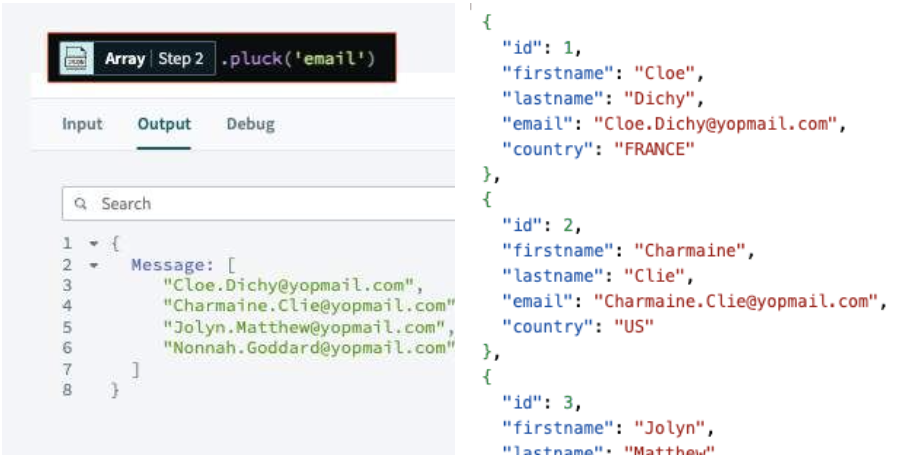
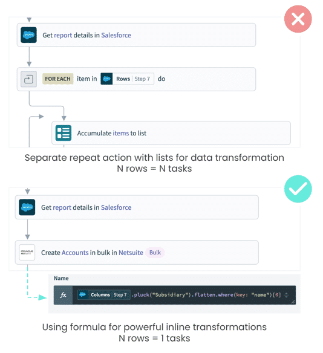
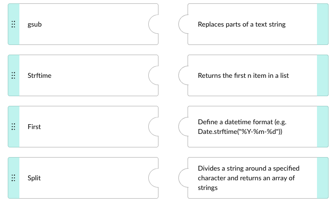
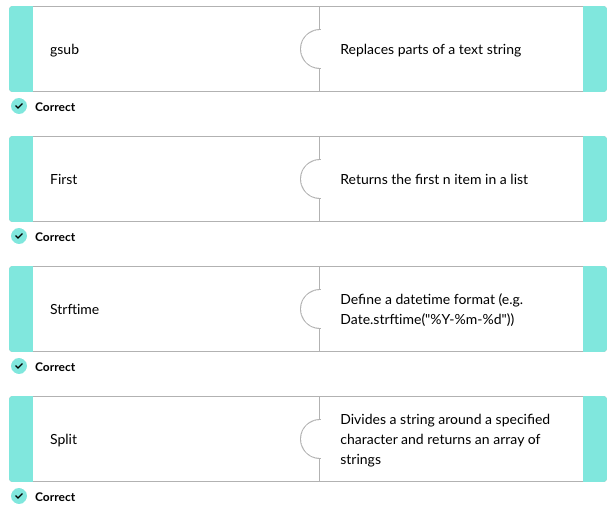

## 📦 **Complex datatypes overview**

> 📌 **Complex datatypes** can store **one or more values of standard (primitive) datatypes** — and they can also store other complex datatypes inside them.

Workato works with three complex datatypes: **List/Array**, **HASH**, and **JSON**.

---

### 🗂️ The three complex datatypes

|Type|Structure|Indexed by|Notes|
|---|---|---|---|
|**📦 List / Array**|Ordered collection of elements|**Integers**|Can hold primitives and complex types.|
|**🗃️ HASH**|Dictionary-like collection of unique key→value pairs|**Any datatype**|Like a Ruby hash or Python dict.|
|**💎 JSON**|JavaScript Object Notation; attribute–value pairs and arrays|(n/a — structural format)|Most popular data format in APIs. Mostly hidden in Workato — data is exposed as input fields and output datapills. Workato can also handle raw JSON.|

---

### 🧠 Quick recall

- Name the three complex datatypes Workato works with. (List/Array, HASH, JSON)
- A List is indexed by `_____`; a HASH is indexed by `_____`. (Integers; any datatype)
- True or false: JSON is usually visible to Workato users as raw text. (False — JSON is mostly hidden; data is exposed as input fields and output datapills.)
- Which complex datatype is the most popular format in APIs? (JSON)

---

## 🏢 **Real-world applications**

Workato's advanced data transformation capabilities let customers handle complex datatypes and perform sophisticated transformations at enterprise scale. Five real customer use cases:

|Customer|Use case|Outcome|
|---|---|---|
|**Large enterprise**|Processes **20M daily records** in an hour via complex ETL; 750+ automations across IT and line-of-business teams.|Major gains in data processing speed and accuracy.|
|**Marketing firm**|Manages **100+ ad campaigns daily across 10+ ad platforms** via automated data transformations and integrations.|Time freed for actual campaign analysis instead of manual data handling.|
|**20,000-employee organization**|**140 recipes** handling complex ETL for SAP integrations across an employee data hub.|Streamlined data management, fewer errors, better cross-system consistency.|
|**Salesforce → Snowflake integration**|Extracts Salesforce account data, transforms via **SQL Transformations**, loads into Snowflake. Includes normalization, validation, cleansing.|Real-time insights and better data-driven decisions.|
|**Marketing data science team**|Integrates and transforms data from many sources for ad campaign analysis.|More time analyzing campaigns, less time importing/exporting data.|

---

## 🔍 **Querying complex datatypes**

> 📌 Workato supports both **ETL (Extract, Transform, Load)** and **ELT (Extract, Load, Transform)** patterns. Built-in formulas handle common data manipulation tasks for simple transformations.

The most common Workato formulas fall into four categories — string, list, date/datetime, and conditional. Some of these will be familiar from Automation Pro II.

---

### 📝 Common formulas at a glance

|Category|Formula|What it does|Example|
|---|---|---|---|
|**🔤 String**|`split`|Divides a string around a delimiter; returns an array.|`"Ms-Jean-Marie".split("-")` → `["Ms", "Jean", "Marie"]`|
|**🔤 String**|`gsub`|Replaces parts of a string; returns a new string.|`"I have a blue house and a blue car".gsub("blue", "red")` → `"I have a red house and a red car"`|
|**🔤 String**|`to_s`|Converts to string.|`123.to_s` → `"123"`|
|**📚 List**|`first`|Returns the first item (or first _n_).|`["One", "Two", "Three"].first` → `"One"`|
|**📚 List**|`last`|Returns the last item (or last _n_).|`["One", "Two", "Three"].last` → `"Three"`|
|**📅 Date**|`to_date`|Converts input into a date datatype.|`"2020/01/23".to_date(format: "YYYY/MM/DD")` → `2020-01-23`|
|**📅 Date**|`strftime`|Lets the user define a datetime format.|`Date.strftime("%Y-%m-%d")` → `2020-01-23`|
|**🔀 Conditional**|`present?`|Returns true if input has a value.|`"Any Value".present?` → `true`|
|**🔀 Conditional**|`blank?`|Returns true if input is empty/null.|`nil.blank?` → `true`|

---

### 🔍 WHERE vs PLUCK

The two formulas serve different but complementary purposes — `where` filters, `pluck` extracts.

- **🔍 `where`** — filters data based on conditions. Specify criteria the data must meet to be included in the result set. Common in triggers and actions to filter rows in databases or lists.
    
    - Example: `where(country: 'FRANCE')` → only rows where the country is France.
- **✂️ `pluck`** — extracts specific fields from a collection. Simplifies the data structure by returning only the named fields. Typically used _after_ filtering.
    
    - Example: `pluck('email')` → just the email addresses.

> 📌 **In practice, they're chained**: filter first, extract second. The composed pattern looks like:

```ruby
where(country: 'FRANCE').pluck('email')
```

Result: a list of email addresses for users located in France.



---

### ⚡ Task optimization

> 📌 **Use inline formulas instead of repeat actions with variables** when transforming data. Mapping data in formula mode handles complex data structures and counts as just **one task per step** — saving both time and task billing.

Use this strategy whenever your recipe needs to perform:

- Data validation
- Data cleansing
- Data extraction
- Data type casting
- Data transformations



---

### 🧠 Quick recall

- Workato supports both `_____` and `_____` patterns. (ETL; ELT)
- What does `where` do? What does `pluck` do? (`where` filters by condition; `pluck` extracts specific fields)
- The composed pattern `where(...).pluck(...)` does what in order? (Filter first, then extract from filtered results)
- Inline formulas count as how many tasks per step? (One — vs repeat actions which count per iteration)
- Name three transformation needs that justify inline formulas. (Any three of: validation, cleansing, extraction, type casting, transformations)

---

## 🚀 **Module key takeaways**

- **Three complex datatypes**: List (integer-indexed), HASH (any-type-indexed), JSON (mostly hidden; exposed as datapills).
- **JSON dominates** in API data exchange and underlies most Workato input/output.
- **Four formula categories** to know: string (`split`, `gsub`, `to_s`), list (`first`, `last`), date (`to_date`, `strftime`), conditional (`present?`, `blank?`).
- **`where` filters, `pluck` extracts** — chain them: `where(...).pluck(...)`.
- **Inline formulas beat repeat actions** for transformations — one task per step regardless of data complexity.

---

## 📝 **Knowledge check: Complex Datatypes**

> ❓**Which option is _not_ a description of the data type JSON?**

- <input type="radio" name="q1"> It is based on name value pairs and arrays
- <input type="radio" name="q1"> It is generally hidden from Workato users who see data as input fields and output datapills
- <input type="radio" name="q1"> It is a dictionary like collection of unique keys and their values
- <input type="radio" name="q1"> It is one of the most famous data format in APIs

<details> <summary>💡 Reveal Answer</summary> - It is a dictionary like collection of unique keys and their values </details>

> ❓**Match the formulas to their respective functions in transforming data.**



<details> <summary>💡 Reveal Answer</summary>  </details>

> ❓**Both "where" and "pluck" formulas are used in recipe steps to transform data. Choose 2 options that correctly describe how these formulas are transforming the data.**
> 
> **`where(company: 'WORKATO').pluck('email')`**

- [ ] The formula is filtering the data to include only rows where the company is Workato
- [ ] The formula is extracting the company Workato from rows where there is an email address.
- [ ] The formula is extracting the email addresses from the filtered data.

<details> <summary>💡 Reveal Answer</summary> - The formula is filtering the data to include only rows where the company is Workato - The formula is extracting the email addresses from the filtered data. </details>

---

> ⬅️ [Previous: 2.4. How to achieve high availability with On-prem Groups ](../02.%20On-Prem%20Agent%20Overview/2.4.%20How%20to%20achieve%20high%20availability%20with%20On-prem%20Groups.md) | ➡️ [Next: 3.2. Advanced Data Transformations](./3.2.%20Advanced%20Data%20Transformations.md)

---