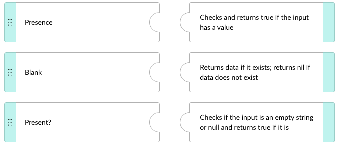
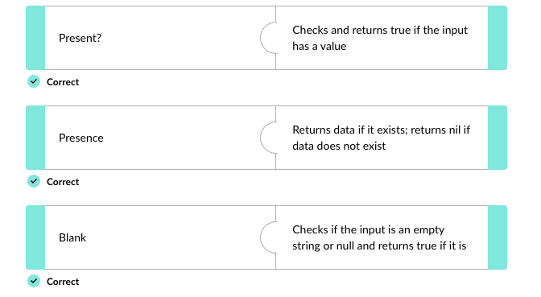
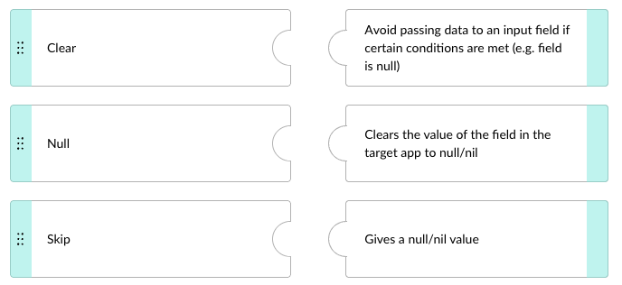
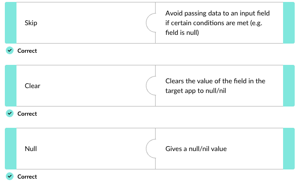

## 🔀 **Applying conditionals**

Recipes need to be resilient against unexpected scenarios — trigger data with missing values, fields with the wrong datatype, edge cases that would otherwise crash a workflow. Conditional logic inside formulas is how you make recipes handle these gracefully.

> 📌 **Formula conditionals** let you apply conditional logic _inside formulas_, enabling dynamic and flexible data transformations.

---

### 🛠️ Four ways to apply conditionals

|#|Approach|Use it for|
|---|---|---|
|1|**Ternary syntax**|Compact `if/else` inside a single formula expression.|
|2|**Conditional formulas** (`present?`, `blank?`, `where`)|Checking the state of a value before acting on it.|
|3|**Safe navigation operator (`&.`)**|Chaining method calls on something that might be null without erroring.|
|4|**Skip formula**|Avoiding sending data to an output field when a condition is met.|

---

### ❓ Ternary syntax

Ruby's ternary form is `condition ? expression1 : expression2`:

```ruby
condition ? expression1 : expression2
```

- **`condition`** — a boolean expression that evaluates to true or false.
- **`expression1`** — returned if the condition is **true**.
- **`expression2`** — returned if the condition is **false**.

---

### 🔗 Combining conditionals

Compound conditions can be built using `AND` and `OR` operators inside formulas — so a single formula can express logic like _"value is present AND is greater than 0"_ in one expression.

The most-used conditional formulas — `present?`, `blank?`, and `where` — were covered in the previous lesson.

---

### 🧠 Quick recall

- Name the four ways to apply conditionals in Workato formulas. (Ternary syntax, conditional formulas, safe navigation operator, skip formula)
- Write the ternary syntax pattern. (`condition ? expression1 : expression2`)
- Which operators let you combine conditionals into compound logic? (AND, OR)

---

## 🚫 **Handling null values**

Handling null values is critical for data integrity and preventing recipe errors. Five techniques work together:

- 🔍 **Conditional formulas** — `present?`, `presence`, `blank?`
- ⏭️ **Skip formula**
- 🧭 **Safe navigation operator** (`&.`)
- 🧹 **Normalize multi-value fields**
- 🛡️ **Error handling and retry mechanisms**

---

### 📥 Handling INPUT null values

When checking for null values at the _input_ side, three formulas matter:

|Formula|What it checks / does|Example|
|---|---|---|
|`present?`|Returns **true** if the input has a value. Used to gate operations on non-null inputs.|`"Any Value".present?` → `true`|
|`presence`|Returns the **data if it exists**, or `nil` if it doesn't.|`nil.presence` → `nil`|
|`blank?`|Returns **true** if the input is an empty string or null.|`nil.blank?` → `true`|

---

### 📤 Handling OUTPUT null values

When you need to control what gets _sent_ to a target system, two formulas matter:

|Formula|What it does|Example|
|---|---|---|
|`skip`|Avoids passing any data to the input field when a condition is met.|When updating records, leave a field untouched if it's empty.|
|`clear`|Clears the target app's field to `null`/`nil`.|Forcibly nullify a value downstream.|

> ⚠️ The `clear` formula requires the field to be toggled to **formula mode**.

---

### 🧭 Safe navigation operator

> 📌 The **safe navigation operator (`&.`)** lets you call methods on values that might be null, returning `nil` instead of throwing an error.

Example:

```ruby
Created_Date&.to_date
```

This converts `Created_Date` to a date datatype **only if it's not null** — otherwise the whole expression returns nil safely.

---

### 🛡️ Error handling and retry

Implement error handling blocks in your recipes for scenarios where null values might still cause issues despite the above. Use retry mechanisms for transient errors so recipes recover gracefully — for example, **Monitor** and **On Error** blocks to catch errors, with retry options for short-term connectivity failures.

---

### 🧠 Quick recall

- The safe navigation operator looks like `_____`. (`&.`)
- Which formula returns `nil` when the input is missing — `presence` or `present?`? (`presence` — returns nil if empty. `present?` returns a boolean.)
- Which output-side formula leaves a field untouched? Which one actively nullifies it? (`skip` leaves untouched; `clear` actively sets to null/nil)
- Before using `clear`, what must you do to the field? (Toggle it to formula mode)
- True or false: a recipe with safe navigation operators still needs error handling blocks. (True — they're complementary, not substitutes.)

---

## 🔐 **Conversion formulas: encoding and encryption**

Workato provides formulas for both **encoding/decoding** and **encrypting/decrypting** data.

**Encoding formulas:**

- 🔢 **SHA256** — encode a string or binary array using the SHA256 algorithm.
- 🔤 **Hexadecimal** — convert a binary string to its hex representation.
- 🌐 **URL-safe Base64** — encode data using a URL-safe modification of the Base64 algorithm.
- 📦 **Standard Base64** — encode data using the standard Base64 algorithm.

Corresponding **decoding formulas** are available for each.

**Encryption formulas:**

> 📌 The `encrypt` formula encrypts an input string with a secret key using the **AES-256-CBC** algorithm. The encrypted output is packed in **RNCryptor V3 format** and **base64 encoded**. The `decrypt` formula reverses this.

> ⚠️ **Encryption and decryption keys should NEVER be hard-coded in recipes.** Store them in **project and environment properties** — this protects them from exposure when recipes are shared, cloned, or audited.

---

### 🧠 Quick recall

- Workato's encrypt formula uses which algorithm? (`_____`) (AES-256-CBC)
- The encrypted output is packed in which format and how is it encoded? (RNCryptor V3 format; base64 encoded)
- Where should encryption keys be stored? (Project and environment properties — never hard-coded in recipes)
- Name two encoding algorithms Workato supports. (Any two of: SHA256, hexadecimal conversion, URL-safe Base64, standard Base64)

---

## 🚀 **Module key takeaways**

- **Four conditional patterns**: ternary (`condition ? a : b`), conditional formulas (`present?`/`blank?`/`where`), safe navigation (`&.`), skip.
- **Input null handling**: `present?` returns boolean, `presence` returns the value or nil, `blank?` returns boolean for empty/null.
- **Output null handling**: `skip` leaves the target field untouched; `clear` actively sets it to null (requires formula mode).
- **Safe navigation `&.`** chains method calls safely on possibly-null values — but doesn't replace error handling blocks.
- **Encryption**: AES-256-CBC in RNCryptor V3, base64 encoded. **Keys go in project/environment properties, never in recipes.**

---

## 📝 **Knowledge check: Advanced Data Transformations**

> ❓**Match the formulas for handling _input null values_ to their appropriate descriptions.**



<details> <summary>💡 Reveal Answer</summary>  </details>

> ❓**Match the formulas for handling _output null values_ to their appropriate descriptions.**



<details> <summary>💡 Reveal Answer</summary>  </details>

> ❓**Which of the following is _not_ a suitable way to handle null values?**

- <input type="radio" name="q3"> Use the safe navigation operator (`&.`) to filter out cases where input is non-null
- <input type="radio" name="q3"> Implement error handling blocks in recipes to manage scenarios where null values might cause issues
- <input type="radio" name="q3"> Normalize to make your dataset consistent without null values and empty strings

<details> <summary>💡 Reveal Answer</summary> - Use the safe navigation operator (`&.`) to filter out cases where input is non-null </details>

---

> ⬅️ [Previous: 3.1. Complex Datatypes](./3.1.%20Complex%20Datatypes.md) | ➡️ [Next: 3.3. Troubleshooting Formula Errors](./3.3.%20Troubleshooting%20Formula%20Errors.md)

---