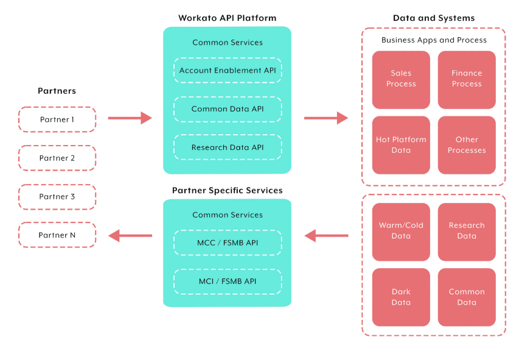
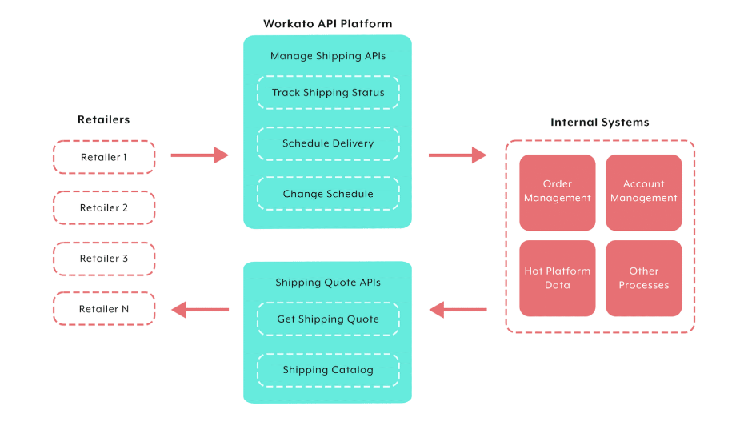
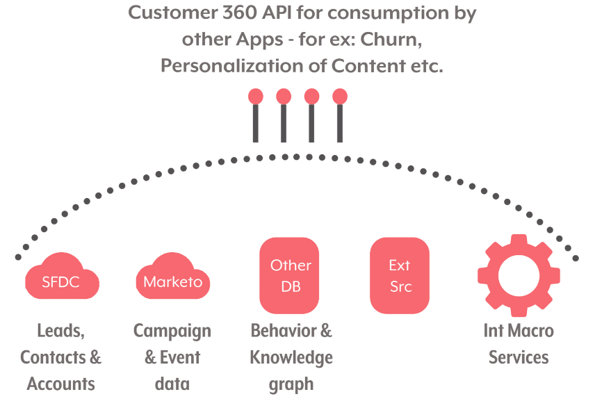

## 🎯 **API integration use cases**

Common API integration patterns appear repeatedly in business workflows. Done well, they save employee time, prevent human errors, get the most out of existing applications, enhance products, and improve both employee and customer experiences.

Your product's own API use cases may not be as obvious as the examples below — but you'll likely identify several opportunities that can improve your end users' experience.

---

### 🤝 Use case 1: Scaling partner services with APIs

APIs can extend a product's functionality by building recipes triggered by API endpoints. This lets you scale partner services.

In this scenario, an organization wants to serve hundreds of partners with access to a world directory of medical schools, medical education & research data, and electronic portfolios of international credentials.

With APIs, the organization can:

- Create a **partner Self Service Portal** with an onboarding approval process.
- **Expose data and processes** to partners via APIs.
- Build **common and partner-specific services**.

The result: a secure way for business partners to send and receive data from the organization.

---

### 📦 Use case 2: Reducing order-to-delivery time with APIs

Long order-to-delivery cycles are a common challenge for organizations selling e-commerce and retail.

APIs enable **real-time access for retailers** to track shipping status and schedule/manage delivery services — supporting last-mile and other downstream services. Real-time events shorten the order-to-delivery process meaningfully.

---

### 👤 Use case 3: Delivering Customer 360

A "Customer 360" is a **single view of the customer across channels** — augmenting business apps with cloud data warehouse data to understand customer intentions and create timelines that predict sales opportunities.

APIs enable **instant access to Customer 360 data** from business intelligence tools, sales/marketing/finance/CS apps, bots, and other automations.

---

### 🧠 Quick recall

- Name the three use cases covered in this lesson. (Scaling partner services; reducing order-to-delivery time; delivering Customer 360)
- A retailer wants real-time shipping status to shorten delivery times. Which use case pattern? (Reducing order-to-delivery time)
- A sales team needs a unified customer view across CRM, support tickets, and marketing data. Which use case? (Customer 360)
- An organization wants to onboard 200+ partners with self-service portals and partner-specific data access. Which use case? (Scaling partner services with APIs)

---

## 🧰 **Building blocks in the API Platform (from the knowledge check)**

The knowledge check below tests several Workato API Platform mechanics that aren't covered in the use-case examples. Surfacing them here for study:

> 📌 **API Platform by Workato** is the application used to **return responses from API requests**. (Not RecipeOps; not Collection.)

> 📌 The **"New API Request" trigger** is used to **define the request and response parameters** for an API endpoint. It's how a recipe becomes an API endpoint.

> 📌 When **creating an API Collection**, the required fields are **Collection Name** and **Version**. The **Description** field is **optional**.

> 📌 **HTTP method recap**: `POST` creates a new object/lead; `PUT`/`PATCH` updates; `GET` reads. A successful response returns **`200`**.

---

## 🚀 **Module key takeaways**

- **Three foundational API use cases**: scaling partner services, shortening order-to-delivery, delivering Customer 360. All share a common shape: real-time data exchange via APIs replaces batch/manual processes.
- **"API Platform by Workato"** is the dedicated Workato app for handling API responses.
- The **"New API Request" trigger** is the entry point for making a recipe API-callable — it defines request and response parameters.
- When defining an **API Collection**: **Name** and **Version** are required; **Description** is optional.
- **HTTP for creating things**: `POST`. **Status code for success**: `200`.

---

## 📝 **Knowledge check: Hands-on Activity for API Platform**

> ❓**Which application should be used to return a response from an API request?**

- <input type="radio" name="q1"> API Platform by Workato
- <input type="radio" name="q1"> RecipeOps by Workato
- <input type="radio" name="q1"> Collection by Workato

 
💡 Reveal Answer
 - API Platform by Workato 

> ❓**The trigger 'New API Request' is used to `_____`.**

- <input type="radio" name="q2"> Return a response from the app.
- <input type="radio" name="q2"> Define the request and response parameters for an API endpoint.
- <input type="radio" name="q2"> Select the object to create in the action.

 
💡 Reveal Answer
 - Define the request and response parameters for an API endpoint. 

> ❓**When creating an API collection, what field is optional?**

- <input type="radio" name="q3"> Version
- <input type="radio" name="q3"> Description
- <input type="radio" name="q3"> Collection Name

 
💡 Reveal Answer
 - Description 

> ❓**What HTTP Method is used to create a new object/lead?**

- <input type="radio" name="q4"> POST
- <input type="radio" name="q4"> PUT
- <input type="radio" name="q4"> GET

 
💡 Reveal Answer
 - POST 

> ❓**A successful API response returns `_____` status code:**

- <input type="radio" name="q5"> 200
- <input type="radio" name="q5"> 500
- <input type="radio" name="q5"> 404

 
💡 Reveal Answer
 - 200 

---

> ⬅️ [Previous: 5.1. API Platform Overview](./5.1.%20API%20Platform%20Overview.md) | ➡️ [Next: 5.3. Best Practices](./5.3.%20Best%20Practices.md)

---