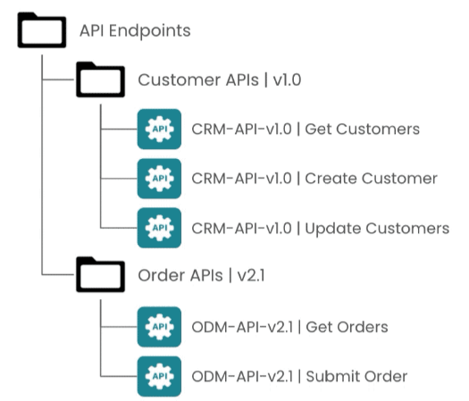
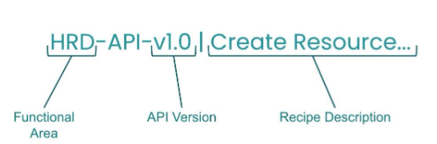

## 🔒 **Security best practices**

Workato API recipes give external sources access to Workato functionality — but since those recipes can perform operations on your business systems, **unauthorized access via APIs must be prevented**. Five security recommendations:

---

### 🎟️ Consider tokens, OAuth 2.0, or JWT

Consider distributing a **JWT token** that encapsulates the auth token secret, instead of the secret itself. JWT tokens are **signed**, **include the client identity**, and can have an **expiration**.

---

### 🔑 Treat API tokens like passwords

> 📌 **API tokens are confidential credentials** that grant access to your API to anyone who possesses them. Treat them like passwords.

Don't distribute tokens through insecure channels like email. Use a secure messaging system or a document system (e.g. Dropbox) that both the API owner and the intended client have access to.

---

### 🚫 Don't distribute the same token to multiple people

> 📌 An API token **identifies a client** — it's the unit by which the API dashboard monitors requests per-client. If multiple people share the same token, **you can't tell who made which call**.

One token per client. Always.

---

### 🔄 Periodically refresh API tokens

Like rotating a password, periodically refreshing API tokens ensures that any compromise of a token doesn't grant long-term access. Alternatively, distribute a **JWT token with an expiration time set** — that bounds the token's lifetime automatically.

---

### 🌐 Use IP whitelisting

In the Access Profile for a client, use **IP whitelisting** to restrict the originating IPs allowed to access the API. This is a strong security practice — though it doesn't fit every scenario:

- Clients on home networks may get varied IPs from their providers.
- Mobile / traveling clients may connect from many IPs.

In those cases, IP whitelisting isn't practical and other controls have to carry the weight.

---

### 🧠 Quick recall

- Treat API tokens like `_____`. (Passwords)
- Should you distribute API tokens via email? (No — use a secure messaging or document system.)
- Why is one-token-per-client important? (So the API dashboard can attribute calls to specific clients for monitoring.)
- What does a JWT token include that a plain auth token might not? (It's signed, includes client identity, and can have an expiration.)
- Where in Workato do you configure IP whitelisting? (In the Access Profile for a client.)

---

## 🗂️ **Organization**

Two practices keep API recipes manageable: folder organization and versioning.

---

### 📁 Organize API recipes into folders

> 📌 Store related API recipes in the **same folder** based on **resource and functionality**. Recipes for the _Customer_ resource go in their own folder; _Order_ recipes in another; etc.

This makes it immediately clear which recipes implement which resource — important when the API surface grows.

---

### 🏷️ Version your API collections

Always version your API collections. Versioning communicates changes to consumers and improves the developer experience.

> 📌 **Versioning rule:**
> 
> - **Breaking changes** → bump the **major version** (e.g. `v1.1 → v2.0`). Consider keeping the old version running so existing users have time to migrate.
> - **Non-breaking enhancements** (new endpoint, new response parameter) → bump the **minor version** (e.g. `v1.1 → v1.2`). Stay on the same API Collection; describe what was added in the Description.

> ✅ **Best practice:** establish an API recipe **naming convention** so recipes are easy to identify. Use the convention in team communication and in your change-control processes.

---

## 📈 **Scalability and performance**

> 📌 Two features handle scalability concerns in the API Platform: **API Caching** and **Rate Limits** (set via API Policies).

- **⚡ API Caching** — for use cases where responses are generally the same given the same parameters (e.g. "Get customer details by ID"). Cached responses are returned significantly faster on subsequent calls.
- **🚦 Rate Limits** — use **API policies** to set limits that prevent clients from over-consuming APIs. Especially important when an API is connected to legacy backend systems that can't handle large volumes of incoming requests.

By capping the number of requests over a period (seconds, minutes, days, weeks, months), you ensure call volume doesn't clog servers or overwhelm apps by exceeding demand expectations.

---

### 🧠 Quick recall

- Major version bump (e.g. `v1.1 → v2.0`) signals what? (A **breaking** change. Keep the old version running so users can migrate.)
- Minor version bump (e.g. `v1.1 → v1.2`) signals what? (A **non-breaking** enhancement — new endpoint or new response parameter.)
- Two scalability/performance features in the API Platform? (API caching; rate limits via API policies)
- When does caching help most? (When responses are generally the same given the same parameters.)
- Where do API recipes belong relative to their resource? (Same folder per resource and functionality.)
- Why are rate limits especially important for APIs connected to legacy systems? (Legacy backends often can't handle high request volumes.)

---

## 🚀 **Module key takeaways**

- **Tokens are passwords** — one per client, refresh periodically, never share via insecure channels, prefer JWT (signed, identifies client, can expire).
- **Use IP whitelisting** in the client's Access Profile when practical.
- **Organize** API recipes into folders by resource; establish a **naming convention**.
- **Version** API collections: **major bump = breaking** (keep old version alive), **minor bump = additive**.
- **Scale & perform** with **API caching** (faster repeated responses) and **rate limits via API policies** (especially in front of legacy systems).

---

## 📝 **Knowledge check: Best Practices**

> ❓**One of the recommendations to maintain security when using API is to:**

- <input type="radio" name="q1"> Consider a JWT token
- <input type="radio" name="q1"> Share API tokens to the public
- <input type="radio" name="q1"> Create a fixed one-time API token

 
💡 Reveal Answer
 - Consider a JWT token 

> ❓**It is important not to distribute the same API token to multiple people.**

- <input type="radio" name="q2"> True
- <input type="radio" name="q2"> False

 
💡 Reveal Answer
 - True 

> ❓**We should treat API tokens like `_____`.**

- <input type="radio" name="q3"> Passwords
- <input type="radio" name="q3"> Key codes
- <input type="radio" name="q3"> Usernames

 
💡 Reveal Answer
 - Passwords 

> ❓**It is important to consider having to `_____` `_____` an API token.**

- <input type="radio" name="q4"> Periodically refresh
- <input type="radio" name="q4"> Permanently set
- <input type="radio" name="q4"> Publicly set

 
💡 Reveal Answer
 - Periodically refresh 

> ❓**Which API best practice ensures scalability and performance?**

- <input type="radio" name="q5"> Organization of folders, resources and versions.
- <input type="radio" name="q5"> Capping the number of requests as we are ensuring that the call volume doesn't slow down performance by exceeding demand expectations.
- <input type="radio" name="q5"> Consideration for Token, OAuth 2.0 or JWT

 
💡 Reveal Answer
 - Capping the number of requests as we are ensuring that the call volume doesn't slow down performance by exceeding demand expectations. 

---

> ⬅️ [Previous: 5.2. Hands-on Activity](./5.2.%20Hands-on%20Activity.md) | ➡️ [Next: 6.1. SQL Collection by Workato](../06.%20SQL%20Collection/6.1.%20SQL%20Collection%20by%20Workato.md)

---