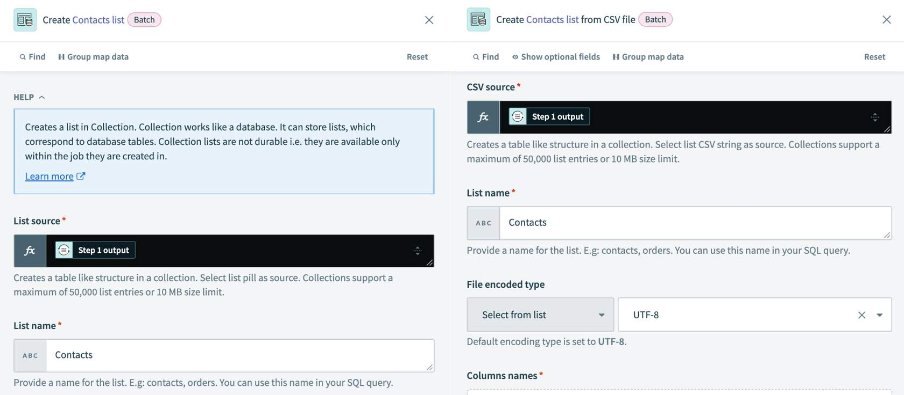
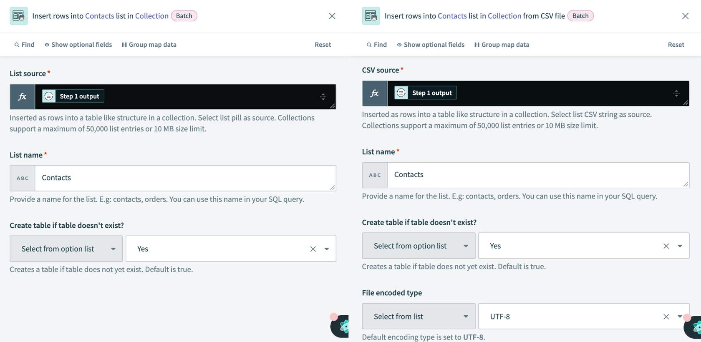
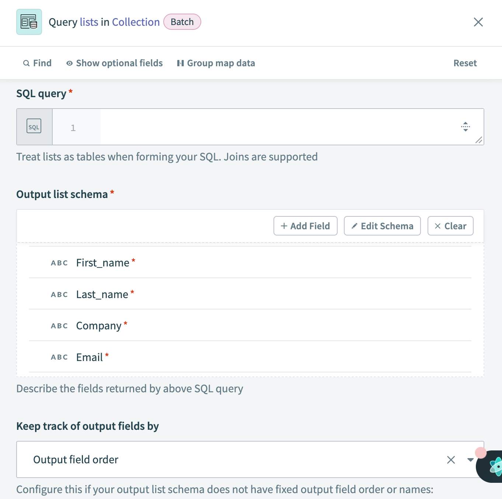

## 💎 **SQL Collection by Workato**

> 📌 **SQL Collection by Workato** is an **out-of-the-box** Workato application that provides actions to integrate and process data **without the need for third-party tools**.

What you can achieve with SQL Collection:

- **🔄 Synchronize related data** across multiple systems — databases, web services, and more.
- **📦 Process large datasets** without worrying about storage capacity or needing a third-party application.
- **🧮 Run a variety of SQL statements** with data from multiple sources to produce the exact output your use case requires.

---

## 📋 **SQL Collection tables / lists**

> 📌 At the core of SQL Collection are **SQL Collection tables** (also called **SQL Collection lists**) — **temporary in-memory storage units that live only for the duration of a single job**.

You create and modify these tables inside the recipe logic, then load the final processed data directly to the target system as output. Nothing persists after the job ends.

---

## 🔄 **Actions for data syncing**

SQL Collection has **five actions** organized into a **three-step flow**: create → insert → query.

---

### ➕ Step 1: Create a SQL Collection list

Two actions for creating a list:

- **`Create list`** — creates an in-memory table from a **list input**. Column headers follow the schema of the input list.
- **`Create list from CSV`** — creates a table from a **CSV input**. Column headers follow the schema of the CSV string. This is useful when bringing in CSV files from databases in on-prem systems.

---

### ⬇️ Step 2: Insert rows into a SQL Collection list

Two actions for inserting data:

- **`Insert rows`** — sync data from various sources by inserting rows into a new or existing SQL Collection list from a **list input**. Works well inside a repeat loop.
- **`Insert rows from CSV file`** — insert rows into a SQL Collection list directly from a **CSV file**.

---

### 🔍 Step 3: Query a SQL Collection list

One action for querying:

- **`Query lists`** — transform data in existing SQL Collection lists using **SQLite commands**.

> 📌 Notice the SQL dialect: SQL Collection uses **SQLite**, not full SQL. Not every SQL command works — more on that in the next lesson.

---

### 🧠 Quick recall

- SQL Collection by Workato is `_____` (third-party / OOB). (OOB — Out-Of-the-Box, native Workato app)
- SQL Collection tables live for how long? (A single job — they're temporary, non-durable.)
- How many actions does SQL Collection have, in how many step categories? (5 actions in 3 categories: create, insert, query.)
- Name both ways to create a SQL Collection list. (`Create list` from a list input; `Create list from CSV`)
- Which SQL dialect does SQL Collection use? (SQLite)
- What's another name for "SQL Collection tables"? (SQL Collection lists)

---

## 🚀 **Module key takeaways**

- **SQL Collection by Workato** = OOB connector providing SQL-style data operations **without needing a real database**.
- **SQL Collection lists/tables** are **temporary, in-memory, single-job-only** storage.
- **5 actions in 3 categories**: Create (`Create list`, `Create list from CSV`), Insert (`Insert rows`, `Insert rows from CSV file`), Query (`Query lists`).
- Uses **SQLite** as the SQL dialect — not all standard SQL commands work.

---

> ⬅️ [Previous: 5.3. Best Practices](../05.%20API%20Platform/5.3.%20Best%20Practices.md) | ➡️ [Next: 6.2. Best Practices](./6.2.%20Best%20Practices.md)

---