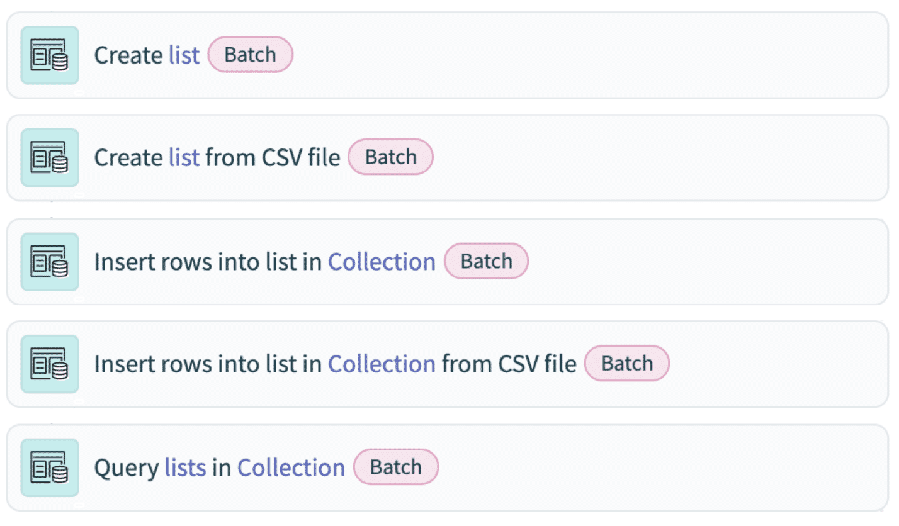

## 📊 **Dataset size**

> 📌 **50,000 records** is the recommended SQL Collection size. With small rows and fewer columns, the app can support **100,000 – 200,000 records**.

For reliable performance on larger datasets, follow these best practices:

- **🔀 Split tables into parts.**
- **⚡ Use parallel recipes** to process larger datasets concurrently.

---

## 💾 **Save data table results**

> ⚠️ SQL Collection lists are **non-durable** — they disappear when the job ends.

To save data, send the SQL Collection list to the target app **within each job**. Specifically, you can query the full list and export the output data by setting **"Write result to CSV"** to **yes**.

---

## ⚙️ **Customizing action fields — four gotchas**

When configuring SQL Collection action steps, four things commonly trip people up:

- **🧮 List source field must be in formula mode** when adding a list datapill. Text mode won't work for list inputs.
- **🐘 Use SQLite, not full SQL.** Not all SQL commands work in SQL Collection — verify against the SQLite spec.
- **🚫 DELETE doesn't return a list output.** Datapills from a `DELETE` action step won't contain the full SQL Collection list, so don't use `DELETE` as your **final output export**.
- **📅 SQLite has no native date/time storage class.** You'll see "collection date errors" if a Date field has an invalid format. The fix: use **Mapper by Workato** to convert dates to **`YYYY-MM-DD HH:MM:SS.SSS`** format, or **skip date fields** entirely if downstream apps don't need them.

---

## 🏎️ **Efficiency of batch actions**

> 📌 **All five SQL Collection actions are batch dispatch.** Batch actions shine when you can transform data **all together** instead of looping through individual records — increasing speed and reducing task load.

This is one of SQL Collection's biggest wins in ETL-style work: replace a row-by-row loop with a single SQL transformation across the entire collection.

---

## ⚖️ **SQL Collection vs other Workato data tools**

Knowing when to reach for SQL Collection means knowing what each Workato data tool actually optimizes for. Quick comparison:

|Tool|Durability|Dataset size|Main advantage|Main precaution|
|---|---|---|---|---|
|**💎 SQL Collection by Workato**|**Impersistent** (single job)|**50,000 records** recommended|Perform database operations **without a database**|Know the outputs of the SQLite commands you're using|
|**🧮 SQL Transformations by Workato**|**Persistent** (exists across jobs)|**No volume limit**|Handle data in bulk; leverages Workato FileStorage|Use either inferred or defined schema|
|**🔎 Lookup tables by Workato**|Persistent (but not for long-term, large relational data)|**10 columns, 100,000 entries**|Store and reference frequently used data|Don't put large data in a single cell|
|**📊 Workato DataTables**|Persistent (but not for long-term, large relational data)|**100 columns, 1,000,000 records**|Primary data store for workflow apps|Don't use to store sensitive PCI data|
|**📁 Workato FileStorage**|Persistent (delete via recipe actions)|**10 GB per file, 100 GB total**|Store recipe-created data as files and directories|Be aware of storing sensitive data — encrypted but still|

> 📌 **The decision question:** _"Do I need persistence?"_ If no → SQL Collection. If yes → SQL Transformations (for size), DataTables (workflow apps), Lookup tables (reference), or FileStorage (files).

---

### 🧠 Quick recall

- The recommended SQL Collection dataset size is `_____` records. (50,000)
- With small rows and fewer columns, the app can support up to `_____` records. (100,000–200,000)
- Are SQL Collection lists persistent? (No — non-durable, single job only.)
- All five SQL Collection actions use which dispatch mode? (Batch)
- What mode must the "List source" field be in when adding a list datapill? (Formula mode)
- Which SQL dialect does SQL Collection use? (SQLite)
- Why shouldn't `DELETE` be used as a final output export? (It doesn't return a list output — datapills won't contain the full list.)
- SQLite is missing what kind of storage class? (Date/time)
- Which Workato utility formats dates correctly for SQLite? (Mapper by Workato — to `YYYY-MM-DD HH:MM:SS.SSS`)
- Which data tool would you use for 500,000 entries that need to persist? (Workato DataTables — up to 1M records, persistent)
- Which tool would you use to store a 5 GB file? (Workato FileStorage — supports up to 10 GB per file)

---

## 🚀 **Module key takeaways**

- **Size**: 50K recommended; 100K–200K for small rows; split tables or run parallel recipes beyond that.
- **Non-durability**: SQL Collection lists die with the job — save to a target app or export via _"Write result to CSV"_.
- **Four gotchas**: formula mode for List source, SQLite (not full SQL), `DELETE` returns no list, no SQLite date storage class.
- **All actions are batch dispatch** — that's the speed-and-task-cost advantage over looping.
- **Decision rule**: persistent data → SQL Transformations / DataTables / FileStorage / Lookup tables. Temporary, in-recipe work → SQL Collection.

---

> ⬅️ [Previous: 6.1. SQL Collection by Workato](./6.1.%20SQL%20Collection%20by%20Workato.md) | ➡️ [Next: 6.3. Use case in data transformation](./6.3.%20Use%20case%20in%20data%20transformation.md)

---