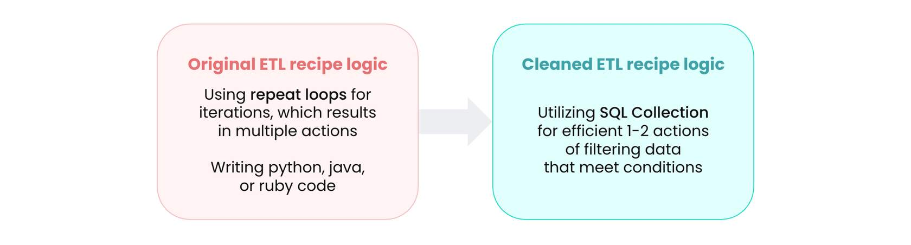

## 🛠️ **SQL Collection in data transformation**

As an SQL engine, SQL Collection plays a major role in data transformation solutions. It's a user-friendly way for any team to manipulate data — no need to request staging tables from database admins, and no OPA required to run custom SQL (the typical requirement on most database connectors).

Data transformation enables data analysis, which in turn produces actionable business intelligence. The two main patterns are **ELT** and **ETL**.

---

### ⚖️ ELT vs ETL at a glance

| |**📥 ELT** (Extract Load Transform)|**🔧 ETL** (Extract Transform Load)|
|---|---|---|
|**Order**|Extract → Load → Transform|Extract → Transform → Load|
|**Where transformation happens**|In the **target system** (e.g. staging table inside a data warehouse)|In the **integration platform tool** (e.g. Workato)|
|**Typical use**|Consolidating data in a data warehouse where the target has scalable compute|Moving data from sources to a central repository with transformation along the way|
|**SQL Collection role**|**Minimal** — transformation usually happens in the target via custom SQL or stored procedures|**Central** — Workato (often via SQL Collection) is the transformation engine|

---

## 📥 **ELT: Extract Load Transform**

In a typical ELT process, data is loaded to the target database first — usually a staging table — and then transformed within the target system itself using custom SQL commands or stored procedures.

> 📌 A standard ELT process **does not particularly make use of SQL Collection.** Performing transformations on the target can make ELT more efficient than ETL.

It's possible to run an ETL flow and then re-apply transformation using SQL Collection after the fact, but **this isn't a common practice**.

---

## 🔧 **ETL: Extract Transform Load**

ETL moves data from one or multiple sources to a central repository (like a data warehouse), and **transformation happens in the integration platform tool — Workato — along the way**.

> 📌 In ETL, **Workato acts as the transformation engine**. SQL Collection is an **effective alternative to using loops** when performing these transformations.

---

### 💡 Example: combining different data formats

A common ETL use case is handling **two sets of data of different nature** — for instance, a CSV file and an array of JSON data.

SQL Collection can transform across various formats (CSV, file, XML) to combine them. A specific scenario:

> 🎯 You have a Salesforce file of opportunities and want to **filter to only rows meeting certain conditions**. Using **batch operations** in SQL Collection makes this far more efficient than looping row-by-row.

---

### 🧠 Quick recall

- In ELT, the order is `_____` → `_____` → `_____`. (Extract, Load, Transform)
- In ETL, the order is `_____` → `_____` → `_____`. (Extract, Transform, Load)
- Which pattern uses Workato as the transformation engine? (ETL)
- Which pattern transforms data _in the target system_? (ELT — using custom SQL or stored procedures inside the warehouse)
- In ETL, SQL Collection is most useful as an alternative to what? (Repeat loops — SQL Collection's batch operations are faster and cheaper than looping row-by-row)
- A classic ETL use case for SQL Collection involves what? (Combining data of different nature — e.g. CSV + JSON, then transforming the merged set.)
- Does SQL Collection require OPA to run custom SQL? (No — that's one of its advantages over database connectors.)

---

## 🚀 **Module key takeaways**

- **ELT**: transform happens in the target. SQL Collection plays a **minimal** role.
- **ETL**: transform happens in Workato. SQL Collection is **central** as a loop-free, batch-driven transformation engine.
- SQL Collection's standout strength is **combining data of different formats** (CSV + JSON + XML) in a single batch operation — exactly what looped approaches struggle with.
- No OPA, no DB admin tickets, no staging tables to request — that's the practical accessibility advantage of SQL Collection vs. doing the same work in a database directly.

---

## 📝 **Knowledge check: SQL Collection**

> ❓**Choose all options with best practices when using SQL Collection.**

- [ ] 50,000 records is the recommended size for SQL Collection. Consider splitting tables into parts or using parallel recipes to process larger datasets.
- [ ] All SQL Collection actions are in batch dispatch, meaning that it is recommended to use repeat loops to go through data one by one.
- [ ] Query the full list to export the output data as a CSV file to save data table results.
- [ ] If a collection date error arises due to invalid format in the Date field, switch all commands from SQLite to SQL, which is supported by SQL Collection.
- [ ] List source field can be in either text or formula mode when you add a list datapill.

 
💡 Reveal Answer
 - 50,000 records is the recommended size for SQL Collection. Consider splitting tables into parts or using parallel recipes to process larger datasets. - Query the full list to export the output data as a CSV file to save data table results. 

> ❓**Choose all options where it would be preferred to use SQL Collection over other database tools.**

- [ ] I want something persistent across multiple jobs.
- [ ] I want to perform database operations in SQLite without a database.
- [ ] I need at least 500,000 entries in my Workato database.
- [ ] I want to store data in files that I can delete in recipes through action steps (Workato FileStorage).

 
💡 Reveal Answer
 - I want to perform database operations in SQLite without a database. 

---

> ⬅️ [Previous: 6.2. Best Practices](./6.2.%20Best%20Practices.md) | ➡️ [Next: 7.1. Key Factors of Task Usage](../07.%20Task%20Optimization/7.1.%20Key%20Factors%20of%20Task%20Usage.md)

---