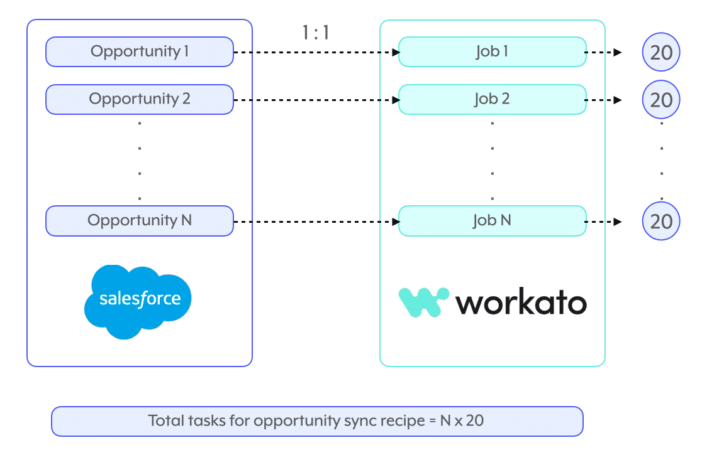
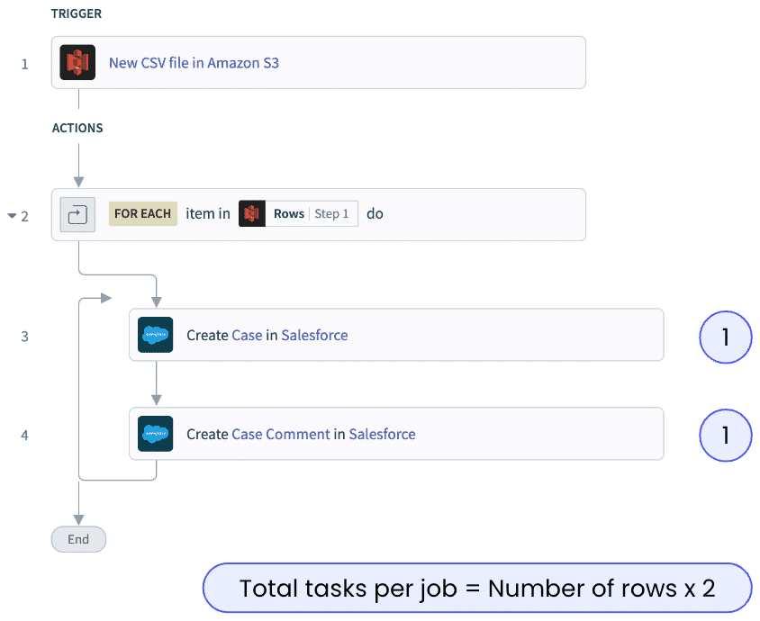
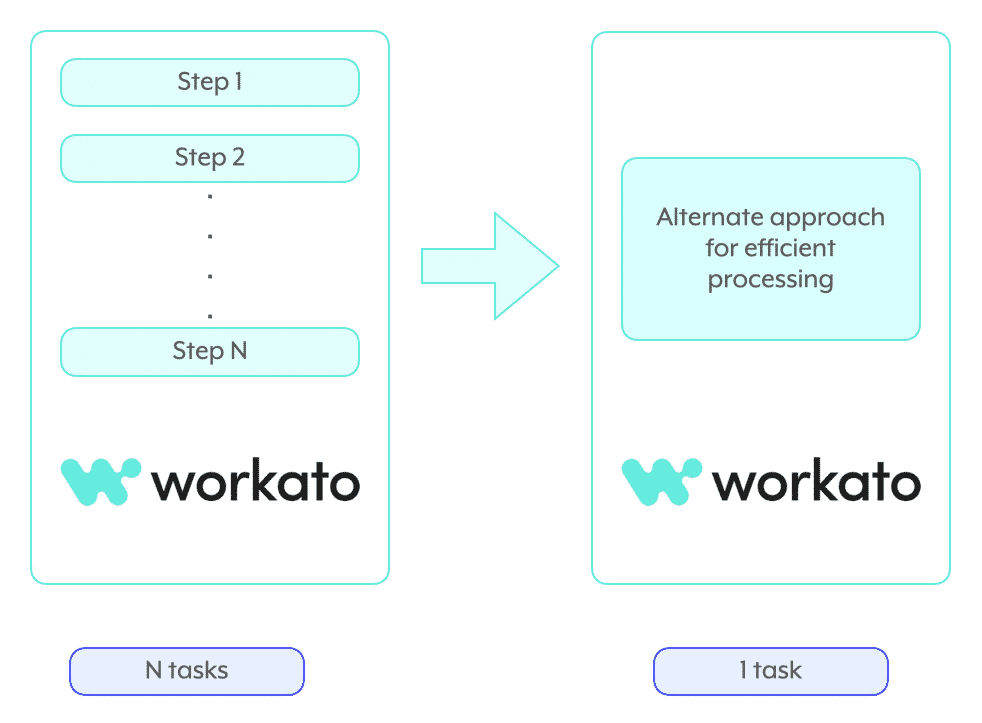

## 📊 **Key factors of task usage**

Why does task consumption escalate for a given recipe? It comes down to **three key factors** that affect every recipe's task consumption at a broad level:

> 📌 The three key factors are:
> 
> 1. **Number of jobs**
> 2. **Number of events per job**
> 3. **Efficient processing of events**

Understanding which factor is driving your high consumption tells you which optimization strategy to apply later.

---

### 🏃 1. Number of jobs

The total number of jobs a recipe runs is the most obvious multiplier.

> 💡 _Example:_ every new opportunity triggers a job that consumes ~20 tasks. If 100 opportunities flow through per day, that's **100 jobs × 20 tasks = 2,000 tasks/day** from just this one recipe.

The volume of trigger events at the source becomes a direct multiplier on task usage.

---

### 📅 2. Number of events per job

How many events you process _within_ each job also multiplies tasks.

> 💡 _Example:_ reading a CSV file from an S3 bucket and taking a couple of actions in Salesforce. Whether each row is processed individually or as a batch dramatically changes the total task count.

> ⚠️ Data synchronization or scheduled jobs typically process **more than one event per trigger event** — so the per-job multiplier matters even more for these recipe types.

---

### ⚡ 3. Efficient processing of events

The third factor is the _logic_ you choose to implement processing. The right tools strike a balance between development effort, complexity, and task optimization — using a formula instead of a repeat loop, for instance, can collapse many tasks into one.

---

### 🧠 Quick recall

- Name the three key factors of task usage. (Number of jobs; number of events per job; efficient processing of events)
- A recipe runs 100 jobs/day at 20 tasks each. Daily task total? (`_____`) (2,000)
- Why are scheduled or sync jobs especially sensitive to factor #2? (They typically process more than one event per trigger event — the per-job multiplier compounds.)
- Which factor is about the _logic shape_ (formula vs loop, etc.) rather than volume? (Factor #3 — efficient processing of events.)

---

## 🚀 **Module key takeaways**

- **Three multipliers** drive task usage: how many **jobs** run, how many **events per job**, and how **efficient** the processing logic is.
- Diagnosing which factor dominates your overconsumption directs you to the right optimization strategy in 7.3.
- Sync and scheduled recipes are especially impacted by factor #2 — they often process many events per single trigger event.

---

> ⬅️ [Previous: 6.3. Use case in data transformation](../06.%20SQL%20Collection/6.3.%20Use%20case%20in%20data%20transformation.md) | ➡️ [Next: 7.2. Task Optimization Approach](./7.2.%20Task%20Optimization%20Approach.md)

---